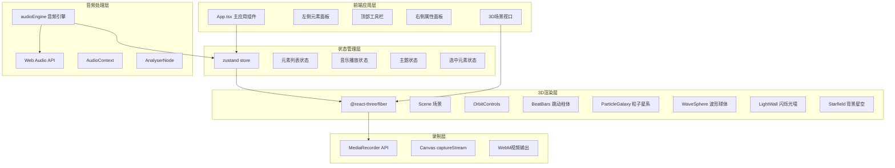

## 1. 架构设计



## 2. 技术栈描述

| 分类 | 技术 | 版本 | 用途 |
|-----|------|------|------|
| 框架 | React | 18.x | UI组件框架 |
| 语言 | TypeScript | 5.x | 类型安全 |
| 构建工具 | Vite | 5.x | 开发服务器和构建 |
| 3D引擎 | Three.js | 0.160.x | WebGL 3D渲染 |
| React绑定 | @react-three/fiber | 8.x | React Three.js 渲染器 |
| 3D工具库 | @react-three/drei | 9.x | 辅助组件（OrbitControls等） |
| 状态管理 | zustand | 4.x | 全局状态管理 |
| 音频 | Web Audio API | - | 音频频谱分析 |
| 录制 | MediaRecorder API | - | WebM视频录制 |

## 3. 项目目录结构

```
├── package.json
├── vite.config.ts
├── tsconfig.json
├── index.html
├── src/
│   ├── main.tsx              # React 入口
│   ├── App.tsx               # 主应用组件
│   ├── store/
│   │   └── useStore.ts       # zustand 全局状态
│   ├── audio/
│   │   └── audioEngine.ts    # 音频引擎模块
│   ├── scene/
│   │   ├── Scene.tsx         # 3D场景组件
│   │   └── Starfield.tsx     # 背景星空
│   ├── elements/
│   │   ├── BeatBars.tsx      # 跳动柱体
│   │   ├── ParticleGalaxy.tsx # 旋转粒子星系
│   │   ├── WaveSphere.tsx    # 起伏波形球体
│   │   └── LightWall.tsx     # 闪烁光墙
│   ├── components/
│   │   ├── LeftPanel.tsx     # 左侧元素面板
│   │   ├── RightPanel.tsx    # 右侧属性面板
│   │   └── TopBar.tsx        # 顶部工具栏
│   └── types/
│       └── index.ts          # 类型定义
```

## 4. 状态管理设计

### 4.1 Zustand Store 结构

```typescript
interface SceneElement {
  id: string;
  type: 'beatBars' | 'particleGalaxy' | 'waveSphere' | 'lightWall';
  position: [number, number, number];
  rotation: [number, number, number];
  scale: number;
  sensitivity: number;
  rotationSpeed: number;
  // 元素特定属性
  barCount?: number;
  particleCount?: number;
  waveDetail?: number;
  wallSize?: [number, number];
  flickerFrequency?: number;
}

interface AppState {
  elements: SceneElement[];
  selectedElementId: string | null;
  isPlaying: boolean;
  currentTime: number;
  duration: number;
  theme: 'cyberpunk' | 'aurora' | 'lava';
  frequencyData: Uint8Array;
  timeData: Uint8Array;
  isRecording: boolean;
  
  // Actions
  addElement: (type: string) => void;
  removeElement: (id: string) => void;
  updateElement: (id: string, props: Partial<SceneElement>) => void;
  selectElement: (id: string | null) => void;
  setTheme: (theme: string) => void;
  setPlaying: (playing: boolean) => void;
  setCurrentTime: (time: number) => void;
  setDuration: (duration: number) => void;
  setFrequencyData: (data: Uint8Array) => void;
  setRecording: (recording: boolean) => void;
  syncAllElements: () => void;
}
```

## 5. 颜色主题定义

```typescript
const themes = {
  cyberpunk: {
    primary: '#ff00ff',    // 洋红
    secondary: '#00ffff',  // 青
    accent: '#ffff00',     // 黄
    bg: '#0a0a1a',
    lightColor: '#ff00ff',
  },
  aurora: {
    primary: '#0000ff',    // 深蓝
    secondary: '#00ff88',  // 浅绿
    accent: '#88ffff',     // 淡蓝
    bg: '#0a0a1a',
    lightColor: '#00ff88',
  },
  lava: {
    primary: '#ff3300',    // 红
    secondary: '#ff8800',  // 橙
    accent: '#ffcc00',     // 黄
    bg: '#0a0a1a',
    lightColor: '#ff8800',
  },
};
```

## 6. 音频引擎设计

### 6.1 audioEngine 模块

- **方法**：
  - `loadFile(file: File): Promise<void>` - 加载音频文件
  - `play(): void` - 播放
  - `pause(): void` - 暂停
  - `stop(): void` - 停止
  - `getFrequencyData(): Uint8Array` - 获取频谱数据
  - `getTimeData(): Uint8Array` - 获取时域数据
  - `getCurrentTime(): number` - 获取当前播放时间
  - `getDuration(): number` - 获取总时长
  - `seek(time: number): void` - 跳转到指定时间

- **事件**：通过自定义事件或回调通知状态更新
  - `timeupdate` - 播放时间更新
  - `ended` - 播放结束
  - `loaded` - 音频加载完成

### 6.2 分析器配置

- FFT大小：256
- 平滑时间常数：0.8
- 频谱数据频率范围响应各元素不同频段

## 7. 3D元素实现要点

### 7.1 BeatBars 跳动柱体
- 使用 `InstancedMesh` 优化性能
- 监听低频段（0-20%）频谱数据
- 柱体高度映射：frequencyValue → scale.y (0.5~2.0)
- 颜色随高度渐变（主题色渐变）

### 7.2 ParticleGalaxy 旋转粒子星系
- 使用 `BufferGeometry + Points`
- 监听中高频段（40-80%）频谱数据
- 粒子颜色根据频率强度在主题色间插值
- 旋转速度与中高频强度正相关

### 7.3 WaveSphere 起伏波形球体
- 使用 `SphereGeometry` 动态修改顶点
- 监听整体音量（全频段平均）
- 顶点沿法线方向位移
- 使用 `ShaderMaterial` 或 `onBeforeRender` 更新

### 7.4 LightWall 闪烁光墙
- 使用 `PlaneGeometry` 平面
- 监听节拍触发（短时能量突变检测）
- 颜色RGB渐变循环
- 透明度随节拍脉冲

## 8. 录制功能实现

- 使用 `canvas.captureStream(60)` 获取视频流
- `MediaRecorder` 录制 WebM 格式
- 录制状态指示（按钮闪烁）
- 停止后自动下载（Blob + a标签download）

## 9. 性能优化策略

1. 使用 `InstancedMesh` 渲染重复几何体
2. 使用 `BufferGeometry` 减少内存占用
3. 限制每个元素顶点数 ≤ 5000
4. 合理使用 `frustumCulled`
5. 音频数据按需读取，避免每帧重复计算
6. 使用 `useMemo` 和 `useRef` 优化 React 渲染
