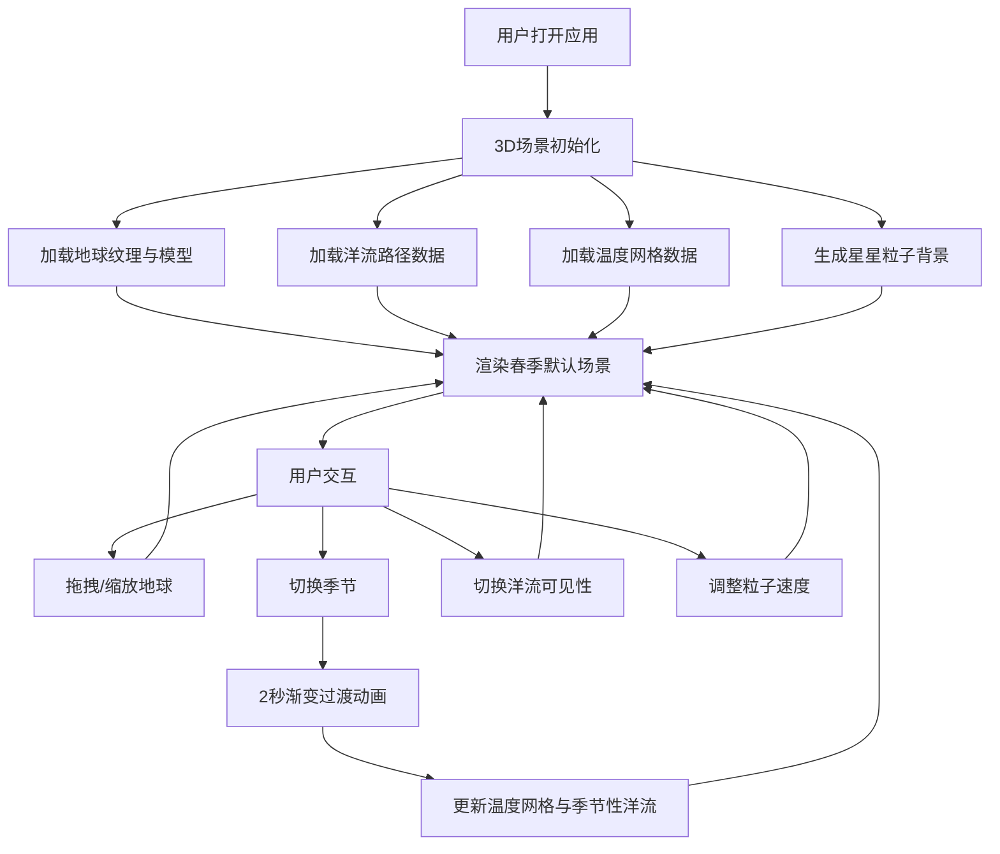

## 1. 产品概述

全球洋流3D可视化应用，为气象爱好者和教育场景提供直观的洋流运动、温度分布及季节变化影响的交互式展示。通过3D地球模型和动态粒子效果，将抽象的海洋气象数据转化为可感知、可交互的视觉体验。

- **核心目标**：解决气象数据难以直观理解的问题，提供沉浸式的洋流与温度梯度探索体验
- **目标用户**：气象爱好者、学生、教师、科普工作者
- **市场价值**：填补教育类气象可视化工具的空白，提供高质量的交互式学习体验

## 2. 核心功能

### 2.1 用户角色
| 角色 | 注册方式 | 核心权限 |
|------|----------|----------|
| 访客用户 | 无需注册 | 浏览3D场景、切换季节、控制洋流可见性、调整粒子速度 |

### 2.2 功能模块

1. **3D地球场景模块**：带纹理的地球模型、星星背景粒子、光照系统
2. **洋流路径模块**：主洋流（6条）+ 季节性洋流（4条）的路径渲染与粒子动画
3. **温度网格模块**：20x10分辨率的温度网格，热力图颜色映射
4. **季节切换模块**：四季切换，温度与洋流同步渐变过渡
5. **交互控制面板**：洋流可见性、粒子速度调节、图例显示
6. **响应式适配模块**：桌面端侧边栏 + 移动端底部抽屉

### 2.3 页面详情

| 页面名称 | 模块名称 | 功能描述 |
|---------|----------|----------|
| 主场景页面 | 3D地球渲染 | 半径2单位的带纹理地球，支持鼠标拖拽旋转（绕Y轴）、滚轮缩放（0.5-5倍） |
| 主场景页面 | 洋流路径动画 | 暖流红橙渐变、寒流蓝青渐变，粒子沿路径流动（速度1-5单位/秒），线条宽度随缩放自动调整（最小0.2） |
| 主场景页面 | 温度网格覆盖 | 20x10半透明网格，温度热力图（深红30°C到深蓝-10°C），additive混合模式 |
| 主场景页面 | 星星粒子背景 | 随机分布闪烁星星，大小0.05-0.15单位，透明度0.3-0.8 |
| 信息面板 | 季节信息展示 | 显示当前季节、温度范围 |
| 信息面板 | 季节切换控制 | 春/夏/秋/冬四季按钮，2秒渐变过渡动画 |
| 信息面板 | 洋流列表 | 10条洋流名称+状态，彩色圆点标识，点击高亮/隐藏 |
| 信息面板 | 速度控制 | 粒子速度滑块（1-5单位/秒） |
| 信息面板 | 图例说明 | 温度色阶图例 |

## 3. 核心流程

用户打开应用 → 3D场景加载（地球、洋流、温度网格、星星粒子） → 查看默认季节（春季）数据 → 可选择：
- 拖拽旋转地球查看不同区域
- 滚轮缩放观察细节
- 点击季节按钮切换季节（温度网格和季节性洋流同步更新）
- 点击洋流名称切换可见性
- 调整粒子速度滑块
- 查看信息面板中的实时数据

## 4. 用户界面设计

### 4.1 设计风格

- **设计基调**：深空科幻风，沉浸式科学可视化
- **主色调**：深空渐变背景 #050510 → #0a1020
- **强调色**：
  - 暖流：#ff3333 → #ff9933（红橙渐变）
  - 寒流：#0066ff → #00ffff（蓝青渐变）
  - 温度热力：#8b0000（30°C）→ #00008b（-10°C）
- **UI控件**：背景rgba(255,255,255,0.1)，边框1px rgba(255,255,255,0.2)，圆角8px，hover时rgba(255,255,255,0.2)
- **字体**：现代无衬线字体（如Inter），数字使用等宽字体
- **布局**：3D场景全屏，右侧固定半透明信息面板（280px宽，圆角12px，背景rgba(10,15,30,0.85)）

### 4.2 页面设计概述

| 页面名称 | 模块名称 | UI元素 |
|---------|----------|--------|
| 主场景页面 | 3D地球 | 纹理贴图、自转效果、光照阴影 |
| 主场景页面 | 洋流路径 | 彩色线条、流动粒子、additive混合 |
| 主场景页面 | 温度网格 | 半透明热力网格、温度数值标签 |
| 主场景页面 | 星星背景 | 随机闪烁粒子、深空渐变 |
| 信息面板 | 季节选择器 | 4个季节按钮、选中高亮 |
| 信息面板 | 洋流列表 | 彩色圆点、名称、状态标签、点击交互 |
| 信息面板 | 速度滑块 | 轨道、滑块手柄、数值显示 |
| 信息面板 | 温度图例 | 渐变色条、温度刻度 |

### 4.3 响应式设计

- **桌面端（>768px）**：右侧固定半透明面板（宽280px）
- **移动端（≤768px）**：底部抽屉（高度自动，展开占40%屏幕），支持上滑展开/下滑收起
- **触控优化**：按钮最小尺寸44x44px，支持双指缩放

### 4.4 3D场景指导

- **环境与氛围**：深空渐变背景，无HDRI，少量闪烁星星营造宇宙感
- **光照设置**：
  - 主方向光：模拟太阳光，暖白色，强度1.2
  - 环境光：弱蓝色，强度0.3，提供基础照明
  - 半球光：天空蓝/深蓝，强度0.2，增强空间感
- **相机设置**：
  - 初始位置：(0, 0, 6)
  - 近裁剪面：0.1
  - 远裁剪面：100
  - 视场角：60°
- **相机运动**：
  - 旋转：仅绕Y轴拖拽，限制X轴旋转范围(-π/3, π/3)
  - 缩放：0.5-5倍，平滑阻尼
  - 自动旋转：可选，默认关闭
- **组成与焦点**：地球位于场景中心，占画面主要区域，信息面板在右侧不遮挡主体
- **交互与动画**：
  - 粒子沿路径流动：使用顶点着色器实现
  - 季节切换：2秒颜色和可见性渐变过渡
  - 洋流高亮：选中时线条宽度加倍，亮度提升
- **后处理效果**：轻微泛光（Bloom）增强发光效果，FXAA抗锯齿
- **资源来源**：
  - 地球贴图：使用公共领域卫星贴图（如NASA Blue Marble）
  - 性能预算：Draw Call < 100，三角形 < 20万，目标帧率≥30FPS
