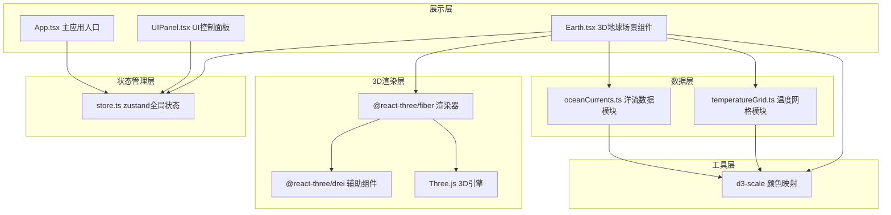

## 1. 架构设计



## 2. 技术描述

- **前端框架**：React@18 + TypeScript
- **构建工具**：Vite@5
- **3D引擎**：Three.js@0.160
- **React 3D绑定**：@react-three/fiber@8.15
- **3D辅助组件**：@react-three/drei@9.92
- **状态管理**：zustand@4.4
- **数据可视化**：d3-scale@4.0
- **样式方案**：TailwindCSS 3（用于UI布局）
- **初始化工具**：vite-init

## 3. 目录结构

```
src/
├── components/
│   ├── Earth.tsx          # 3D地球场景组件
│   └── UIPanel.tsx        # UI控制面板组件
├── data/
│   ├── oceanCurrents.ts   # 洋流数据模拟模块
│   └── temperatureGrid.ts # 温度网格模拟模块
├── store/
│   └── store.ts           # zustand全局状态管理
├── App.tsx                # 主应用组件
├── main.tsx               # 应用入口
└── index.css              # 全局样式
```

## 4. 数据模型

### 4.1 洋流数据结构

```typescript
interface OceanCurrent {
  id: string;
  name: string;
  nameEn: string;
  type: 'warm' | 'cold';
  isSeasonal: boolean;
  seasons: string[]; // ['winter'] 或 ['summer']
  points: [number, number][]; // [经度, 纬度] 数组，50-80个点
}
```

### 4.2 温度网格数据结构

```typescript
interface TemperatureGrid {
  resolution: { width: number; height: number }; // 20 x 10
  data: {
    lon: number;
    lat: number;
    temperature: number; // -10 ~ 30 °C
  }[];
  minTemp: number;
  maxTemp: number;
}
```

### 4.3 全局状态结构

```typescript
interface AppState {
  season: 'spring' | 'summer' | 'autumn' | 'winter';
  visibleCurrents: string[]; // 可见洋流ID数组
  particleSpeed: number; // 1-5 单位/秒
  highlightedCurrent: string | null;
  isTransitioning: boolean;
  transitionProgress: number;
  
  // Actions
  setSeason: (season: string) => void;
  toggleCurrent: (id: string) => void;
  setParticleSpeed: (speed: number) => void;
  setHighlightedCurrent: (id: string | null) => void;
  startTransition: () => void;
  updateTransitionProgress: (progress: number) => void;
  endTransition: () => void;
}
```

## 5. 核心模块说明

### 5.1 oceanCurrents.ts 洋流数据模块

**导出函数**：
- `getMainCurrents(): OceanCurrent[]` - 返回6条主要洋流（全年可见）
  - 墨西哥湾暖流（Gulf Stream）
  - 北大西洋暖流（North Atlantic Drift）
  - 北太平洋暖流（North Pacific Current）
  - 秘鲁寒流（Peru Current）
  - 本格拉寒流（Benguela Current）
  - 西澳大利亚寒流（West Australian Current）
- `getSeasonalCurrents(season: string): OceanCurrent[]` - 根据季节返回4条季节性洋流
  - 索马里暖流（夏季）
  - 东北季风漂流（冬季）
  - 西南季风漂流（夏季）
  - 鄂霍次克海寒流（冬季）

### 5.2 temperatureGrid.ts 温度网格模块

**导出函数**：
- `getTemperatureGrid(season: string): TemperatureGrid` - 根据季节生成20x10温度网格
  - 纬度越高温度越低
  - 季节影响：北半球夏季温度高，冬季温度低，南半球相反
  - 洋流经过区域有温度异常

### 5.3 Earth.tsx 3D地球组件

**核心功能**：
- 使用 `<mesh>` + `<sphereGeometry>` + `<meshStandardMaterial>` 渲染带纹理地球
- 使用 `<OrbitControls>` 实现旋转缩放
- 自定义 `OceanPath` 组件渲染洋流路径和粒子动画
- 自定义 `TemperatureGrid` 组件渲染温度热力网格
- `<Stars>` 组件渲染背景星星
- 使用 `useFrame` 实现粒子动画和过渡效果

**关键实现**：
- 经纬度转3D坐标函数
- 粒子沿路径流动的着色器实现
- 颜色插值实现季节过渡动画

### 5.4 UIPanel.tsx UI面板组件

**核心功能**：
- 季节切换按钮组
- 洋流列表（带彩色圆点和状态标识）
- 粒子速度滑块
- 温度图例
- 响应式布局（桌面端侧边栏 / 移动端底部抽屉）

## 6. 关键技术实现

### 6.1 经纬度转3D坐标

```typescript
function latLonToVector3(lat: number, lon: number, radius: number): THREE.Vector3 {
  const phi = (90 - lat) * (Math.PI / 180);
  const theta = (lon + 180) * (Math.PI / 180);
  
  return new THREE.Vector3(
    -radius * Math.sin(phi) * Math.cos(theta),
    radius * Math.cos(phi),
    radius * Math.sin(phi) * Math.sin(theta)
  );
}
```

### 6.2 洋流路径渲染

- 使用 `<line>` 或 `<Line2>` 渲染路径线条
- 使用 `<points>` + 自定义着色器渲染流动粒子
- 颜色渐变：暖流 `#ff3333` → `#ff9933`，寒流 `#0066ff` → `#00ffff`
- 混合模式：`AdditiveBlending` 或 `ScreenBlending`

### 6.3 季节过渡动画

- 使用 `useFrame` 每帧更新过渡进度（0→1，2秒完成）
- 温度值：`temp = temp1 * (1-progress) + temp2 * progress`
- 洋流可见性：根据季节淡入淡出

### 6.4 性能优化

- 使用 `BufferGeometry` 减少内存占用
- 粒子使用 `Points` 批量渲染
- 避免在 `useFrame` 中创建新对象
- 合理设置几何体分段数
- 使用 `drei` 提供的优化组件（如 `<Preload>`）

## 7. 依赖版本

```json
{
  "react": "^18.2.0",
  "react-dom": "^18.2.0",
  "three": "^0.160.0",
  "@react-three/fiber": "^8.15.12",
  "@react-three/drei": "^9.92.7",
  "zustand": "^4.4.7",
  "d3-scale": "^4.0.2",
  "typescript": "^5.3.3",
  "vite": "^5.0.10",
  "@types/react": "^18.2.47",
  "@types/react-dom": "^18.2.18",
  "@types/three": "^0.160.0",
  "@types/d3-scale": "^4.0.6"
}
```

## 8. 配置文件

### vite.config.js

- resolve alias: `@` → `src`
- 优化Three.js打包

### tsconfig.json

- 严格模式（strict: true）
- 模块：ESNext
- 目标：ES2020
- 路径别名配置

### tailwind.config.js

- 自定义颜色主题
- 响应式断点配置
