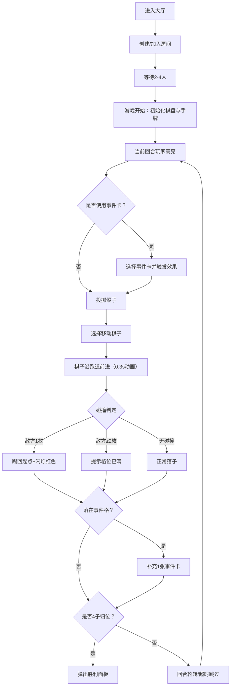

## 1. 产品概述

多人实时桌面飞行棋对战应用——支持2-4名玩家在线匹配，每位玩家控制4枚棋子绕4×7回形跑道一圈返回起点，融合随机事件卡、棋子碰撞踢回和实时同步机制，为线上桌游体验提供即时物理反馈与策略深度。

- 目标用户：线上派对玩家、桌游爱好者、朋友聚会群体
- 核心价值：将传统飞行棋的社交乐趣与数字化的即时物理互动（骰子动画、碰撞踢回、事件卡特效）结合，打造沉浸式多人实时对战体验

## 2. 核心功能

### 2.1 用户角色

| 角色 | 进入方式 | 核心权限 |
|------|----------|----------|
| 玩家 | 输入昵称加入房间 | 投骰子、移动棋子、使用事件卡、查看排行榜 |
| 观战者 | 加入房间（只读） | 观看棋盘实时状态和排行榜 |

### 2.2 功能模块

1. **游戏主页面**：棋盘渲染、骰子交互、棋子移动动画、碰撞特效、事件卡动画、排行榜面板
2. **大厅页面**：玩家昵称输入、房间创建/加入、2-4人匹配

### 2.3 页面详情

| 页面名称 | 模块名称 | 功能描述 |
|----------|----------|----------|
| 游戏主页面 | 棋盘区域 | 渲染4×7回形跑道（28格），格子分区着色（红黄蓝绿四角+中央区），显示编号和特殊标记（箭头=捷径入口、星号=事件格） |
| 游戏主页面 | 骰子区域 | 白色3D旋转骰子，点击投掷带挤压反弹动画，1秒内完成，点数1-6 |
| 游戏主页面 | 棋子动画 | 投骰后棋子沿格子中心跳跃前进，0.3秒路径插值动画 |
| 游戏主页面 | 碰撞提示 | 落地同格时被踢棋子闪烁红色0.5秒，提示踢回；多棋子碰撞提示格位已满 |
| 游戏主页面 | 事件卡区域 | 投骰前可选触发事件卡，卡片翻转特效+文字说明，3种效果类型 |
| 游戏主页面 | 排行榜面板 | 右侧半透明面板，显示昵称、棋子颜色圆点、完成棋子数，当前回合玩家金色边框脉动 |
| 游戏主页面 | 胜利面板 | 弹出金色背景面板，显示玩家头像和名次 |
| 大厅页面 | 昵称输入 | 输入昵称，选择玩家颜色 |
| 大厅页面 | 房间操作 | 创建房间或加入已有房间，等待2-4人齐后开始 |

## 3. 核心流程

1. 玩家进入大厅，输入昵称并创建/加入房间
2. 房间满2-4人后，房主点击开始，游戏初始化（每人4枚棋子在起点，3张事件卡）
3. 回合按玩家顺序轮转，当前回合玩家高亮（金色边框脉动）
4. 当前玩家可选择是否使用事件卡（每轮投骰前，点击手牌中事件卡）
5. 当前玩家点击骰子投掷，骰子3D旋转动画后显示点数
6. 选择要移动的棋子，棋子沿跑道前进对应格数（0.3秒插值动画）
7. 系统判定碰撞：若目标格有敌对方棋子（1枚），踢回起点并闪烁红色；若≥2枚，提示格位已满
8. 若落在事件格（星号），补充1张事件卡
9. 回合结束，30秒超时自动跳过，轮转至下一位玩家
10. 首位4枚棋子全部返回起点的玩家获胜，弹出胜利面板

## 4. 用户界面设计

### 4.1 设计风格

- 主色调：深木色棋盘背景（#5a3d2b），金色边框（#c9a94e），营造豪华桌游质感
- 四分区配色：红区#e74c3c（0.7透明度）、蓝区#3498db、黄区#f1c40f、绿区#2ecc71
- 棋子风格：平面圆形+径向渐变毛绒边缘效果，24px，四色区分玩家
- 骰子风格：白色3D正方体，透视transform旋转，点击挤压反弹
- 面板风格：半透明黑色背景（rgba(0,0,0,0.6)），模糊8px
- 字体：标题使用粗体衬线字体（如Playfair Display），正文使用无衬线字体（如DM Sans）
- 布局：flex布局，棋盘居中，排行榜贴右侧；屏幕<768px时面板折叠到底部
- 动效：骰子3D旋转、棋子跳跃插值、碰撞闪烁、事件卡翻转、金色边框脉动

### 4.2 页面设计概览

| 页面名称 | 模块名称 | UI元素 |
|----------|----------|--------|
| 游戏主页面 | 棋盘区域 | 深木色纹理背景，28格金色边框方块，分区着色，编号+特殊标记（箭头/星号），棋子圆形毛绒效果 |
| 游戏主页面 | 骰子区域 | 白色3D正方体，透视旋转动画，挤压反弹点击反馈，点数显示 |
| 游戏主页面 | 事件卡区域 | 卡片翻转CSS 3D特效，文字说明浮层，手牌区域展示剩余卡数 |
| 游戏主页面 | 排行榜面板 | 半透明黑色背景+模糊，昵称+颜色圆点+完成数，当前玩家金色脉动边框，35%高度 |
| 游戏主页面 | 胜利面板 | 金色渐变背景模态弹窗，玩家头像+名次排列，彩纸粒子效果 |
| 大厅页面 | 大厅主体 | 居中卡片式布局，昵称输入框，房间列表/创建按钮，玩家颜色选择 |

### 4.3 响应式设计

- 桌面优先（≥768px）：棋盘居中+右侧排行榜面板
- 移动端（<768px）：排行榜面板折叠到底部，棋盘自适应缩放
- 骰子和操作区域始终在视口内可见

### 4.4 特殊动效

- 棋子移动：0.3秒路径插值跳跃动画（沿格子中心点序列）
- 碰撞踢回：被踢棋子闪烁红色0.5秒后传送回起点
- 事件卡翻转：CSS 3D rotateY 180度翻转+文字渐显
- 骰子投掷：3D绕X/Y轴旋转随机圈数（1秒内完成）+点击挤压反弹
- 当前回合：玩家头像金色边框脉动动画（box-shadow pulse）
- 胜利：金色背景弹窗+简单彩纸粒子
