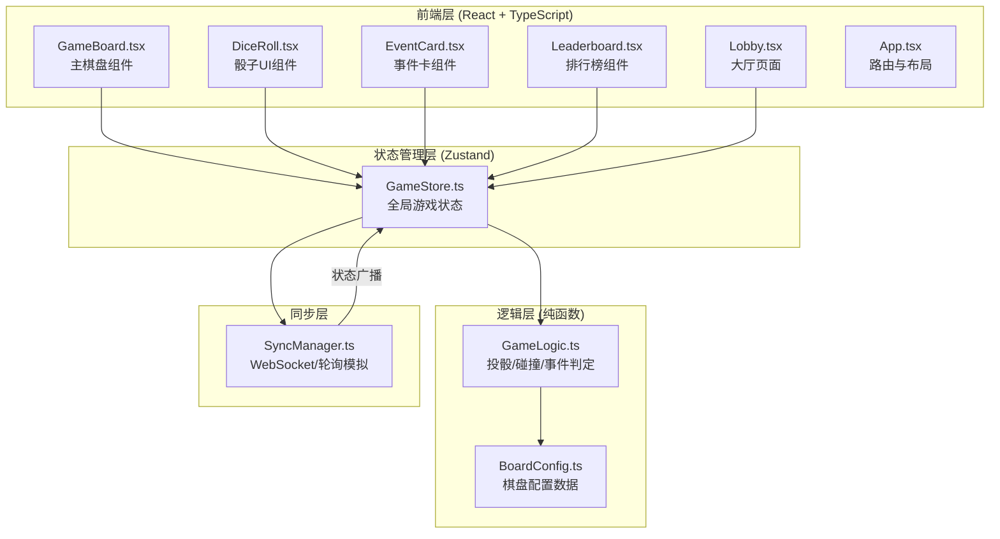

## 1. 架构设计



### 数据流向

1. **用户交互 → Store**：玩家点击骰子/选择棋子/使用事件卡 → 调用GameStore的action
2. **Store → GameLogic**：Store调用GameLogic纯函数（传入骰子点数+棋盘状态） → 返回新位置+碰撞/事件结果
3. **Store → 同步**：状态更新后通过SyncManager广播至其他客户端
4. **同步 → Store**：收到远端状态后，对比时间戳差值决定插值或跳转
5. **Store → UI**：Zustand状态变化触发React组件重渲染

## 2. 技术说明

- 前端：React@18 + TypeScript（严格模式）+ Vite + Zustand
- 初始化工具：vite-init（react-ts模板）
- 后端：无（纯前端，WebSocket通过轮询模拟实时同步）
- 数据库：无（游戏状态全部在内存/Zustand store中管理）
- 关键依赖：react, react-dom, typescript, vite, zustand, uuid

## 3. 路由定义

| 路由 | 用途 |
|------|------|
| / | 大厅页面：昵称输入、房间创建/加入 |
| /game | 游戏主页面：棋盘、骰子、事件卡、排行榜 |

## 4. 文件结构与调用关系

```
project/
├── package.json              # 依赖与脚本
├── vite.config.js            # Vite构建配置
├── tsconfig.json             # TypeScript严格模式配置
├── index.html                # 入口HTML
└── src/
    ├── main.tsx              # React入口，渲染App
    ├── App.tsx               # 路由配置与全局布局
    ├── types.ts              # 全局类型定义
    ├── BoardConfig.ts        # 棋盘配置（28格坐标、分区、特殊标记）
    ├── GameLogic.ts          # 纯函数模块（投骰、碰撞判定、事件卡触发）
    ├── GameStore.ts          # Zustand store（玩家、棋子、回合、事件队列）
    ├── SyncManager.ts        # 实时同步（轮询模拟WebSocket）
    ├── GameBoard.tsx         # 主棋盘组件
    ├── DiceRoll.tsx          # 骰子UI组件（3D旋转动画）
    ├── EventCard.tsx         # 事件卡组件（翻转特效+文字说明）
    ├── Leaderboard.tsx       # 排行榜面板组件
    ├── Lobby.tsx             # 大厅页面组件
    ├── VictoryPanel.tsx      # 胜利面板组件
    └── index.css             # 全局样式（Tailwind + 自定义CSS变量）
```

### 各文件间调用关系

| 调用方 | 被调用方 | 说明 |
|--------|----------|------|
| App.tsx | GameBoard.tsx, Lobby.tsx | 路由切换，游戏页/大厅页 |
| GameBoard.tsx | GameStore.ts | 读取棋盘状态、当前回合、事件队列 |
| GameBoard.tsx | DiceRoll.tsx | 渲染骰子组件 |
| GameBoard.tsx | EventCard.tsx | 渲染事件卡组件 |
| GameBoard.tsx | Leaderboard.tsx | 渲染排行榜面板 |
| GameBoard.tsx | VictoryPanel.tsx | 胜利时渲染胜利面板 |
| DiceRoll.tsx | GameStore.ts | 投掷后调用store.rollDice() |
| EventCard.tsx | GameStore.ts | 使用事件卡后调用store.useEventCard() |
| GameStore.ts | GameLogic.ts | 调用纯函数计算移动/碰撞/事件结果 |
| GameStore.ts | SyncManager.ts | 状态变更后广播，接收远端状态 |
| GameLogic.ts | BoardConfig.ts | 读取棋盘配置（格子坐标、分区、特殊标记） |
| SyncManager.ts | GameStore.ts | 接收远端状态更新，调用store.applyRemoteState() |

## 5. 数据模型

### 5.1 核心类型定义

```typescript
interface Player {
  id: string;
  name: string;
  color: PlayerColor;
  pieces: Piece[];
  eventCards: EventCardType[];
  isCurrentTurn: boolean;
}

type PlayerColor = 'red' | 'blue' | 'yellow' | 'green';

interface Piece {
  id: string;
  position: number;       // -1=起点待出发, 0-27=棋盘格, 28=终点归位
  isHome: boolean;        // 是否已归位
}

interface BoardCell {
  index: number;
  zone: 'red' | 'blue' | 'yellow' | 'green' | 'center';
  x: number;
  y: number;
  isStart: boolean;
  isEvent: boolean;       // 星号标记=事件格
  isShortcut: boolean;    // 箭头标记=捷径入口
  shortcutTarget?: number;
}

type EventCardType = 'advance2_clear' | 'retreat3_collision' | 'teleport_ally';

interface GameState {
  players: Player[];
  currentPlayerIndex: number;
  diceValue: number | null;
  isRolling: boolean;
  phase: 'waiting' | 'rolling' | 'moving' | 'event' | 'finished';
  eventQueue: GameEvent[];
  winner: string | null;
  timestamp: number;
}

interface GameEvent {
  type: 'collision' | 'event_card' | 'shortcut' | 'turn_timeout';
  description: string;
  affectedPieces: string[];
  timestamp: number;
}
```

### 5.2 棋盘配置

- 4×7回形跑道，共28格（编号0-27）
- 四角区各4格：红区(0-3)、蓝区(7-10)、黄区(14-17)、绿区(21-24)
- 中央区12格：(4-6, 11-13, 18-20, 25-27)
- 特殊格子：事件格（星号）、捷径格（箭头→跳转目标格）
- 每位玩家起点：红0、蓝7、黄14、绿21

## 6. 性能约束

- 棋盘状态更新频率 ≥ 30fps（requestAnimationFrame驱动插值动画）
- 碰撞判定响应时间 < 100ms（GameLogic纯函数同步计算）
- 骰子动画时长 ≤ 1秒（CSS 3D transform动画）
- 棋子移动插值动画 0.3秒（requestAnimationFrame逐帧插值）
- 同步插值阈值：时间戳差 < 200ms渐进调整，≥ 200ms直接跳转
