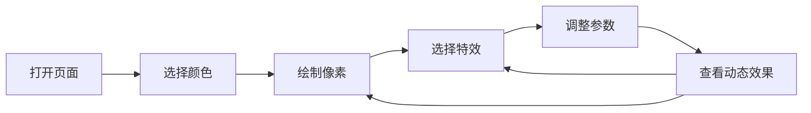

## 1. 产品概述

在线动态像素艺术生成器，用户可在网格画布上逐像素绘制图案，并一键应用多种动态特效（水波、星点、火焰、雪花），让静态像素图动起来，支持随时切换主题和调整特效参数。

- 目标用户：像素艺术爱好者、创意工作者、游戏开发者
- 产品价值：提供简单易用的像素绘制与动态特效工具，快速生成有趣的动态像素作品

## 2. 核心功能

### 2.1 功能模块

1. **主页面**：像素网格画布、调色板、特效控制面板、帧率监视器

### 2.2 页面详情

| 页面名称 | 模块名称 | 功能描述 |
|----------|----------|----------|
| 主页面 | 像素网格画布 | 30x30/50x50可调整网格，单击填充颜色，右键取消填充，浅蓝色发光边框，1px半透明白色网格线 |
| 主页面 | 调色板 | 32种预设色（色相环排列圆点）+ 自定义取色器，选中时圆点脉动放大效果 |
| 主页面 | 特效控制面板 | 4个特效卡片（水波、星点、火焰、雪花），每个含滑块（强度0-100）和开关按钮 |
| 主页面 | 帧率监视器 | 左上角显示当前帧率，半透明黑色方块白色数字 |

## 3. 核心流程

用户打开页面 → 在调色板选择颜色 → 在画布上单击绘制像素 → 在特效面板选择并开启特效 → 拖动滑块调整特效参数 → 查看动态效果 → 可继续编辑画布或切换特效

## 4. 用户界面设计

### 4.1 设计风格

- **主色调**：深灰到黑色渐变背景 (#1a1a2e → #16213e)
- **强调色**：浅蓝色发光 (rgba(100,200,255,0.3))、绿色激活态 (#00ff88)
- **卡片风格**：半透明毛玻璃效果 (rgba(255,255,255,0.08)，12px模糊)，圆角12px，悬停时上移4px
- **字体**：现代无衬线字体，白色为主
- **动画**：0.2s脉动放大、0.3s透明度过渡、平滑滑块渐变

### 4.2 页面设计概览

| 页面名称 | 模块名称 | UI 元素 |
|----------|----------|---------|
| 主页面 | 像素画布 | 居中布局、发光边框、网格线、可交互像素格 |
| 主页面 | 调色板 | 底部布局、32色圆点色相环、取色器输入框、选中脉动效果 |
| 主页面 | 特效面板 | 右侧280px宽度、毛玻璃背景、4个特效卡片、悬停上移效果 |
| 主页面 | 帧率监视器 | 左上角小号方块、半透明黑底、白色数字 |

### 4.3 响应式

桌面端优先，特效面板在画布右侧；窄屏下特效面板可移至画布下方。
