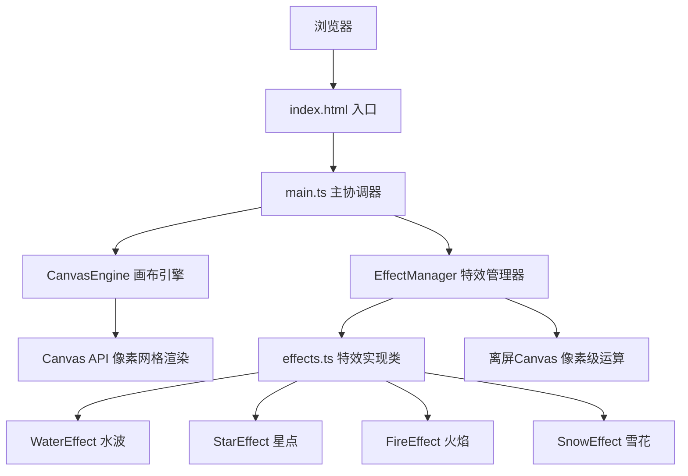

## 1. 架构设计



## 2. 技术说明

- **前端**：原生 TypeScript + Vite，无前端框架
- **渲染技术**：HTML5 Canvas API + 离屏Canvas进行特效像素运算
- **性能优化**：requestAnimationFrame 驱动渲染循环，5秒无操作自动暂停
- **目标帧率**：30x30网格 ≥ 30fps，50x50网格 ≥ 20fps

## 3. 文件结构

```
├── package.json           # 依赖与脚本配置
├── index.html             # HTML入口
├── tsconfig.json          # TypeScript严格模式配置
├── vite.config.js         # Vite构建配置
└── src/
    ├── main.ts            # 入口协调器：事件绑定、状态管理
    ├── canvasEngine.ts    # 画布引擎：网格绘制、像素填充、取色
    ├── effectManager.ts   # 特效管理器：实例化、参数更新、渲染循环
    └── effects.ts         # 特效实现：WaterEffect/StarEffect/FireEffect/SnowEffect
```

## 4. 核心类与接口设计

### 4.1 CanvasEngine
```typescript
class CanvasEngine {
  constructor(canvas: HTMLCanvasElement, gridSize: number, pixelSize: number)
  drawGrid(): void
  fillPixel(x: number, y: number, color: string): void
  clearPixel(x: number, y: number): void
  clearGrid(): void
  getPixelData(): Uint8ClampedArray
  getGridSize(): number
}
```

### 4.2 EffectManager
```typescript
class EffectManager {
  constructor(offscreenCanvas: HTMLCanvasElement)
  activate(effectName: string): void
  deactivate(effectName: string): void
  setParam(effectName: string, param: string, value: number): void
  render(baseImageData: ImageData): ImageData
  start(): void
  stop(): void
}
```

### 4.3 特效接口
```typescript
interface IEffect {
  active: boolean
  intensity: number
  params: Record<string, number>
  render(pixelData: ImageData, width: number, height: number, time: number): ImageData
}
```

## 5. 性能策略

1. **离屏Canvas渲染**：所有特效在离屏Canvas上进行像素级运算
2. **requestAnimationFrame**：统一渲染循环，保证帧率稳定
3. **智能暂停**：5秒无用户操作自动暂停渲染，活动时立即恢复
4. **像素数据复用**：避免重复创建ImageData对象，使用TypedArray操作
