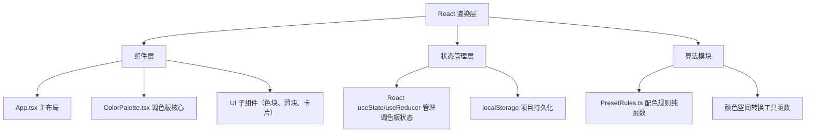

## 1. 架构设计
纯前端单页应用，无后端服务，数据通过浏览器localStorage持久化存储。



## 2. 技术描述
- 前端框架：React 18 + TypeScript
- 构建工具：Vite 5 + @vitejs/plugin-react
- 样式方案：原生 CSS + CSS 变量，不引入UI框架以实现极简定制风格
- 状态管理：React Hooks（useState, useEffect, useCallback, useRef）
- 数据存储：localStorage
- 图标：lucide-react
- 性能优化：CSS transform 动画、will-change 提示、requestAnimationFrame、React.memo 避免不必要重渲染

## 3. 模块划分与文件结构
```
├── index.html
├── package.json
├── vite.config.js
├── tsconfig.json
└── src/
    ├── main.tsx              # ReactDOM 渲染入口
    ├── App.tsx               # 主布局：左侧面板 + 右侧调色板
    ├── ColorPalette.tsx      # 调色板核心组件
    ├── PresetRules.ts        # 预设配色规则算法（纯函数）
    ├── utils/
    │   └── colorUtils.ts     # HEX/RGB/HSL 颜色转换与和谐算法
    ├── components/
    │   ├── ColorSwatch.tsx   # 单个色块组件
    │   ├── Slider.tsx        # 亮度/饱和度滑块
    │   ├── ProjectCard.tsx   # 已保存项目卡片
    │   └── ControlPanel.tsx  # 左侧控制面板
    ├── hooks/
    │   └── useLocalStorage.ts # localStorage Hook
    └── styles/
        └── global.css        # 全局样式与 CSS 变量
```

## 4. 数据模型
### 4.1 色块数据结构
```typescript
interface ColorItem {
  id: string;
  hex: string;
  name?: string;
}
```

### 4.2 保存项目数据结构
```typescript
interface SavedProject {
  id: string;
  name: string;
  colors: ColorItem[];
  createdAt: number;
}
```

### 4.3 localStorage Key
```
palette-projects: SavedProject[]
```

## 5. 关键算法说明
### 5.1 配色规则算法（PresetRules.ts）
- 单色（Monochromatic）：基于基准色调整亮度生成同色系
- 互补色（Complementary）：基准色 + 色相180°互补色
- 三角配色（Triadic）：色相均匀间隔120°的三色
- 四阶配色（Tetradic）：两对等距互补色，色相间隔60°
- 类似色（Analogous）：相邻色相±30°范围内的和谐色

### 5.2 相邻色块和谐同步
调整某色块亮度/饱和度时，相邻色块色相自动微调±3°以内，使用加权平均保持整体和谐感。

### 5.3 性能保障
- 色块使用 CSS transform 处理拖动和动画，触发 GPU 合成层
- 颜色计算使用纯函数，配合 useMemo 缓存
- 动画使用 CSS transition，避免 JS 动画主线程阻塞
- 50色块压测：通过 React.memo + 局部状态更新维持 50fps+
