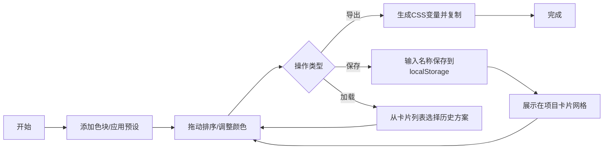

## 1. 产品概述
配色方案设计与分享应用，帮助设计师和开发者在项目初期快速创建、调整和保存配色方案，解决色彩搭配反复沟通、难以直观比较的问题。
- 目标用户：前端设计师、UI/UX设计师、前端开发者
- 产品价值：提供直观的色彩操作体验，支持多种配色规则和一键导出CSS变量，加速设计决策流程

## 2. 核心功能

### 2.1 功能模块
1. **调色板管理**：添加/删除/拖动排序色块、颜色输入（HEX/RGB）、取色器、亮度/饱和度调整
2. **预设配色规则**：单色、互补、三角、四阶、类似色5种规则一键应用
3. **项目保存与加载**：命名保存到localStorage、网格卡片展示、悬停交互、加载动画
4. **代码导出**：一键生成CSS变量代码片段、复制反馈

### 2.3 页面详情
| 页面名称 | 模块名称 | 功能描述 |
|---------|---------|---------|
| 主应用 | 左侧控制面板 | 添加色块按钮、预设规则选择器、保存项目、已保存项目列表、导出CSS代码 |
| 主应用 | 右侧调色板区域 | 色块网格展示、拖动排序、亮度/饱和度滑块、颜色编辑 |

## 3. 核心流程
用户从左侧面板添加色块或选择预设规则，在右侧调色板中拖动排序和调整颜色参数，满意后命名保存方案；也可从已保存的项目卡片中点击加载历史方案，或点击导出按钮复制CSS变量代码到剪贴板。

## 4. 用户界面设计
### 4.1 设计风格
- 主背景色：暖白色 #faf8f5
- 色块卡片：圆角12px，浅灰柔和阴影
- 左侧面板：固定宽度280px，毛玻璃效果 backdrop-filter: blur(8px)
- 字体：选用优雅的衬线与无衬线字体组合，体现设计工具的专业感
- 动画过渡：所有交互操作300~500ms缓动过渡

### 4.2 页面设计概述
| 页面名称 | 模块名称 | UI元素 |
|---------|---------|--------|
| 主应用 | 左侧控制面板 | 顶部标题区、功能按钮组、预设规则按钮、保存输入框、已保存项目网格、CSS导出区 |
| 主应用 | 右侧调色板区域 | 自适应色块网格、每个色块包含颜色预览、HEX/RGB输入、亮度/饱和度滑块、删除按钮 |

### 4.3 响应式
- 桌面端优先设计（Desktop-first）
- 1024px以下断点：左侧面板折叠为悬浮按钮，点击展开为侧边抽屉
- 色块网格根据容器宽度自动调整列数
- 移动端触控优化：增大点击区域，支持触摸拖动

### 4.4 动效规范
- 色块拖动排序：弹性回位动画 0.3s ease-out
- 应用预设规则：色块从中点向四周扩散排列，颜色渐变过渡 0.5s
- 加载已保存方案：色块逐个弹入动画，间隔80ms
- 项目卡片悬停：上浮6px并显示删除按钮
- 复制按钮：点击后显示"已复制"，1.5s后恢复
