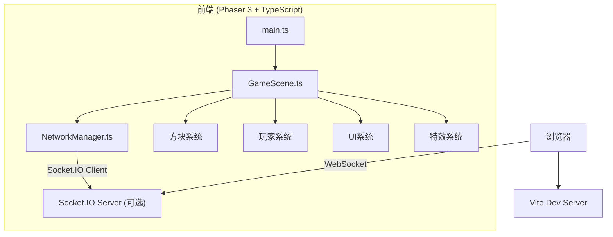

## 1. 架构设计



## 2. 技术说明

- **前端框架**：Phaser 3 + TypeScript
- **构建工具**：Vite 5
- **网络通信**：Socket.IO Client（多人同步）
- **音效**：Web Audio API（程序化生成）
- **后端**：无需独立后端，本地模拟多人场景，Socket.IO 服务端可选

## 3. 项目文件结构

| 文件路径 | 用途 |
|----------|------|
| package.json | 项目依赖和脚本配置 |
| vite.config.js | Vite构建配置 |
| tsconfig.json | TypeScript编译配置 |
| index.html | 入口页面，全屏Canvas |
| src/main.ts | 初始化Phaser游戏实例、场景配置、网络连接 |
| src/scene/GameScene.ts | 游戏主场景：网格、方块、玩家、UI、特效 |
| src/network/NetworkManager.ts | WebSocket客户端：房间、同步、广播 |

## 4. 核心数据结构

### 4.1 方块数据
```typescript
interface Block {
  x: number;
  y: number;
  color: string;
  isIndestructible: boolean;
}
```

### 4.2 玩家数据
```typescript
interface Player {
  id: string;
  name: string;
  x: number;
  y: number;
  hatColor: string;
  isCurrentPlayer: boolean;
}
```

### 4.3 网络消息类型
```typescript
type NetworkMessage =
  | { type: 'player_join'; player: Player }
  | { type: 'player_leave'; playerId: string }
  | { type: 'player_move'; playerId: string; x: number; y: number }
  | { type: 'block_place'; x: number; y: number; color: string }
  | { type: 'block_break'; x: number; y: number }
  | { type: 'world_state'; blocks: Block[]; players: Player[] };
```

### 4.4 预制结构
```typescript
interface Prefab {
  name: string;
  blocks: { dx: number; dy: number; color: string }[];
}
```

## 5. 性能优化策略

1. **对象池**：重复利用方块精灵和粒子对象，避免频繁创建销毁
2. **脏矩形渲染**：仅更新变化的方块区域
3. **输入节流**：方块操作输入节流50ms，防止操作过于频繁
4. **插值平滑**：玩家位置使用插值过渡，减少网络抖动
5. **延迟补偿**：本地预测+服务器回滚，降低操作感知延迟

## 6. 调色板（16色）

```
#FF0000 #FF7F00 #FFFF00 #00FF00
#00FFFF #0000FF #8B00FF #FF00FF
#FFFFFF #C0C0C0 #808080 #404040
#8B4513 #FFC0CB #A52A2A #228B22
```

## 7. 快速建筑预制结构

### 7.1 小屋
- 7x6 区域
- 墙体棕色、屋顶红色、门黄色、窗户蓝色

### 7.2 桥梁
- 9x3 区域
- 棕色木桥结构，带栏杆

### 7.3 塔楼
- 5x8 区域
- 灰色石头塔身，红色尖顶
