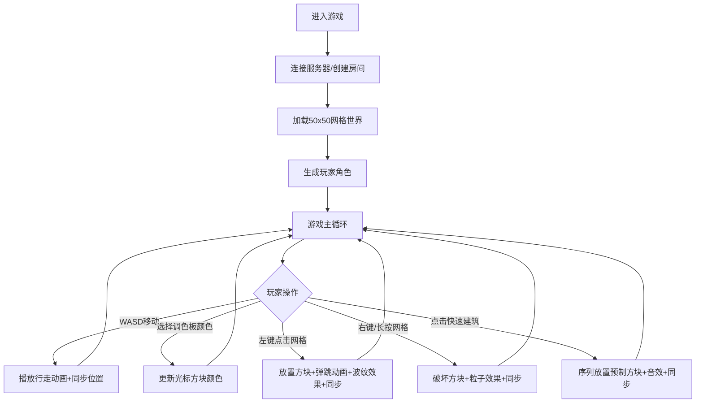

## 1. 产品概述

多人实时合作建造沙盒游戏，支持最多4名玩家在同一网格世界中协作放置和破坏方块，共同搭建建筑或地形。
- 核心价值：提供沉浸式多人协作建造体验，鼓励创造力与社交互动
- 目标用户：喜欢沙盒建造、像素风格游戏的休闲玩家

## 2. 核心功能

### 2.1 用户角色
| 角色 | 注册方式 | 核心权限 |
|------|----------|----------|
| 玩家 | 匿名加入房间 | 放置/破坏方块、移动、使用快速建筑模式 |

### 2.2 功能模块
1. **游戏主场景**：50x50网格世界、方块系统、玩家角色
2. **网络同步系统**：玩家加入/离开、移动同步、方块操作广播
3. **玩家交互系统**：WASD移动、方块放置/破坏、调色板选择
4. **快速建筑系统**：预制结构（小屋、桥梁、塔楼）一键建造
5. **视觉效果系统**：放置/破坏动画、粒子效果、波纹效果、音效
6. **UI界面**：玩家列表、调色板、预制结构按钮

### 2.3 页面详情
| 页面名称 | 模块名称 | 功能描述 |
|----------|----------|----------|
| 游戏主场景 | 网格世界 | 50x50方块网格，底部泥土层不可破坏 |
| 游戏主场景 | 玩家角色 | 带帽子的像素小人，行走动画，最多4人 |
| 游戏主场景 | 方块操作 | 左键放置、右键/长按破坏，0.2秒弹跳动画 |
| 游戏主场景 | 移动系统 | WASD网格移动，行走帧动画 |
| UI界面 | 玩家列表 | 左上角显示所有玩家名字和帽子颜色，当前玩家高亮 |
| UI界面 | 调色板 | 右上角16色调色板（4x4），0.15秒缩放反馈 |
| UI界面 | 快速建筑 | 预制结构按钮（小屋/桥梁/塔楼），序列建造动画+音效 |
| 特效系统 | 破坏粒子 | 5个碎块粒子，0.4秒消失 |
| 特效系统 | 放置波纹 | 向外扩散波纹，0.3秒 |

## 3. 核心流程

玩家进入游戏后自动加入房间，通过WASD控制角色在网格世界中移动，使用调色板选择方块颜色，点击网格放置方块，右键或长按破坏方块。可使用快速建筑模式一键放置预制结构，所有操作实时同步给其他玩家。

## 4. 用户界面设计

### 4.1 设计风格
- 主色调：深蓝紫 #1a1a2e（背景），搭配16种亮色调色板
- 方块风格：像素风格，带柔和描边
- 按钮风格：圆角矩形，像素字体
- UI布局：顶部状态栏半透明黑底，调色板固定右下角，玩家列表左上角

### 4.2 页面设计概览
| 页面名称 | 模块名称 | UI元素 |
|----------|----------|--------|
| 游戏主场景 | 网格世界 | 像素方块、泥土底层、网格线条 |
| 游戏主场景 | 玩家角色 | 像素小人、彩色帽子、行走动画 |
| UI界面 | 玩家列表 | 半透明黑底、玩家头像（帽子颜色）、名字、高亮当前玩家 |
| UI界面 | 调色板 | 16色块4x4网格、选中高亮、0.15秒缩放反馈 |
| UI界面 | 快速建筑按钮 | 圆角矩形按钮、像素字体、悬停效果 |
| 特效系统 | 动画效果 | 方块弹跳、碎块粒子、波纹扩散 |

### 4.3 响应式
- 桌面优先设计，适配1920x1080到1366x768分辨率
- 所有UI元素使用固定比例，窗口缩放时保持位置和大小比例
- Canvas全屏自适应

## 4.4 性能指标
- 帧率：稳定60FPS
- 方块操作响应时间：<50ms
- 网络同步延迟补偿后误差：<100ms
- 网络同步延迟：<200ms
