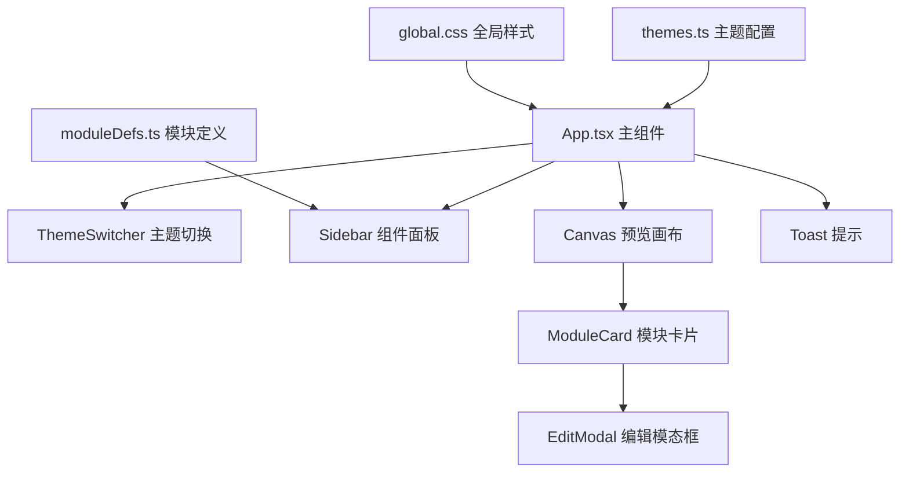

## 1. 架构设计



## 2. 技术描述
- 前端框架：React@18 + TypeScript
- 构建工具：Vite
- 拖拽库：@dnd-kit/core@6、@dnd-kit/sortable@6、@dnd-kit/utilities@6
- 状态管理：React useState/useContext（轻量级场景）
- 唯一ID：uuid
- 初始化方式：Vite手动创建项目结构

## 3. 核心数据模型

### 3.1 模块实例类型
```typescript
interface ModuleStyle {
  backgroundColor: string;
  fontSize: number;
  borderRadius: number;
  padding: number;
}

interface CanvasModule {
  id: string;
  type: string; // 对应moduleDefs中的type
  style: ModuleStyle;
}
```

### 3.2 主题类型
```typescript
interface Theme {
  id: string;
  name: string;
  navbarBg: string;
  navbarText: string;
  sidebarBg: string;
  canvasBg: string;
  moduleBg: string;
  moduleText: string;
  moduleBorder: string;
  moduleShadow: string;
  accent: string;
}
```

### 3.3 模块定义类型
```typescript
interface ModuleDef {
  type: string;
  name: string;
  icon: string;
  defaultStyle: ModuleStyle;
}
```

## 4. 文件结构
```
├── package.json
├── vite.config.js
├── tsconfig.json
├── index.html
└── src/
    ├── App.tsx
    ├── components/
    │   ├── Sidebar.tsx
    │   ├── Canvas.tsx
    │   ├── ModuleCard.tsx
    │   └── ThemeSwitcher.tsx
    ├── data/
    │   └── moduleDefs.ts
    ├── styles/
    │   ├── themes.ts
    │   └── global.css
    └── main.tsx
```

## 5. 性能优化策略
- 拖拽操作使用@dnd-kit优化，确保30FPS以上帧率
- 模块数量限制在20个以内，避免重排卡顿
- CSS过渡动画使用transform和opacity属性，确保GPU加速
- 主题切换使用CSS变量实现全局同步过渡

## 6. 关键交互实现要点
- 拖拽放置：使用DndContext + useDroppable + useDraggable
- 排序重排：使用SortableContext + useSortable
- 动画效果：CSS transitions + keyframes动画
- 模态框：React Portal或条件渲染 + CSS动画
- 数据持久化：JSON导入导出，Blob下载
