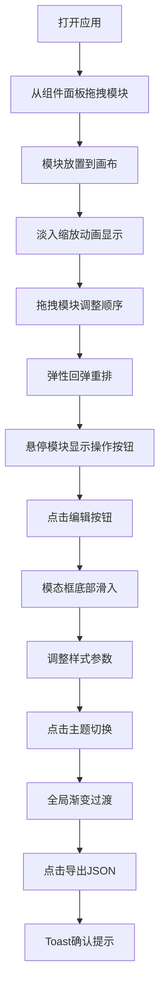

## 1. 产品概述
博客首页布局可视化搭建工具，通过拖拽方式帮助非技术用户快速创建个性化博客首页布局。
- 核心目的：解决静态博客模板千篇一律、非开发者难以调整页面结构的问题
- 目标用户：博客作者、内容创作者、希望自定义博客外观但缺乏前端开发技能的用户
- 产品价值：降低博客页面定制门槛，提供所见即所得的布局搭建体验

## 2. 核心功能

### 2.1 功能模块
1. **组件面板**：左侧可折叠组件列表，包含可拖拽的博客模块
2. **预览画布**：右侧可视化编辑区域，支持模块排序和预览
3. **模块编辑**：单个模块的样式配置能力
4. **主题切换**：全局配色方案切换
5. **数据导入导出**：布局配置的JSON格式导入导出

### 2.2 页面详情
| 页面名称 | 模块名称 | 功能描述 |
|-----------|-------------|---------------------|
| 主页面 | 顶部导航栏 | 主题切换器、导入导出按钮 |
| 主页面 | 左侧组件面板 | 展示可拖拽模块（文章列表、个人简介、标签云、归档日历、社交媒体链接、最近评论），支持折叠为图标条 |
| 主页面 | 右侧预览画布 | 浅灰网格背景，支持拖拽排序，实时预览布局效果 |
| 主页面 | 模块卡片 | 悬停显示编辑/删除按钮，淡入缩放动画进入，拖拽重排带弹性效果 |
| 主页面 | 编辑模态框 | 底部滑入动画，半透明遮罩，调整背景色、字体大小、圆角半径、内边距 |
| 主页面 | Toast提示 | 右下角绿色确认提示，3秒自动淡出 |

## 3. 核心流程
用户从左侧组件面板拖拽模块到右侧画布 → 在画布上拖拽调整模块顺序 → 悬停模块点击编辑按钮调整样式 → 切换主题预览不同配色 → 导出JSON保存布局配置。

## 4. 用户界面设计

### 4.1 设计风格
- 布局风格：卡片式设计，左右分栏布局
- 组件面板：固定280px宽度，可折叠
- 卡片样式：8px圆角，轻微投影（box-shadow: 0 2px 8px rgba(0,0,0,0.1)），悬停投影加深并上移2px
- 画布背景：浅灰网格线（#f0f0f0，网格间隔20px）
- 动画风格：平滑过渡，弹性动效

### 4.2 页面设计概述
| 页面名称 | 模块名称 | UI元素 |
|-----------|-------------|-------------|
| 主页面 | 组件面板 | 垂直列表、拖拽手柄、折叠按钮 |
| 主页面 | 预览画布 | 网格背景、排序容器、放置区域 |
| 主页面 | 模块卡片 | 8px圆角、投影、悬停上移、编辑/删除图标（右上角） |
| 主页面 | 主题切换器 | 6个色板（明亮、暗夜、森林、海洋、复古、糖果），点击切换 |
| 主页面 | 编辑模态框 | 半透明遮罩（50%黑）、底部滑入动画、样式调整表单 |
| 主页面 | Toast提示 | 右下角、绿色、3秒淡出 |

### 4.3 响应式
- 桌面端优先设计
- 组件面板可折叠节省空间
- 画布区域自适应剩余空间

### 4.4 动画规范
- 模块进入：淡入缩放，0.4秒 ease-out
- 模块重排：弹性回弹效果
- 主题切换：所有颜色属性渐变过渡，0.6秒
- 模态框：从底部滑入
- Toast提示：3秒自动淡出
