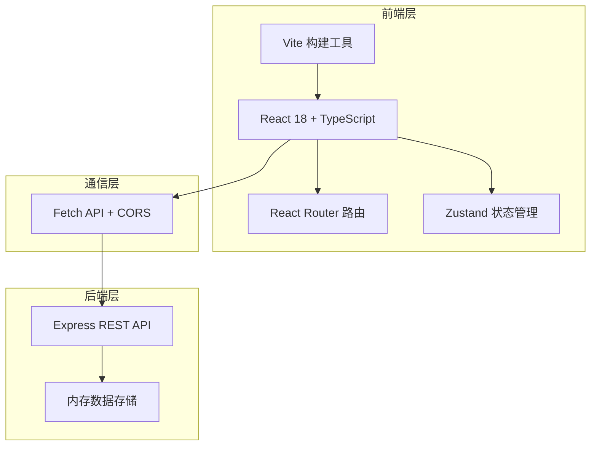
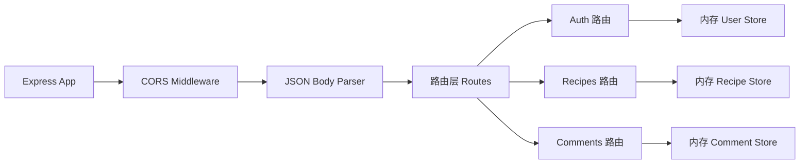
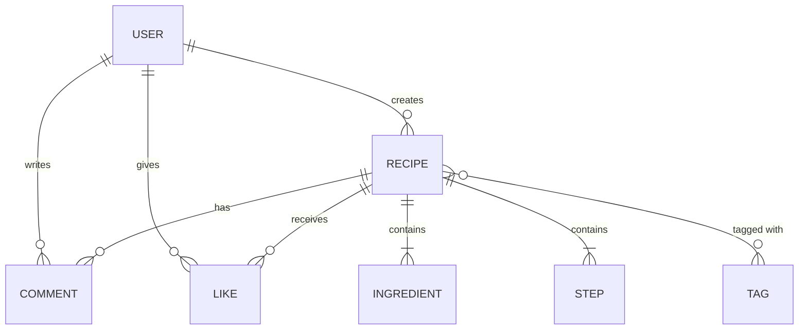

## 1. 架构设计



## 2. 技术描述

- **前端框架**：React 18 + TypeScript（严格模式）
- **构建工具**：Vite + @vitejs/plugin-react
- **路由**：React Router DOM
- **状态管理**：Zustand
- **样式**：CSS Modules / 内联样式（无需Tailwind，使用原生CSS实现暖橙主题）
- **图标**：Lucide React
- **后端**：Express 4.x + TypeScript
- **数据存储**：内存存储（开发阶段）
- **跨域**：cors 中间件
- **ID生成**：uuid

## 3. 路由定义

| 路由 | 用途 |
|------|------|
| `/` | 首页（瀑布流菜谱展示 + 搜索筛选） |
| `/recipe/:id` | 菜谱详情页 |
| `/create` | 创建菜谱页（需登录） |
| `/login` | 登录页 |
| `/register` | 注册页 |

## 4. API 定义

### 4.1 类型定义

```typescript
interface User {
  id: string;
  username: string;
  avatar: string;
}

interface Ingredient {
  id: string;
  name: string;
  amount: string;
}

interface Step {
  id: string;
  description: string;
  image: string;
  order: number;
}

interface Recipe {
  id: string;
  title: string;
  description: string;
  mainImage: string;
  authorId: string;
  author: User;
  ingredients: Ingredient[];
  steps: Step[];
  tags: string[];
  difficulty: 'easy' | 'medium' | 'hard';
  likes: number;
  likedBy: string[];
  averageRating: number;
  createdAt: string;
}

interface Comment {
  id: string;
  recipeId: string;
  userId: string;
  user: User;
  content: string;
  createdAt: string;
}
```

### 4.2 REST API 端点

| 方法 | 路径 | 描述 |
|------|------|------|
| POST | `/api/auth/register` | 用户注册 |
| POST | `/api/auth/login` | 用户登录 |
| GET | `/api/recipes` | 获取菜谱列表（支持 search/tag/difficulty/rating 查询参数） |
| GET | `/api/recipes/:id` | 获取单个菜谱详情 |
| POST | `/api/recipes` | 创建菜谱 |
| POST | `/api/recipes/:id/like` | 点赞菜谱 |
| DELETE | `/api/recipes/:id/like` | 取消点赞 |
| GET | `/api/recipes/:id/comments` | 获取菜谱评论列表 |
| POST | `/api/recipes/:id/comments` | 发表评论 |

## 5. 服务器架构图



## 6. 数据模型

### 6.1 实体关系图



## 7. 项目文件结构

```
.
├── package.json
├── vite.config.ts
├── tsconfig.json
├── index.html
├── src/
│   ├── main.tsx
│   ├── App.tsx
│   ├── components/
│   │   ├── Navbar.tsx
│   │   ├── RecipeCard.tsx
│   │   ├── RecipeForm.tsx
│   │   ├── CommentList.tsx
│   │   └── SearchFilter.tsx
│   ├── pages/
│   │   ├── HomePage.tsx
│   │   ├── RecipeDetailPage.tsx
│   │   ├── CreateRecipePage.tsx
│   │   ├── LoginPage.tsx
│   │   └── RegisterPage.tsx
│   ├── store/
│   │   └── useAuthStore.ts
│   ├── types/
│   │   └── index.ts
│   ├── utils/
│   │   └── api.ts
│   └── styles/
│       └── global.css
└── server/
    ├── index.ts
    ├── data.ts
    └── routes/
        ├── auth.ts
        ├── recipes.ts
        └── comments.ts
```
