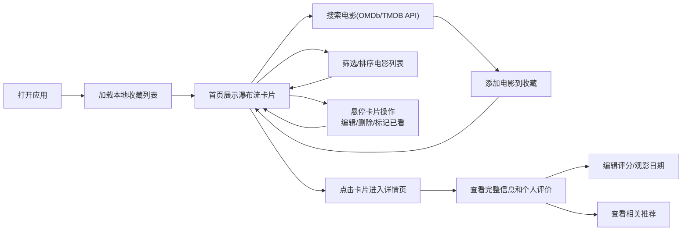

## 1. 产品概述
个人电影收藏管理应用，帮助用户在线管理观影记录，解决手动记录和分类观影信息不够直观、难以追踪的问题。
- 主要目标：提供电影搜索、收藏、评分、筛选等完整功能，打造沉浸式的个人观影记录平台
- 目标用户：电影爱好者、有观影记录习惯的用户
- 产品价值：直观、美观、高效的个人电影库管理体验

## 2. 核心功能

### 2.1 功能模块
1. **首页（电影列表页）**：搜索栏、筛选排序、瀑布流电影卡片展示
2. **电影详情页**：完整电影信息展示、个人评分编辑、同类型/同导演推荐

### 2.2 页面详情
| 页面名称 | 模块名称 | 功能描述 |
|-----------|-------------|---------------------|
| 首页 | 顶部搜索栏 | 毛玻璃效果，支持通过OMDb/TMDB API搜索电影，输入聚焦时边框颜色渐变动画 |
| 首页 | 筛选排序面板 | 按年份、评分、是否已看筛选，按评分或添加日期排序，切换时有300ms渐隐渐显过渡 |
| 首页 | 瀑布流电影卡片 | 海报+基本信息展示，悬停放大1.05倍，淡入显示编辑/删除/标记已看按钮 |
| 首页 | 骨架屏加载 | 列表加载时脉冲闪烁占位动画 |
| 详情页 | 电影详情展示 | 海报、片名、年份、导演、剧情简介完整展示 |
| 详情页 | 个人评价区 | 个人评分(0-10)、观影日期展示与编辑 |
| 详情页 | 相关推荐 | 基于本地收藏库匹配同类型或同导演的其他电影 |

## 3. 核心流程
用户在首页通过搜索栏搜索电影，选择后添加到个人收藏；在首页可通过筛选排序浏览所有收藏电影，悬停卡片可快捷操作；点击卡片进入详情页查看完整信息并管理个人评价。

## 4. 用户界面设计

### 4.1 设计风格
- **主色调**：背景色 #1a1a2e，卡片色 #16213e，强调色 #e94560
- **按钮风格**：圆角、悬停缩放、强调色高亮
- **字体**：采用现代无衬线字体，层次分明
- **布局风格**：全屏响应式、瀑布流卡片布局
- **动效**：悬停放大、渐隐渐显、脉冲闪烁骨架屏

### 4.2 页面设计概述
| 页面名称 | 模块名称 | UI 元素 |
|-----------|-------------|-------------|
| 首页 | 搜索栏 | 毛玻璃半透明背景+10px模糊，输入聚焦时边框颜色渐变动画 |
| 首页 | 筛选面板 | 深色背景，下拉选择器，切换时300ms渐隐渐显过渡 |
| 首页 | 电影卡片 | 深色卡片，海报为主视觉，悬停放大1.05倍，操作按钮淡入显示 |
| 首页 | 骨架屏 | 脉冲闪烁占位符，模拟卡片布局 |
| 详情页 | 详情区域 | 大幅海报，信息分层展示，深色主题延续 |
| 详情页 | 推荐区 | 横向滚动推荐卡片，与主卡片风格一致 |

### 4.3 响应式设计
- 桌面端优先设计
- 瀑布流列数根据屏幕宽度自适应（大屏4列、中屏3列、小屏2列、移动端1列）
- 触控设备优化点击区域大小

### 4.4 性能要求
- 首屏加载后接口请求在2秒内完成
- 列表滚动时保持60fps流畅度
- 使用CSS transform和opacity动画确保性能
