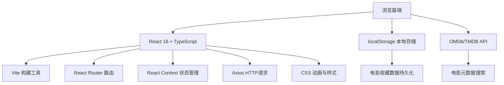
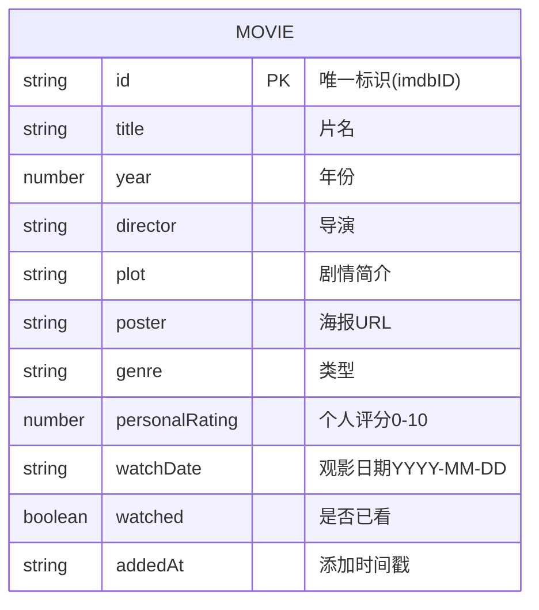

## 1. 架构设计



## 2. 技术说明
- **前端框架**：React@18 + TypeScript
- **构建工具**：Vite
- **路由管理**：react-router-dom@6
- **HTTP 客户端**：axios
- **状态管理**：React Context（按用户要求）
- **数据存储**：浏览器 localStorage
- **外部服务**：OMDb 或 TMDB 开放 API

## 3. 路由定义
| 路由 | 用途 |
|-------|---------|
| / | 首页 - 电影列表、搜索、筛选排序 |
| /movie/:id | 详情页 - 电影详情、个人评价、相关推荐 |

## 4. 数据模型

### 4.1 数据模型定义



### 4.2 TypeScript 类型定义

```typescript
interface Movie {
  id: string;
  title: string;
  year: number;
  director: string;
  plot: string;
  poster: string;
  genre: string;
  personalRating: number | null;
  watchDate: string | null;
  watched: boolean;
  addedAt: string;
}

interface SearchResult {
  id: string;
  title: string;
  year: string;
  poster: string;
  type: string;
}

interface FilterState {
  year: number | null;
  minRating: number | null;
  watched: boolean | null;
  sortBy: 'rating' | 'addedAt';
  sortOrder: 'asc' | 'desc';
}
```

## 5. 文件结构

```
d:\Solocoder\VersionFast\tasks\auto2\
├── package.json
├── index.html
├── vite.config.ts
├── tsconfig.json
└── src/
    ├── App.tsx              # 主应用，路由+Context状态管理
    ├── types/
    │   └── index.ts         # 类型定义
    ├── components/
    │   ├── MovieCard.tsx    # 电影卡片组件
    │   ├── MovieList.tsx    # 电影列表(瀑布流+筛选排序)
    │   ├── SearchBar.tsx    # 搜索栏组件
    │   ├── FilterPanel.tsx  # 筛选排序面板
    │   └── SkeletonCard.tsx # 骨架屏组件
    ├── pages/
    │   ├── HomePage.tsx     # 首页
    │   └── MovieDetailPage.tsx # 详情页
    ├── context/
    │   └── MovieContext.tsx # 全局状态Context
    └── utils/
        ├── storage.ts       # localStorage封装
        └── api.ts           # OMDb/TMDB API封装
```

## 6. 核心模块职责

| 模块 | 职责 |
|------|------|
| storage.ts | 封装localStorage读写，提供电影CRUD接口，数据持久化 |
| api.ts | 封装OMDb/TMDB API调用，处理搜索和详情获取 |
| MovieContext.tsx | 全局状态管理：电影列表、筛选状态、加载状态 |
| MovieCard.tsx | 单张电影卡片UI展示，悬停交互（放大1.05倍，淡入按钮） |
| MovieList.tsx | 瀑布流布局渲染，筛选排序逻辑，300ms过渡动画 |
| SearchBar.tsx | 毛玻璃搜索栏，API搜索，聚焦动画 |
| MovieDetailPage.tsx | 详情展示，评分/日期编辑，相关推荐匹配 |
