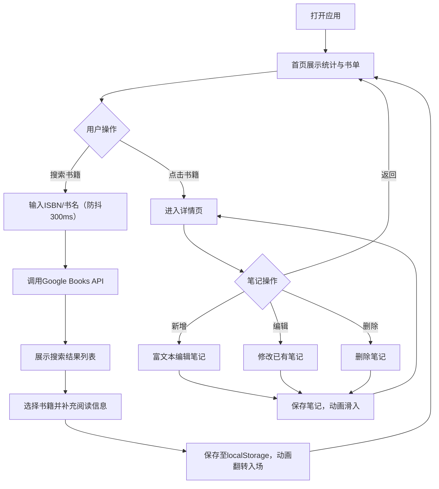

## 1. 产品概述

个人阅读书单与读书笔记管理应用，解决纸质和电子书籍阅读记录分散、读书笔记难以系统整理和回顾的问题，为热爱阅读的用户提供一站式阅读追踪与知识沉淀平台。

- 目标用户：有阅读习惯、需要系统化管理书单和笔记的读者
- 核心价值：快速记录阅读进度、高效整理读书笔记、直观展示阅读成果

## 2. 核心功能

### 2.1 用户角色

| 角色 | 注册方式 | 核心权限 |
|------|----------|----------|
| 普通用户 | 无需注册（本地存储） | 管理个人书单、添加/编辑/删除笔记、查看阅读统计 |

### 2.2 功能模块

1. **首页看板**：阅读统计概览、标签词云、书籍列表展示与搜索
2. **书籍详情页**：书籍信息展示、笔记列表、笔记富文本编辑

### 2.3 页面详情

| 页面名称 | 模块名称 | 功能描述 |
|-----------|-------------|---------------------|
| 首页 | 统计看板 | 展示总阅读量、本月阅读量、平均评分、标签词云 |
| 首页 | 书籍搜索 | 通过ISBN或书名调用Google Books API搜索书籍，输入防抖300ms |
| 首页 | 书籍列表 | 三列网格展示书籍卡片，支持点击进入详情 |
| 首页 | 添加书籍 | 从搜索结果选择书籍添加，补充阅读状态、评分、日期 |
| 详情页 | 书籍信息 | 左侧展示书封、作者、出版社、页数、简介、阅读状态、评分、日期 |
| 详情页 | 笔记列表 | 右侧按创建时间逆序展示笔记，显示字数统计 |
| 详情页 | 笔记编辑 | 富文本编辑器（加粗、斜体、列表、插入图片），支持新增/编辑/删除 |

## 3. 核心流程

用户打开应用 → 首页展示阅读统计和已有书单 → 搜索新书籍并添加（自动获取书籍信息，手动补充阅读状态） → 点击书籍进入详情 → 查看/添加/编辑/删除读书笔记 → 返回首页查看统计更新

## 4. 用户界面设计

### 4.1 设计风格

- **主色调**：米白 `#f7f3ee`（背景）、深蓝 `#1a3a5c`（文字/强调）
- **辅助色**：浅灰 `#d6d0c8`（卡片阴影）、深灰 `#b0a99f`（悬停阴影）
- **卡片样式**：柔和圆角 12px，浅灰阴影
- **字体**：衬线体与无衬线体搭配，营造书香氛围
- **布局风格**：卡片式网格布局，海洋风格配色营造沉静阅读氛围

### 4.2 页面设计概览

| 页面名称 | 模块名称 | UI元素 |
|-----------|-------------|-------------|
| 首页 | 统计看板 | 四个统计卡片 + 标签词云，词云逐个放大渐入动画 |
| 首页 | 搜索框 | 圆角输入框，搜索按钮悬停变色（0.2s），点击缩放（0.95→1） |
| 首页 | 书籍网格 | 三列网格，卡片含书封+书名，悬停上移3px加深阴影 |
| 详情页 | 左侧信息区 | 书封大图 + 详细信息，1px虚线与右侧分隔 |
| 详情页 | 右侧笔记区 | 笔记卡片列表，新笔记从左向右滑入（0.3s ease-out） |

### 4.3 响应式设计

- **桌面端（>768px）**：三列网格布局
- **平板端（≤768px）**：单列网格布局
- **移动端（≤480px）**：卡片宽度90%居中显示
- 触控区域 ≥ 44px × 44px

### 4.4 动效设计

- **添加书籍**：书封从底部向上翻转动画，0.4秒，带轻微阴影变化
- **新增笔记**：卡片从左向右滑入，0.3秒 ease-out
- **词云加载**：逐个放大渐变动画
- **按钮交互**：悬停颜色切换 0.2秒，点击缩放至0.95再恢复
- **卡片悬停**：上移3px，阴影从 `#d6d0c8` 加深至 `#b0a99f`

## 5. 性能要求

- 搜索输入防抖：300ms
- 本地数据读写延迟：≤ 100ms
- 页面首次渲染时间：< 1.5秒
