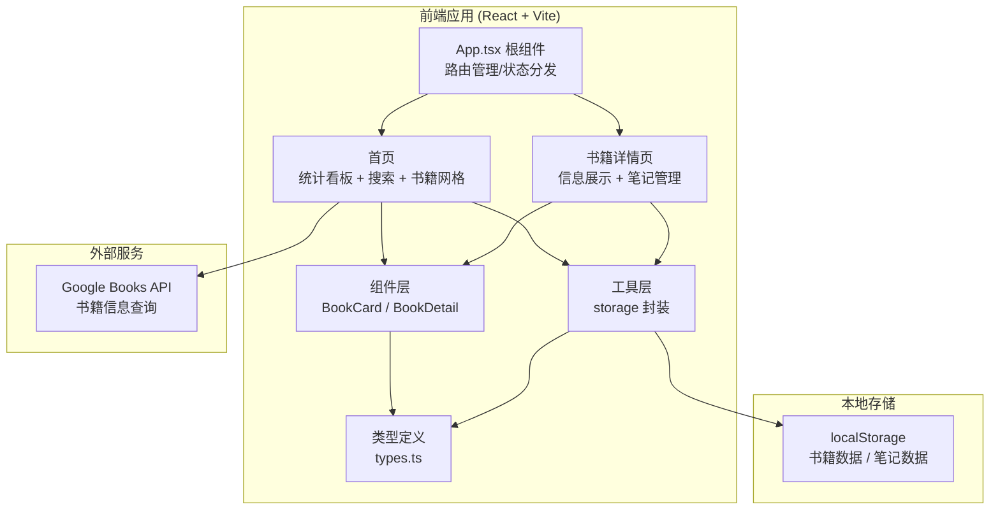
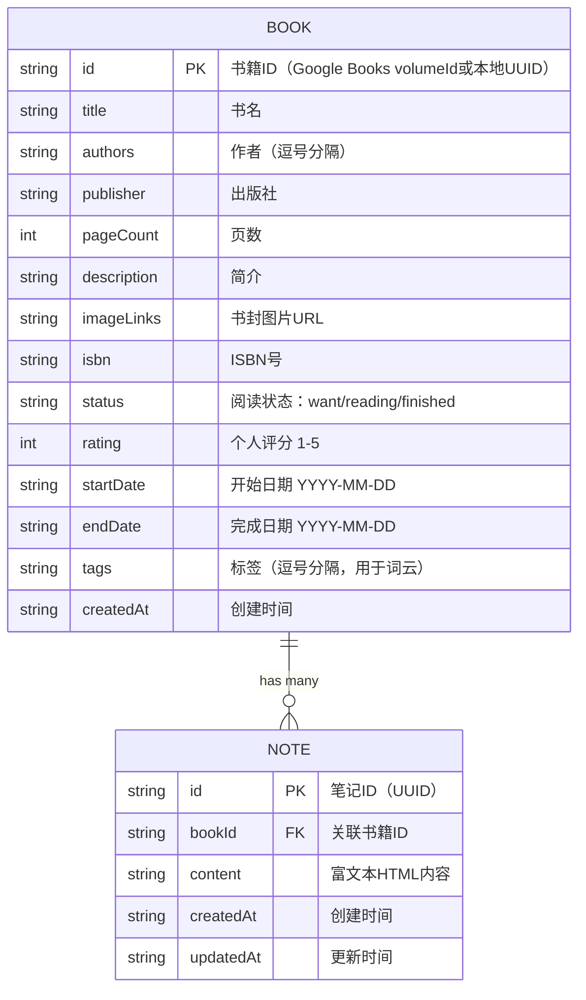

## 1. 架构设计



## 2. 技术说明

- **前端框架**：React 18 + TypeScript
- **构建工具**：Vite
- **路由管理**：简单状态路由（App.tsx 内部分发）
- **HTTP请求**：axios（调用 Google Books API）
- **数据持久化**：localStorage（封装为异步 Promise API）
- **样式方案**：原生 CSS（CSS 变量统一主题，CSS 动画）

## 3. 路由定义

| 路由（视图状态） | 用途 |
|-------|---------|
| home | 首页：阅读统计、书籍搜索、书单展示 |
| detail | 详情页：书籍信息、笔记列表、笔记编辑 |

## 4. 数据模型

### 4.1 类型定义



### 4.2 localStorage 存储结构

- Key: `reading_books` → Book[]
- Key: `reading_notes` → Note[]

## 5. 文件结构

```
├── package.json
├── vite.config.js
├── tsconfig.json
├── index.html
└── src/
    ├── types.ts          # Book / Note 等类型定义
    ├── App.tsx           # 根组件：路由、状态、分发
    ├── components/
    │   ├── BookCard.tsx  # 书籍卡片组件
    │   └── BookDetail.tsx # 书籍详情 + 笔记管理
    ├── utils/
    │   └── storage.ts    # localStorage CRUD 封装
    └── index.css         # 全局样式 + CSS 变量 + 动画
```

## 6. 工具方法 API

所有 storage 方法返回 `Promise<T>`，模拟异步操作（内含 setTimeout ≤ 100ms）：

| 方法 | 签名 | 说明 |
|------|------|------|
| getBooks | `() => Promise<Book[]>` | 获取所有书籍 |
| saveBook | `(book: Book) => Promise<Book>` | 新增或更新书籍 |
| deleteBook | `(id: string) => Promise<void>` | 删除书籍及其笔记 |
| getNotes | `(bookId?: string) => Promise<Note[]>` | 获取笔记，可选按书籍过滤 |
| saveNote | `(note: Note) => Promise<Note>` | 新增或更新笔记 |
| deleteNote | `(id: string) => Promise<void>` | 删除单条笔记 |

## 7. 性能优化

- **搜索防抖**：`useDebounce` hook，300ms 延迟触发 API 请求
- **localStorage 封装**：异步读写，避免阻塞主线程，单次延迟 ≤ 100ms
- **首次渲染**：Vite 冷启动 + 轻量组件，目标 FCP < 1.5s
- **动画**：全部使用 CSS transform / opacity，触发 GPU 合成
