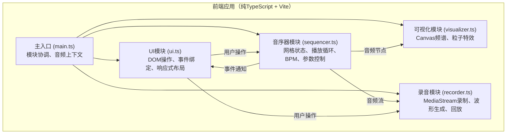

## 1. 架构设计



## 2. 技术描述
- **前端框架**：无（原生DOM + TypeScript），符合用户"不使用任何框架"要求
- **构建工具**：Vite（vite.config.js启用TypeScript）
- **音频技术**：Web Audio API（OscillatorNode、GainNode、StereoPannerNode、AnalyserNode、MediaStreamDestination）
- **可视化技术**：Canvas 2D API（requestAnimationFrame驱动）
- **录音技术**：MediaStream Recording API（MediaRecorder）
- **类型系统**：TypeScript严格模式（strict: true），ESNext模块，target ES2020

## 3. 目录结构
```
auto25/
├── package.json
├── vite.config.js
├── tsconfig.json
├── index.html
└── src/
    ├── main.ts        # 应用入口，协调各模块
    ├── sequencer.ts   # 音序器核心
    ├── visualizer.ts  # 频谱可视化
    ├── recorder.ts    # 录音回放
    └── ui.ts          # UI搭建与事件
```

## 4. 核心数据模型

### 4.1 类型定义
```typescript
// 乐器音色定义
interface Instrument {
  id: string;
  name: string;
  icon: string;      // Unicode字符
  color: string;
  frequency: number; // 基础频率
  type: OscillatorType;
}

// 音色参数
interface InstrumentParams {
  volume: number;     // 0-100
  pan: number;        // -100 to +100
  detune: number;     // -12 to +12 半音
  arpEnabled: boolean;
  arpRate: 1 | 2 | 4; // 速率倍率
}

// 网格状态
type GridState = boolean[][]; // 8行 x N列

// 预设模板
interface Preset {
  name: string;
  grid: GridState;
}

// 录音数据
interface Recording {
  id: string;
  blob: Blob;
  waveform: number[];
  duration: number;
  bars: number;
}
```

### 4.2 事件发射器接口
```typescript
interface SequencerEvents {
  'step': (col: number) => void;
  'play': () => void;
  'pause': () => void;
  'bpmChange': (bpm: number) => void;
  'gridChange': (grid: GridState) => void;
  'paramChange': (instId: string, params: InstrumentParams) => void;
  'arpRateChange': (colCount: number) => void;
}
```

## 5. 模块职责与通信

### 5.1 sequencer.ts - 音序器核心
- 维护8xN网格状态（N随琶音器倍率变化：16/32/64）
- 使用Web Audio API合成8种音色（底鼓、军鼓、镲片、贝斯、和弦、主音、琶音、打击乐）
- 基于AudioContext.currentTime的精确计时器，驱动step事件
- 管理每轨的GainNode、StereoPannerNode、detune参数
- 琶音器逻辑：启用时按倍率对网格列进行插值步进
- 事件发射器：通知UI步进、播放状态、参数变化

### 5.2 visualizer.ts - 频谱可视化
- 接收AnalyserNode的时域/频域数据
- Canvas 2D绘制频谱条（30fps定时刷新）
- 粒子系统：激活时发射30个粒子，生命力1秒，向上扩散
- 颜色渐变：底部#2196f3 → 顶部#f44336
- 非激活状态微闪烁动画

### 5.3 recorder.ts - 录音回放
- MediaStreamDestination捕获音频输出
- MediaRecorder录制最多16小节（自动停止）
- 离线分析录制音频生成波形数据（采样点）
- Canvas绘制贝塞尔曲线波形图，绿到紫时间渐变
- 回放时AudioBufferSourceNode播放，进度指示同步移动

### 5.4 ui.ts - 用户界面
- 动态生成网格DOM元素（8行×动态列）
- 推子（input range自定义样式）、声像旋钮、音高微调
- BPM滑块（脉冲光晕CSS动画）
- 预设按钮组（刷新动画：随机顺序逐个点亮再熄灭，0.5秒）
- 响应式布局监听（matchMedia）
- 所有事件绑定与状态同步

### 5.5 main.ts - 应用入口
- 创建AudioContext（用户首次交互时resume）
- 实例化SequencerModule、VisualizerModule、RecorderModule
- 搭建UI（调用ui.ts）
- 连接各模块：音序器音频输出→可视化分析器→录音目标
- 启动渲染循环
