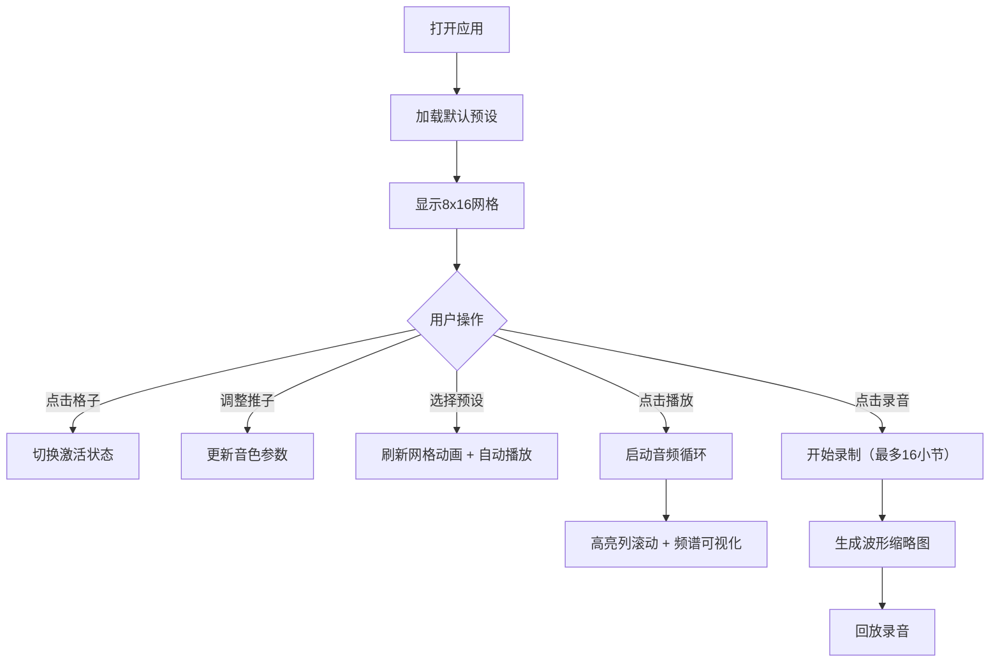

## 1. 产品概述
合成器音序器是一款面向音乐制作初学者的交互式节拍生成应用，帮助用户在缺乏硬件设备时直观理解节奏编排和音色叠加原理。
- 核心目标：提供可视化、可交互的音乐节奏编排工具，降低电子音乐制作入门门槛
- 目标用户：音乐制作初学者、音乐爱好者、教育场景中的学生
- 市场价值：填补网页端轻量级合成教学工具的空白，无需安装即可使用

## 2. 核心功能

### 2.1 功能模块
1. **主页面**：音序器网格、控制面板、频谱可视化、录音回放、预设模板

### 2.2 页面详情
| 页面名称 | 模块名称 | 功能描述 |
|-----------|-------------|---------------------|
| 主页面 | 8x16节拍网格 | 每行代表一种乐器（底鼓、军鼓、镲片、贝斯、和弦、主音、琶音、打击乐），每列代表16分音符，点击切换激活状态，播放时高亮列从左到右滚动 |
| 主页面 | 播放控制区 | 播放/暂停按钮、BPM滑块（120-180）、录音按钮，按钮悬停放大1.05倍并变全色 |
| 主页面 | 音色控制面板 | 每个音色独立的音量推子(0-100)、声像控制(-100到+100)、音高微调(-12到+12半音)、琶音器开关及速率倍率(x1/x2/x4) |
| 主页面 | 频谱可视化区 | 右侧Canvas实时绘制频谱条和粒子特效，颜色从蓝到红渐变，激活时发射粒子 |
| 主页面 | 预设模板区 | 6个预设（摇滚、电子、嘻哈、拉丁、爵士、自定义），切换时网格刷新动画，自动播放 |
| 主页面 | 录音回教区 | 录制最多16小节，生成贝塞尔曲线波形缩略图，回放时进度指示移动 |

## 3. 核心流程
用户打开页面 → 选择预设模板或手动编排网格 → 调整音色参数（音量/声像/音高/琶音器） → 播放试听 → 录制演奏 → 回放录音

## 4. 用户界面设计

### 4.1 设计风格
- **主题色调**：深色背景 `#0d0d2b`，网格背景 `#1a1a3e`
- **音色颜色**：底鼓红`#ef5350`、军鼓橙`#ff7043`、镲片黄`#ffee58`、贝斯绿`#66bb6a`、和弦蓝`#42a5f5`、主音靛`#7e57c2`、琶音紫`#ab47bc`、打击乐粉`#ec407a`
- **频谱渐变**：底部蓝`#2196f3` → 顶部红`#f44336`
- **按钮样式**：圆角矩形，半透明背景，悬停变`#ff4081`并放大1.05倍
- **字体**：采用现代等宽字体配合清晰无衬线字体，营造专业DAW氛围
- **布局风格**：三栏布局（左侧控制、中间网格、右侧频谱），响应式适配

### 4.2 页面设计概述
| 页面名称 | 模块名称 | UI元素 |
|-----------|-------------|-------------|
| 主页面 | 顶部控制栏 | 播放/暂停/录音按钮、BPM滑块（带脉冲光晕）、预设模板按钮 |
| 主页面 | 左侧控制区 | 8行音色控制，每行含：Unicode图标+名称、音量推子、声像、音高、琶音器开关、速率倍率 |
| 主页面 | 中间网格区 | 8行x16列格子，40px间距，行首显示乐器标识，播放列0.3秒渐变高亮 |
| 主页面 | 右侧频谱区 | Canvas频谱条，粒子特效，非激活微闪烁，激活高亮+粒子扩散 |
| 主页面 | 底部录音区 | 波形缩略图（贝塞尔曲线，绿到紫渐变），回放进度指示器 |

### 4.3 响应式
- 桌面端（≥900px）：三栏布局，列宽40px
- 移动端（<900px）：控制面板折叠到网格下方，频谱宽度减半，列宽自动缩小到30px

## 5. 性能指标
- 播放状态帧率：≥45fps
- 按钮响应延迟：<50ms
- 频谱刷新频率：30fps
- 动画时长：高亮渐变0.3s、推子阻尼0.2s ease-out、网格弹性0.4s弹性缓出、录音脉冲0.8s周期、预设刷新0.5s
