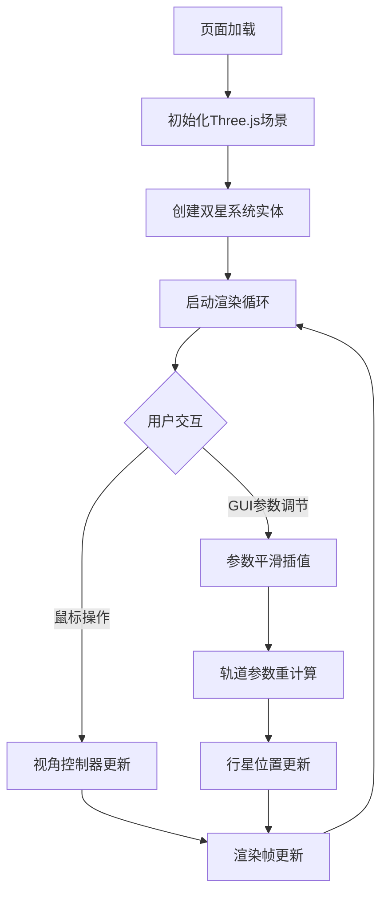

## 1. 产品概述

交互式3D恒星系轨道模拟器，面向天体物理研究人员和科学爱好者，通过可视化方式展示恒星系统的引力相互作用与行星轨道演化。解决现有工具过于专业复杂或缺乏实时交互参数调节的痛点，提供直观、高性能的三维轨道模拟体验。

## 2. 核心功能

### 2.1 功能模块
1. **3D场景渲染**：Three.js三维空间渲染，双星系统、行星、轨道线、星云背景
2. **天体物理模拟**：开普勒定律轨道计算、引力扰动效应、质量参数影响
3. **GUI参数控制**：lil-gui控制面板，实时调节恒星质量、轨道速度、轨道线显示
4. **视角交互**：鼠标拖拽旋转、滚轮缩放、右键平移、一键重置视角
5. **信息展示**：恒星悬停信息浮层、轨道参数标签

### 2.2 页面详情
| 页面名称 | 模块名称 | 功能描述 |
|-----------|-------------|---------------------|
| 主场景 | 双星系统渲染 | 黄色大恒星(3M☉)、红色小恒星(1.5M☉)，各带一颗互补色行星，30°倾斜轨道面 |
| 主场景 | 引力扰动模拟 | 双星距离过近时行星轨道可见扭曲变形 |
| 主场景 | 星云粒子系统 | 500个蓝紫到青色随机粒子，缓慢旋转，微弱发光 |
| 主场景 | 轨道线渲染 | 半透明渐变色轨道线，平滑过渡动画 |
| GUI面板 | 恒星质量控制 | 滑块0.5-10M☉，步长0.1，轨道实时重算 |
| GUI面板 | 速度/显示控制 | 轨道速度倍率、轨道线显示切换、视角重置按钮 |
| 信息层 | 恒星悬停信息 | 质量、半径、温度浮层，0.3s淡入动画 |

## 3. 核心流程

用户进入页面 → 加载默认双星系统 → 3D场景渲染循环启动
→ 鼠标交互：拖拽旋转/滚轮缩放/右键平移/悬停查看信息
→ GUI操作：调节恒星质量/速度倍率/切换轨道线/重置视角
→ 参数更新 → 轨道平滑插值重算 → 行星速度更新 → 渲染更新

## 4. 用户界面设计

### 4.1 设计风格
- **主色调**：深空黑色 `#000011`
- **恒星颜色**：黄色主星 `#FFD700`、红色伴星 `#FF4500`
- **行星颜色**：黄星互补色青色 `#00CED1`、红星互补色蓝绿色 `#20B2AA`
- **星云粒子**：蓝紫色 `#4a00e0` 到青色 `#00e5ff` 渐变
- **UI文字**：浅灰色 `#e0e0e0`
- **GUI面板**：半透明毛玻璃 `rgba(255,255,255,0.05)`，模糊10px，边框 `#ffffff33`
- **按钮风格**：圆角矩形，半透明背景，悬停微亮过渡0.2s
- **布局风格**：全屏3D场景，UI悬浮于左上角（标题）和右下角（控制面板），不遮挡主要视野

### 4.2 页面设计概述
| 页面名称 | 模块名称 | UI元素 |
|-----------|-------------|-------------|
| 主场景 | 顶部标题区 | 白色标题文字，半透明背景，左上角悬浮 |
| 主场景 | 右下控制面板 | lil-gui毛玻璃面板，包含滑块、开关、按钮 |
| 主场景 | 悬停信息浮层 | 圆角卡片，淡入淡出动画，跟随鼠标 |
| 主场景 | 3D场景区域 | 全屏Canvas，深空背景，恒星发光效果 |

### 4.3 响应式
桌面端为主要目标，全屏自适应Canvas，UI控件固定定位；支持浏览器窗口缩放时场景自动适配。

### 4.4 3D场景指导
- **环境**：纯深空黑背景 `#000011`，无HDRI，自发光粒子营造氛围
- **光照**：PointLight跟随两颗恒星位置，模拟恒星发光；低强度AmbientLight保证暗部可见
- **相机**：PerspectiveCamera，初始俯瞰45°视角，fov=60，近裁剪0.1，远裁剪1000
- **相机运动**：OrbitControls，阻尼0.08，缩放范围0.5-50单位，右键平移
- **构图**：双星系统位于场景中心，行星轨道围绕各自母星，星云粒子分布于外层半径20-100单位
- **动画**：行星沿椭圆轨道运行，星云粒子整体缓慢旋转（0.01 rad/s），恒星自转
- **后处理**：恒星Bloom发光效果，轨道线透明度渐变
- **性能预算**：Draw calls < 50，粒子数500，稳定30FPS+
