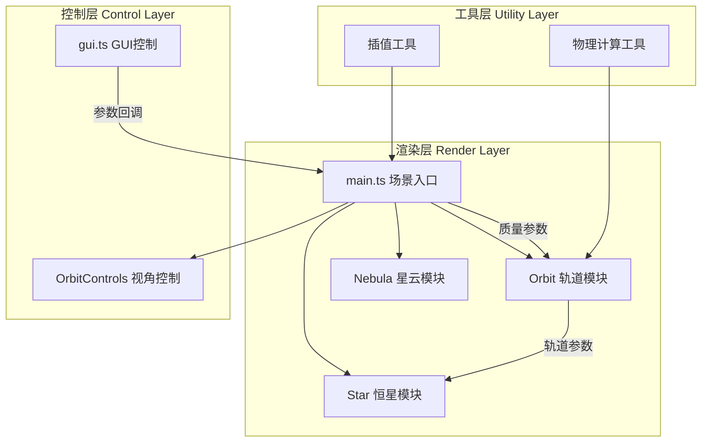

## 1. 架构设计



## 2. 技术描述
- **前端框架**：纯 TypeScript 5.x + Vite 5.x（无React/Vue，直接使用Three.js）
- **3D引擎**：Three.js ^0.160.0 + @types/three
- **GUI库**：lil-gui ^0.19.0
- **构建工具**：Vite，启用TypeScript严格模式
- **无后端，纯前端静态页面**

## 3. 文件结构与调用关系

```
d:\Solocoder\VersionFast\tasks\auto30/
├── index.html              # 入口HTML，全屏Canvas + UI容器
├── package.json            # 依赖与启动脚本
├── vite.config.js          # Vite配置
├── tsconfig.json           # TypeScript严格模式配置
└── src/
    ├── main.ts             # 场景入口，初始化/渲染循环/模块调度
    ├── star.ts             # Star类：恒星+行星实体，拖拽移动
    ├── orbit.ts            # Orbit类：轨道线计算与渲染
    ├── gui.ts              # GUI控制面板封装
    └── types.ts            # 共享类型定义（可选）
```

**调用关系与数据流向**：
1. `index.html` → 加载 `main.ts`
2. `main.ts` → 引入 `Star` / `Orbit` / `setupGUI` / Three.js
3. `gui.ts` → 通过回调函数将用户操作传递给 `main.ts`
4. `main.ts` → 将恒星质量参数传递给 `Orbit` 类
5. `Orbit` → 计算轨道参数后更新行星位置，更新轨道线几何体
6. `Star` → 接收位置/缩放参数，输出Three.js Object3D供main.ts加入场景
7. 渲染循环（main.ts）→ 每帧更新所有模块状态 → renderer.render()

## 4. 核心数据模型

### 4.1 恒星配置 StarConfig
```typescript
interface StarConfig {
  name: string;
  mass: number;           // 太阳质量倍数 M☉
  radius: number;         // 显示半径
  color: number;          // 颜色hex
  temperature: number;    // 表面温度 K
  position: THREE.Vector3;
}
```

### 4.2 轨道参数 OrbitParams
```typescript
interface OrbitParams {
  semiMajorAxis: number;      // 半长轴
  eccentricity: number;       // 偏心率
  inclination: number;        // 轨道倾角（弧度）
  period: number;             // 公转周期（秒）
  trueAnomaly: number;        // 当前真近点角
}
```

### 4.3 GUI状态 GUIState
```typescript
interface GUIState {
  primaryMass: number;        // 主星质量
  secondaryMass: number;      // 伴星质量
  speedMultiplier: number;    // 速度倍率
  showOrbits: boolean;        // 是否显示轨道线
}
```

## 5. 关键算法

### 5.1 开普勒轨道积分
- 基于开普勒第三定律：`T² ∝ a³/M`，根据恒星质量计算行星周期
- 每帧根据时间增量更新真近点角，通过椭圆参数方程计算行星位置
- 轨道倾斜通过Euler旋转实现：`rotation.x = 30°（PI/6）`

### 5.2 引力扰动近似
- 实时计算两恒星距离 `d`
- 当 `d < 扰动阈值（如8单位）` 时，对行星轨道参数施加正弦扰动：
  - `扰动强度 = max(0, 1 - d/threshold) * 扰动系数`
  - 影响轨道偏心率和倾角，产生可见扭曲效果

### 5.3 参数平滑插值
- 使用 `lerp` 线性插值，目标值与当前值之间0.5秒过渡
- `current = current + (target - current) * deltaTime * 2`
- 作用于：恒星质量变化→轨道参数、缩放；GUI所有数值参数

### 5.4 视角重置
- 保存初始相机位置 `(0, 20, 20)` 和目标点 `(0, 0, 0)`
- 重置时使用球面插值将相机平滑过渡回初始状态
