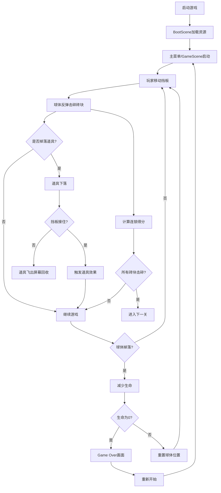

## 1. 产品概述

霓虹风格动态进化打砖块游戏，融合复古街机文化与现代视觉特效，通过程序化生成关卡、丰富道具系统和连锁爆炸机制，为玩家带来沉浸式的视觉和交互体验。

- 核心目标：重现经典打砖块玩法，通过霓虹视觉风格、动态关卡生成、道具系统和连锁得分机制提升游戏趣味性
- 目标用户：复古街机游戏爱好者、休闲游戏玩家

## 2. 核心功能

### 2.1 功能模块

1. **主菜单场景**：动态银河粒子背景、霓虹发光标题、呼吸灯渐变按钮
2. **游戏核心场景**：砖块阵列、球体物理、挡板控制、道具系统、得分系统、生命系统
3. **加载场景**：粒子背景加载进度条

### 2.2 页面详情

| 页面名称 | 模块名称 | 功能描述 |
|---------|---------|---------|
| BootScene | 预加载模块 | 加载游戏资源，显示带粒子背景的进度条，完成后自动切换 |
| GameScene | 砖块管理 | 动态生成5关不同砖块阵列，彩虹渐变色，1-3层生命值 |
| GameScene | 挡板控制 | 鼠标跟随移动，渐变色条，道具伸缩，弹性阻尼 |
| GameScene | 球体物理 | 反弹检测，三球分裂，火焰球穿透效果 |
| GameScene | 道具系统 | 20%掉落概率，加宽/三球/火焰球三种效果，屏幕外回收 |
| GameScene | 得分系统 | 基础10分，连锁指数级得分，金色闪烁动画 |
| GameScene | 生命系统 | 3条生命，球体掉落减命，挡板闪烁，Game Over画面 |

## 3. 核心流程

## 4. 用户界面设计

### 4.1 设计风格

- **主色调**：深紫色背景 #0f0c29，霓虹粉 #ff4081，霓虹青 #00e5ff，橙色 #ff6f00，黄色 #ffee58，蓝色 #4fc3f7
- **砖块颜色**：彩虹渐变 #ff0000 → #4fc3f7
- **字体**：霓虹发光效果，阴影偏移2px，发光颜色 #00e5ff
- **按钮**：渐变按钮（#ff6f00 到 #ff4081），呼吸灯效果，悬停发光
- **UI横条**：半透明磨砂玻璃效果 rgba(255,255,255,0.1)，模糊10px

### 4.2 页面设计概览

| 页面名称 | 模块名称 | UI元素 |
|---------|---------|--------|
| BootScene | 加载界面 | 粒子背景（200个粒子，#ff6f00和#4fc3f7混合），进度条 |
| GameScene | 顶部HUD | 分数、连锁数、生命值，磨砂玻璃横条，白色发光文字 |
| GameScene | 砖块阵列 | 彩虹渐变多层砖块，破碎粒子效果 |
| GameScene | 挡板 | 底部渐变色条（#ff6f00→#ffee58），边缘发光效果 |
| GameScene | 球体 | 普通/火焰（燃烧效果）状态 |
| GameScene | 道具 | 绿色/蓝色/红色发光方块 |
| GameScene | Game Over | 屏幕震动，重新开始按钮 |

### 4.3 响应式

- 桌面端优先，Canvas全屏自适应
- 鼠标操作优化

### 4.4 特效与动画

- 砖块破碎：彩色碎片粒子拖尾效果（0.5秒，透明度衰减）
- 连锁得分：金色闪烁，放大缩小动画（0.3秒）
- 挡板伸缩：0.2秒动画，弹性阻尼变形
- 主菜单粒子：缓慢旋转的银河粒子背景
- 挡板受击：红色闪烁0.5秒
