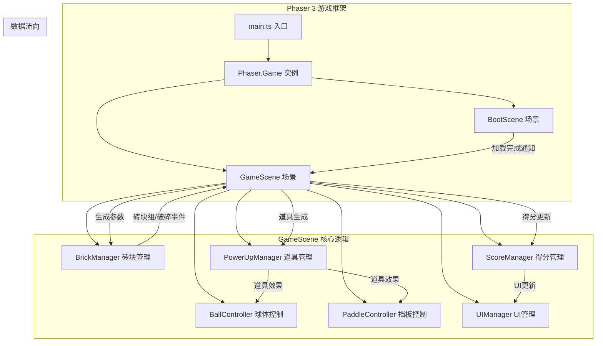

## 1. 架构设计



## 2. 技术描述

- **游戏引擎**：Phaser 3.x
- **构建工具**：Vite 5.x
- **开发语言**：TypeScript 5.x（严格模式）
- **模块系统**：ESNext
- **包管理器**：npm

## 3. 文件结构与职责

| 文件路径 | 职责说明 | 调用关系 |
|---------|---------|---------|
| package.json | 项目依赖和脚本配置 | - |
| vite.config.js | Vite构建配置，TypeScript支持 | - |
| tsconfig.json | TypeScript编译配置（严格模式，ESNext） | - |
| index.html | 入口页面，全屏Canvas，深紫色背景 | - |
| src/main.ts | 游戏主入口，初始化Phaser.Game，注册所有场景 | 创建配置 → 传入BootScene和GameScene |
| src/scenes/BootScene.ts | 预加载资源，粒子背景进度条，加载完成切换GameScene | 接收main.ts配置 → 通知GameScene启动 |
| src/scenes/GameScene.ts | 核心游戏逻辑，管理所有子系统 | 调用BrickManager、BallController、PowerUpManager → 更新UI |
| src/utils/BrickManager.ts | 砖块生成、颜色渐变、连锁破碎逻辑 | GameScene传参 → 返回砖块组 → 破碎事件 |
| src/utils/BallController.ts | 球体物理、碰撞检测、特殊状态 | GameScene驱动更新 |
| src/utils/PaddleController.ts | 挡板跟随、伸缩动画、弹性变形 | GameScene驱动更新 |
| src/utils/PowerUpManager.ts | 道具掉落、效果触发、回收管理 | 接收BrickManager事件 → 输出效果到挡板/球体 |
| src/utils/ScoreManager.ts | 分数计算、连锁逻辑 | GameScene调用 |
| src/utils/UIManager.ts | HUD显示、动画效果 | ScoreManager驱动 |

## 4. 核心数据模型

### 4.1 砖块数据
```typescript
interface Brick {
  x: number;
  y: number;
  width: number;
  height: number;
  hp: number;          // 1-3层生命值
  maxHp: number;
  color: string;       // 彩虹渐变色
  row: number;
  col: number;
}
```

### 4.2 道具数据
```typescript
type PowerUpType = 'expand' | 'multiball' | 'fireball';

interface PowerUp {
  type: PowerUpType;
  x: number;
  y: number;
  speed: number;       // 200px/s
  color: string;
}
```

### 4.3 游戏状态
```typescript
interface GameState {
  score: number;
  lives: number;       // 初始3
  level: number;       // 1-5关
  combo: number;       // 当前连锁数
  isPlaying: boolean;
  isPaused: boolean;
}
```

## 5. 性能优化

- 粒子系统单帧上限500个，自动回收过期粒子
- 道具飞出屏幕后立即销毁对象
- 对象池复用砖块、球体、道具对象
- 物理碰撞优化：仅检测活跃对象
- 全程60FPS目标帧率
