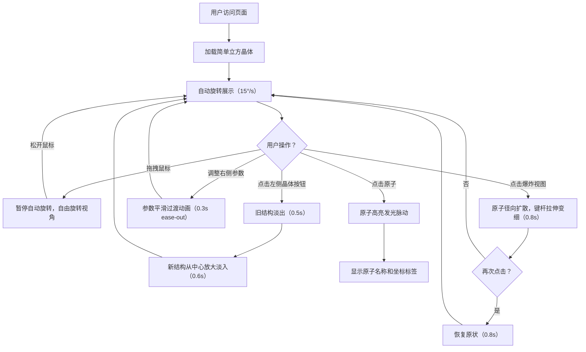

## 1. 产品概述

本产品是一款基于Web的交互式3D晶体结构模型查看器，专为材料科学爱好者和学生设计，解决在缺乏专业三维建模软件时难以直观理解不同晶体构型原子空间排布的问题。

- 核心价值：提供轻量化、零安装的浏览器端3D晶体可视化体验，支持多种常见晶体结构的交互式探索
- 目标用户：材料科学/化学领域的学生、教师、研究人员及科普爱好者

## 2. 核心功能

### 2.1 用户角色
无多角色区分，所有用户均可使用全部功能。

### 2.2 功能模块
1. **主界面**：3D场景渲染区、左侧晶体选择面板、右侧参数控制面板
2. **晶体结构管理**：5种预设晶体（简单立方、体心立方、面心立方、氯化钠、金刚石）的加载与切换动画
3. **3D交互**：自动旋转、鼠标拖拽视角控制、原子点击高亮与信息展示
4. **参数控制**：晶格常数调节、原子半径比例调节、坐标轴与网格显示切换
5. **爆炸视图**：原子沿径向扩散/恢复的动画切换

### 2.3 页面详情
| 页面名称 | 模块名称 | 功能描述 |
|---------|---------|---------|
| 主界面 | 晶体选择面板 | 5种晶体类型的圆形图标按钮，选中发光效果，底部显示晶体名称和空间群编号 |
| 主界面 | 3D场景 | Three.js渲染的晶体结构，自动旋转15°/s，鼠标拖拽暂停并自由旋转 |
| 主界面 | 参数控制面板 | 晶格常数滑块（1-5埃）、原子半径比例滑块（0.3-1.0）、坐标轴/网格开关、爆炸视图按钮 |
| 主界面 | 原子交互 | 点击原子高亮发光（淡蓝色脉动，周期1.5秒）并弹出信息标签显示原子名称和坐标 |

## 3. 核心流程

用户打开页面 → 默认加载简单立方晶体并自动旋转 → 用户可拖拽鼠标自由观察 → 点击左侧按钮切换晶体类型（淡出淡入动画）→ 拖动右侧滑块调整参数（实时平滑动画）→ 点击原子查看详细信息 → 点击爆炸视图按钮展开/收回结构。

## 4. 用户界面设计

### 4.1 设计风格
- **主色调**：深黑灰渐变背景（#121212 到 #1e1e1e），青色强调色 #00bcd4
- **面板样式**：半透明毛玻璃效果（rgba(255,255,255,0.05)，背光模糊10px）
- **原子颜色**：金属银灰 #a9a9a9，氯绿色 #00ff00，钠浅紫 #b39ddb，碳深灰 #404040
- **字体**：现代无衬线字体，参数标签颜色 #cccccc
- **交互过渡**：所有UI元素悬停0.2秒亮度提升，滑块拖动时按钮外围光晕

### 4.2 页面设计概述
| 页面名称 | 模块名称 | UI元素 |
|---------|---------|---------|
| 主界面 | 左侧选择面板 | 宽度240px，圆形图标按钮网格排列，选中边框发光（#00bcd4，4px），底部晶体信息文本栏 |
| 主界面 | 3D场景 | 占屏幕85%宽度居中，全屏Canvas，深色背景 |
| 主界面 | 右侧控制面板 | 宽度240px，滑块轨迹#333，滑块圆形按钮#00bcd4，开关控件，爆炸视图按钮 |
| 主界面 | 原子信息标签 | 跟随3D位置，淡蓝色，显示原子名称和(x,y,z)坐标 |

### 4.3 响应式
- Desktop-first设计
- 屏幕宽度<768px时，左右面板变为可折叠抽屉式
- 左上角菜单图标触发展开/折叠

### 4.4 3D场景指导
- **环境**：深色科技风，环境光+点光源组合产生立体感
- **灯光**：AmbientLight基础照明 + PointLight主光源 + PointLight补光
- **相机**：PerspectiveCamera，OrbitControls控制，自动旋转15°/s
- **原子材质**：MeshStandardMaterial，金属感，光滑球体
- **键杆**：半透明圆柱（透明度0.4，颜色#cccccc）
- **坐标轴**：红X绿Y蓝Z三色半透明箭头
- **网格**：浅灰色半透明GridHelper，间距1单位
- **后处理**：原子高亮外发光效果（淡蓝色脉动）
- **性能目标**：≥45fps，80个原子（金刚石结构）无明显卡顿

## 5. 数据定义

### 5.1 晶体结构数据
| 晶体类型 | 空间群 | 原子数量 | 说明 |
|---------|-------|---------|-----|
| 简单立方 (SC) | Pm-3m | 1 | 立方体8个顶点各1原子 |
| 体心立方 (BCC) | Im-3m | 2 | 8顶点+1体心 |
| 面心立方 (FCC) | Fm-3m | 4 | 8顶点+6面心 |
| 氯化钠 (NaCl) | Fm-3m | 8 | Na和Cl交替排列的面心立方 |
| 金刚石 (Diamond) | Fd-3m | 8 | 两个面心立方沿体对角线平移1/4套构 |
