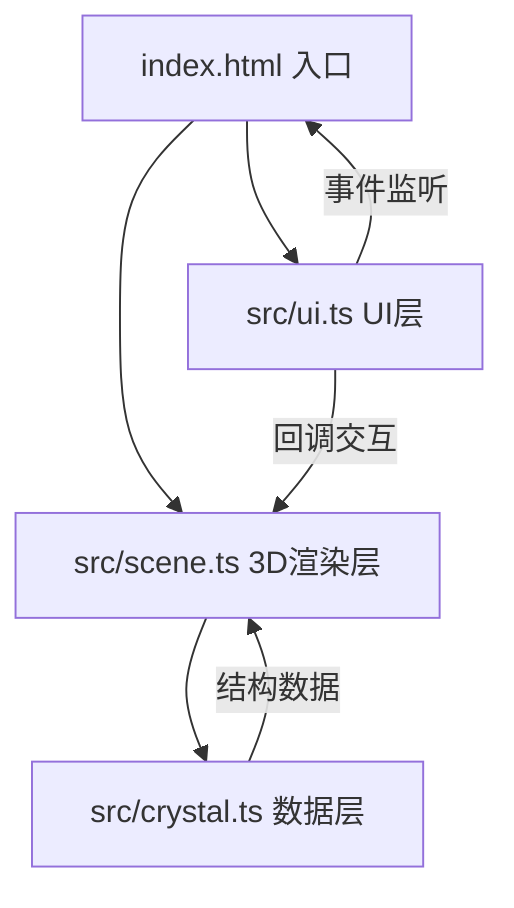

## 1. 架构设计

本项目为纯前端单页应用，采用模块化分层架构，将数据定义、3D渲染、UI交互完全分离。



### 模块职责
- **crystal.ts**：纯数据层，定义晶体结构（原子坐标、化学键、元素属性），无外部依赖
- **scene.ts**：Three.js场景管理，负责渲染、相机、灯光、动画、交互拾取
- **ui.ts**：DOM操作与事件绑定，构建控制面板，通过回调与scene交互
- **index.html**：页面入口，定义Canvas容器和面板布局

## 2. 技术描述

- **前端框架**：原生 TypeScript + Three.js（无React/Vue框架，用户明确指定文件组织）
- **构建工具**：Vite 5.x，启用TypeScript支持
- **3D引擎**：Three.js 0.160+，使用OrbitControls、MeshStandardMaterial
- **UI控件**：lil-gui 0.19+（可选，用户要求自定义DOM面板，lil-gui作为备选）
- **语言标准**：TypeScript严格模式，ESNext模块
- **初始化方式**：通过Vite vanilla-ts模板创建，后按用户指定文件结构调整

## 3. 项目文件结构

```
auto35/
├── package.json
├── vite.config.js
├── tsconfig.json
├── index.html
└── src/
    ├── crystal.ts      # 晶体结构数据定义
    ├── scene.ts        # Three.js场景与渲染
    └── ui.ts           # DOM面板与事件绑定
```

## 4. 核心数据类型定义

### 4.1 晶体结构数据类型

```typescript
// 元素类型
interface AtomElement {
  name: string;        // 原子名称，如 "Na", "Cl", "C", "Fe"
  color: string;       // 十六进制颜色值
  radius: number;      // 默认原子半径（相对值）
}

// 单个原子
interface CrystalAtom {
  id: string;          // 唯一标识
  element: string;     // 元素名称，关联AtomElement
  position: [number, number, number];  // 分数坐标（0~1）
}

// 化学键
interface CrystalBond {
  atomA: string;       // 原子A的id
  atomB: string;       // 原子B的id
}

// 完整晶体结构
interface CrystalStructure {
  id: string;           // 晶体标识，如 "sc", "bcc", "fcc", "nacl", "diamond"
  name: string;         // 中文名称
  spaceGroup: string;   // 空间群编号
  latticeConstant: number;  // 默认晶格常数（埃）
  elements: Record<string, AtomElement>;  // 元素映射表
  atoms: CrystalAtom[];
  bonds: CrystalBond[];
}
```

### 4.2 5种晶体结构定义

| 晶体ID | 名称 | 空间群 | 原子坐标（分数坐标） |
|--------|------|--------|---------------------|
| sc | 简单立方 | Pm-3m | (0,0,0) |
| bcc | 体心立方 | Im-3m | (0,0,0), (0.5,0.5,0.5) |
| fcc | 面心立方 | Fm-3m | (0,0,0), (0.5,0.5,0), (0.5,0,0.5), (0,0.5,0.5) |
| nacl | 氯化钠 | Fm-3m | Na: (0,0,0),(0.5,0.5,0),(0.5,0,0.5),(0,0.5,0.5); Cl: (0.5,0,0),(0,0.5,0),(0,0,0.5),(0.5,0.5,0.5) |
| diamond | 金刚石 | Fd-3m | (0,0,0),(0.5,0.5,0),(0.5,0,0.5),(0,0.5,0.5),(0.25,0.25,0.25),(0.75,0.75,0.25),(0.75,0.25,0.75),(0.25,0.75,0.75) |

## 5. 场景管理器接口

```typescript
interface CrystalSceneCallbacks {
  onAtomClick?: (atomId: string, screenPos: { x: number; y: number }, info: { name: string; position: [number, number, number] }) => void;
}

class CrystalScene {
  constructor(canvas: HTMLCanvasElement, callbacks?: CrystalSceneCallbacks);
  
  // 加载晶体结构，带动画过渡
  loadCrystal(structure: CrystalStructure): void;
  
  // 设置晶格常数（缩放整体）
  setLatticeConstant(value: number, animate?: boolean): void;
  
  // 设置原子半径比例
  setAtomRadiusScale(value: number, animate?: boolean): void;
  
  // 切换坐标轴显示
  setAxesVisible(visible: boolean): void;
  
  // 切换网格显示
  setGridVisible(visible: boolean): void;
  
  // 切换爆炸视图
  toggleExplodedView(): void;
  
  // 清除选中原子高亮
  clearAtomSelection(): void;
  
  // 销毁场景
  dispose(): void;
}
```

## 6. 动画系统设计

### 6.1 动画类型与参数
| 动画 | 时长 | 缓动函数 | 说明 |
|------|------|---------|------|
| 晶体淡出 | 0.5s | linear | 透明度1→0 |
| 晶体淡入+放大 | 0.6s | ease-out | 透明度0→1，缩放0.5→1 |
| 晶格常数缩放 | 0.3s | ease-out | 整体均匀缩放 |
| 原子半径变化 | 0.3s | ease-out | 原子球体半径过渡 |
| 爆炸视图切换 | 0.8s | ease-in-out | 原子径向2倍扩散/恢复 |
| 自动旋转 | 持续 | linear | 15°/s 绕Y轴 |
| 原子高亮脉动 | 1.5s周期 | sine | 外发光强度脉动 |

### 6.2 实现方式
- 使用requestAnimationFrame主循环统一驱动所有动画
- 每个动画维护startTime、duration、easing函数
- 支持动画叠加（如爆炸视图+自动旋转可同时进行）

## 7. 性能优化策略

1. **几何复用**：同种元素的原子共享同一个SphereGeometry实例
2. **材质复用**：相同属性的原子共享MeshStandardMaterial
3. **射线拾取优化**：Raycaster检测时只对原子Mesh数组求交
4. **渲染帧率控制**：使用SetAnimationLoop，目标60fps，最低保证45fps
5. **键杆合并**：静态场景下使用BufferGeometryUtils.mergeGeometries合并多个圆柱
6. **LOD策略**：原子球体使用32分段（平衡质量与性能）
