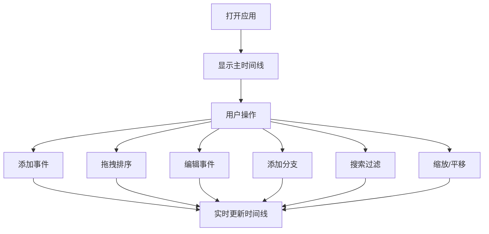

## 1. 产品概述

交互式时间线事件编排器是一个可视化的时间管理工具，允许用户以直观的方式创建、拖拽排序和分组时间轴上的事件卡片，并支持多时间线分支对比。主要面向需要进行项目规划、个人时间管理、历史事件记录等场景的用户。

- 核心价值：将复杂的时间事件以可视化方式呈现，支持灵活的拖拽排序和分支对比，提升时间规划效率
- 目标用户：项目经理、研究者、学生、个人用户

## 2. 核心功能

### 2.1 用户角色
无需角色区分，所有用户拥有相同权限。

### 2.2 功能模块
1. **时间线面板**：横向时间轴显示、滚轮缩放、拖拽平移、月份刻度、年份标签
2. **事件卡片**：事件节点显示、悬停浮动卡片、拖拽排序、展开编辑
3. **事件编辑面板**：标题编辑、日期选择、描述编辑、类别选择、删除操作、分支管理

### 2.3 页面详情
| 页面名称 | 模块名称 | 功能描述 |
|---------|---------|---------|
| 主页面 | 时间线区域（70%宽度） | 横向时间轴显示，支持滚轮缩放和拖拽平移，事件按日期从左到右排列，月份刻度和年份标签 |
| 主页面 | 顶部工具栏 | 搜索框（事件搜索过滤）、添加事件按钮 |
| 主页面 | 事件编辑面板（300px固定宽度） | 标题输入框、日期选择器、描述多行文本框、类别下拉选择、删除按钮、分支管理 |
| 主页面 | 事件节点 | 圆形节点标记，悬停显示浮动卡片，支持拖拽排序，拖拽时显示垂直辅助线 |
| 主页面 | 分支时间线 | 主时间线下方平行显示，高度比主时间线小30%，更小的节点和虚线连接，最多3条分支 |

## 3. 核心流程

用户打开应用后，默认显示以当前月份为中心的12个月时间跨度。用户可以：
1. 点击"添加事件"按钮创建新事件
2. 拖拽事件节点调整日期位置
3. 点击事件节点在右侧面板编辑详情
4. 在编辑面板中为事件添加分支时间线
5. 使用搜索框快速定位事件
6. 通过滚轮缩放和平移浏览时间线

## 4. 用户界面设计

### 4.1 设计风格
- **主色调**：深蓝 #2c3e50，浅灰 #ecf0f1
- **按钮**：渐变蓝 #3498db → #2980b9，悬停时更亮
- **事件类别颜色**：工作 #ff6b6b（红）、学习 #4ecdc4（青）、旅行 #45b7d1（蓝）、个人 #96ceb4（绿）
- **字体**：系统无衬线字体 -apple-system, BlinkMacSystemFont, 'Segoe UI'
- **整体风格**：干净极简，圆角8px卡片，柔和阴影
- **动画**：0.2s-0.3s ease-in-out过渡，事件添加放大动画（0.3s scale 0→1），删除缩小淡出（0.2s scale 1→0 opacity→0）

### 4.2 页面设计概述
| 页面名称 | 模块名称 | UI元素 |
|---------|---------|---------|
| 主页面 | 整体布局 | 左右分栏（70%/300px），1024px以下折叠为上下布局 |
| 主页面 | 时间线区域 | 白色背景，底部浅灰#ddd月份刻度线，顶部深灰#333年份标签 |
| 主页面 | 事件节点 | 圆形10px（分支8px），颜色按类别，悬停阴影 |
| 主页面 | 浮动卡片 | 白色背景，圆角8px，阴影，标题14px加粗，日期12px灰色 |
| 主页面 | 编辑面板 | 标题输入框（聚焦边框）、日期选择器、可伸缩文本框、类别下拉（带颜色预览）、红色删除按钮 |

### 4.3 响应式
- 桌面端（≥1024px）：左右分栏，左侧70%时间线，右侧300px编辑面板
- 移动端（<1024px）：上下布局，编辑面板折叠到底部全宽显示，时间线自适应填满剩余高度
- 支持触摸操作优化
