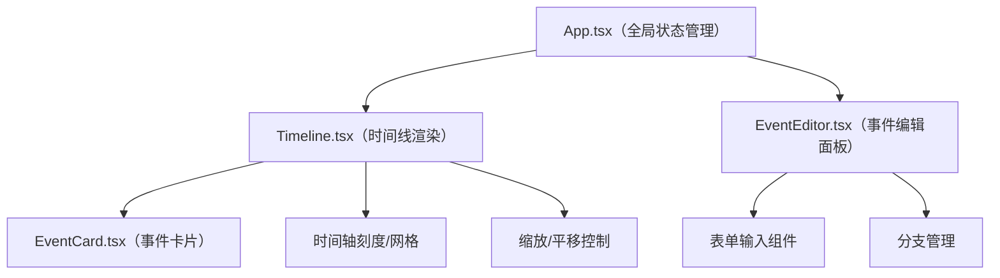

## 1. 架构设计



## 2. 技术描述

- **前端框架**：React 18 + TypeScript
- **构建工具**：Vite
- **状态管理**：React useState/useReducer（内置，轻量级场景）
- **样式方案**：原生CSS + CSS变量
- **无后端**：纯前端应用，数据存储在内存中

## 3. 文件结构

| 文件路径 | 用途 |
|---------|------|
| `package.json` | 项目依赖和脚本配置 |
| `vite.config.js` | Vite构建配置 |
| `tsconfig.json` | TypeScript严格模式配置 |
| `index.html` | 入口HTML页面 |
| `src/App.tsx` | 根组件，全局状态管理，分栏布局 |
| `src/Timeline.tsx` | 时间线渲染组件，横向时间轴，缩放平移 |
| `src/EventCard.tsx` | 单个事件卡片组件，拖拽排序，悬停显示 |
| `src/EventEditor.tsx` | 事件编辑面板，表单编辑，分支管理 |
| `src/types.ts` | TypeScript类型定义 |
| `src/index.css` | 全局样式 |
| `src/main.tsx` | React入口文件 |

## 4. 数据模型

### 4.1 类型定义

```typescript
// 事件类别
type EventCategory = 'work' | 'study' | 'travel' | 'personal';

// 事件接口
interface TimelineEvent {
  id: string;
  title: string;
  date: string; // ISO格式 YYYY-MM-DD
  description: string;
  category: EventCategory;
  branchId?: string; // 所属分支ID，undefined表示主时间线
  parentId?: string; // 父事件ID（用于子事件）
}

// 分支时间线
interface TimelineBranch {
  id: string;
  name: string;
  parentEventId: string;
  offset: number; // 垂直偏移量
}

// 类别颜色映射
const CATEGORY_COLORS: Record<EventCategory, string> = {
  work: '#ff6b6b',
  study: '#4ecdc4',
  travel: '#45b7d1',
  personal: '#96ceb4',
};
```

### 4.2 全局状态

```typescript
interface AppState {
  events: TimelineEvent[];
  branches: TimelineBranch[];
  selectedEventId: string | null;
  searchQuery: string;
  viewport: {
    startDate: Date;
    endDate: Date;
    zoom: number;
    panX: number;
  };
}
```

## 5. 性能优化策略

- 使用CSS transform实现拖拽和平移，确保GPU加速
- 事件节点使用will-change提示浏览器优化
- 缩放计算使用requestAnimationFrame节流
- 大数据量（100+事件）时使用虚拟滚动优化
- 避免不必要的重渲染，使用React.memo优化组件
