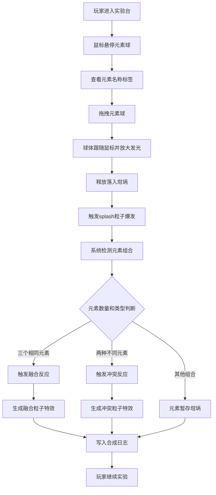

## 1. 产品概述

魔法元素调和实验台是一款基于 Canvas 2D 的交互式魔法化学实验游戏。玩家通过拖拽六种魔法元素球（火、水、风、土、光、暗）到中央坩埚中，观察元素之间的动态化学反应，包括融合、冲突和爆炸效果，体验华丽的粒子特效和视觉反馈。

- 核心目标：提供沉浸式的魔法元素实验体验，通过直观的拖拽交互和丰富的粒子动画让玩家感受魔法元素合成的乐趣
- 目标用户：喜欢休闲益智游戏、对魔法和化学元素感兴趣的所有年龄段玩家
- 产品价值：将抽象的化学概念转化为可视化的魔法互动体验，兼具娱乐性和教育启发意义

## 2. 核心功能

### 2.1 用户角色

| 角色 | 注册方式 | 核心权限 |
|------|----------|----------|
| 玩家 | 无需注册，直接进入 | 拖拽元素、进行合成实验、查看合成日志 |

### 2.2 功能模块

1. **元素架区域**：六个元素球的存放和选择区域，包含拖拽交互
2. **坩埚调和区域**：中央反应容器，检测元素进入、管理化学反应
3. **粒子特效系统**：负责所有粒子的创建、更新、渲染和生命周期管理
4. **合成日志系统**：记录每次合成反应的时间、类型和结果
5. **UI 交互界面**：悬浮标签、提示圈、状态动画等视觉反馈

### 2.3 页面详情

| 页面名称 | 模块名称 | 功能描述 |
|----------|----------|----------|
| 实验台主界面 | 元素架 | 展示六个元素球，支持鼠标拖拽，悬停显示名称标签，球体有浮动动画 |
| 实验台主界面 | 坩埚区域 | 半透明玻璃坩埚，呼吸脉冲边框，检测元素落入并触发反应 |
| 实验台主界面 | 合成日志 | 右上角滚动列表，记录合成历史，带时间戳和颜色标签，新记录滑入动画 |
| 实验台主界面 | 粒子系统 | 实现 splash 爆发、融合光环、冲突反应等多种粒子效果 |

## 3. 核心流程

玩家打开游戏 → 鼠标悬停在元素球上查看名称 → 拖拽元素球向坩埚移动 → 球体跟随鼠标并放大发光 → 释放元素球落入坩埚 → 触发 splash 粒子爆发 → 系统检测坩埚内元素组合 → 触发相应反应（三元素融合/双元素冲突）→ 生成对应粒子特效 → 记录合成日志 → 玩家继续实验

## 4. 用户界面设计

### 4.1 设计风格

- **主色调**：深棕色木质纹理背景 (#2a1f14)，营造神秘实验室氛围
- **元素色板**：
  - 火：#ff4500 → #ffa500（橙红渐变）
  - 水：#00bfff → #1e90ff（蓝色渐变）
  - 风：#98fb98 → #3cb371（绿色渐变）
  - 土：#8b4513 → #d2691e（棕色渐变）
  - 光：#ffffe0 → #fffacd（浅黄渐变）
  - 暗：#4b0082 → #8a2be2（紫色渐变）
- **坩埚**：半透明玻璃质感，发光边框，呼吸脉冲透明度 0.5-0.8 循环
- **字体**：使用具有魔法奇幻风格的字体，标题使用衬线体，正文使用清晰无衬线体
- **布局风格**：桌面居中布局，左侧元素架，中央坩埚，右上合成日志
- **视觉风格**：玻璃质感元素球、粒子光效、木质纹理背景，整体呈现神秘魔法实验室氛围

### 4.2 页面设计概览

| 页面名称 | 模块名称 | UI 元素 |
|----------|----------|---------|
| 实验台主界面 | 背景 | 深棕色木质纹理 (#2a1f14)，全屏无滚动 |
| 实验台主界面 | 元素架 | 六个圆形凹槽，空置时淡蓝色荧光提示圈（半径40px，透明度0.3-0.6循环），元素球轻微上下浮动（幅度3px，周期1.5-2.5秒） |
| 实验台主界面 | 元素球 | 半透明彩色玻璃质感，半径30px，悬停膨胀1.1倍显示名称标签，拖拽时放大1.2倍释放微光晕 |
| 实验台主界面 | 坩埚 | 桌面中央凹陷放置，半透明玻璃材质，发光边框呼吸脉冲 |
| 实验台主界面 | 合成日志 | 右上角滚动列表，每条记录带时间戳和颜色圆点标签，新日志从底部滑入0.3秒 |
| 实验台主界面 | 粒子特效 | splash爆发、融合光环、蒸汽云、沙尘暴、黑洞漩涡等多种动画效果 |

### 4.3 响应式设计

- 设计优先级：桌面端优先（Desktop-first）
- 画布自适应：Canvas 尺寸跟随窗口大小调整，保持元素比例
- 交互适配：桌面端使用鼠标拖拽交互，不考虑移动端触摸适配

### 4.4 性能优化

- 帧率目标：所有粒子特效和动画循环稳定在 50fps 以上
- 粒子管理：当屏幕上粒子数量超过 500 个时自动合并同类型粒子以减少渲染开销
- 渲染优化：使用 Canvas 2D 分层渲染，静态元素缓存减少重绘
