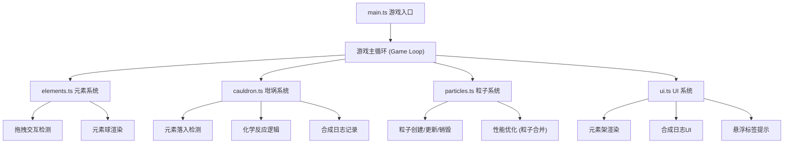

## 1. 架构设计

本项目是一个纯前端的 Canvas 2D 交互式游戏，采用模块化架构设计，将游戏逻辑、渲染、粒子系统和 UI 层分离，便于维护和扩展。



## 2. 技术说明

- **前端框架**：原生 TypeScript + Canvas 2D API（不使用 Three.js 等 3D 库）
- **构建工具**：Vite 5.x，启用 TypeScript 支持
- **开发语言**：TypeScript 5.x，严格模式，ESNext 模块
- **无后端服务**：纯客户端运行，数据全部保存在内存中
- **无外部数据库**：合成日志仅在当前会话中保存

## 3. 文件结构

```
auto38/
├── package.json              # 项目依赖和脚本
├── vite.config.js            # Vite 构建配置
├── tsconfig.json             # TypeScript 配置
├── index.html                # 入口 HTML 页面
└── src/
    ├── main.ts               # 应用入口，初始化 Canvas 和游戏循环
    ├── elements.ts           # 元素球定义和渲染
    ├── cauldron.ts           # 坩埚逻辑和反应管理
    ├── particles.ts          # 粒子系统管理
    └── ui.ts                 # UI 组件渲染
```

## 4. 核心数据模型

### 4.1 元素类型定义

```typescript
type ElementType = 'fire' | 'water' | 'wind' | 'earth' | 'light' | 'dark';

interface ElementConfig {
  type: ElementType;
  name: string;
  colorStart: string;
  colorEnd: string;
  radius: number;
}
```

### 4.2 元素球类

```typescript
class ElementBall {
  id: string;
  type: ElementType;
  x: number;
  y: number;
  vx: number;
  vy: number;
  radius: number;
  isDragging: boolean;
  isHovered: boolean;
  floatOffset: number;
  floatSpeed: number;
  homeX: number;
  homeY: number;
  inCauldron: boolean;
}
```

### 4.3 粒子类

```typescript
type ParticleType = 'splash' | 'fusionAura' | 'fireSpirit' | 'iceCrystal' 
  | 'stone' | 'steam' | 'sandstorm' | 'blackhole';

class Particle {
  id: string;
  type: ParticleType;
  x: number;
  y: number;
  vx: number;
  vy: number;
  life: number;
  maxLife: number;
  size: number;
  color: string;
  opacity: number;
}
```

### 4.4 合成日志

```typescript
interface SynthesisLog {
  id: string;
  timestamp: number;
  elements: ElementType[];
  result: string;
  color: string;
}
```

## 5. 核心算法

### 5.1 碰撞检测算法

使用圆形碰撞检测判断元素球是否进入坩埚区域：

```
distance(ball.x, ball.y, cauldron.x, cauldron.y) < cauldron.radius
```

### 5.2 反应类型判断

- 三元素融合：统计坩埚内相同元素数量，当某元素数量 >= 3 时触发融合
- 双元素冲突：检测坩埚内是否存在特定元素对（水火、风土、光暗）触发冲突反应

### 5.3 粒子性能优化

- 粒子池：对象池模式复用粒子对象，减少 GC 开销
- 粒子合并：当粒子总数 > 500 时，将同类型、同位置区域的粒子合并渲染
- 生命周期管理：自动销毁超出生命周期的粒子

### 5.4 渲染循环

使用 `requestAnimationFrame` 实现稳定的游戏循环，采用固定时间步长保证动画一致性。
