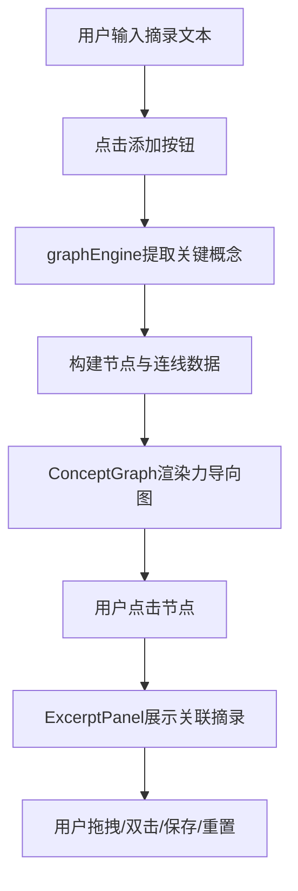

## 1. 产品概述

智能电子书摘知识图谱应用，帮助用户将零散的文本摘录自动关联为可交互的知识网络，发现概念间的隐含联系。

- 核心价值：将无结构的文本摘录转化为可视化知识图谱，支持概念探索、关联发现
- 目标用户：知识工作者、学生、研究人员、读书爱好者

## 2. 核心功能

### 2.1 功能模块

1. **摘录输入模块**：文本输入框、添加按钮、摘录列表展示
2. **知识图谱模块**：D3力导向图渲染、节点拖拽/缩放/双击折叠、悬浮高亮
3. **概念关联面板**：选中节点关联摘录展示、概念文字高亮、关联节点跳转
4. **持久化模块**：localStorage保存/恢复、重置布局

### 2.2 页面详情

| 页面名称 | 模块名称 | 功能描述 |
|---------|---------|---------|
| 主页面 | 顶部导航栏 | 应用标题、保存按钮、重置布局按钮 |
| 主页面 | 左侧摘录输入区 | 文本输入框（<300字）、添加按钮、摘录列表（淡入动画） |
| 主页面 | 右侧知识图谱区 | 力导向图、可拖拽节点、滚轮缩放、双击折叠子概念 |
| 主页面 | 摘录详情面板 | 选中节点关联摘录、概念高亮、关联节点列表、左右滑入动画 |

## 3. 核心流程

用户输入/粘贴文本摘录 → 点击添加 → graphEngine提取关键概念（TF-IDF简化版）→ 构建节点和连线 → ConceptGraph渲染力导向图（节点飞入、连线渐显动画）→ 用户点击节点 → ExcerptPanel展示关联摘录 → 用户可拖拽节点、双击折叠、保存/重置状态

## 4. 用户界面设计

### 4.1 设计风格

- 极简知识管理风格，主背景浅灰色 #f0f0f0
- 主色调：概念 #4A90D9（蓝）、人物 #E74C3C（红）、地点 #2ECC71（绿）、事件 #F1C40F（黄）
- 卡片：白色背景、圆角12px、阴影2px
- 顶部导航：深灰色 #2c3e50 背景，高度50px
- 字体：现代无衬线字体，层级清晰
- 动画：节点飞入0.5s ease-out、连线渐显0.3s、面板切换0.3s、悬浮过渡0.2s

### 4.2 页面设计概述

| 页面名称 | 模块名称 | UI元素 |
|---------|---------|--------|
| 主页面 | 顶部导航栏 | 深灰背景、标题居左、保存/重置按钮居右、悬停半透明白色渐变 |
| 主页面 | 左侧输入区 | 白色卡片、圆角12px、占宽30%、文本域+添加按钮+摘录列表 |
| 主页面 | 右侧图谱区 | 占宽70%、SVG画布、节点圆形（半径15-40px按频率缩放）、连线带箭头 |
| 主页面 | 摘录面板 | 关联摘录列表、概念文字加粗标蓝#4A90D9、底部关联节点链接 |

### 4.3 响应式

- 桌面端（≥768px）：左右分栏布局，左侧30%右侧70%
- 移动端（<768px）：左侧面板折叠为顶部抽屉，点击图标向下滑入0.3s展开/收起，图谱区占满全屏
