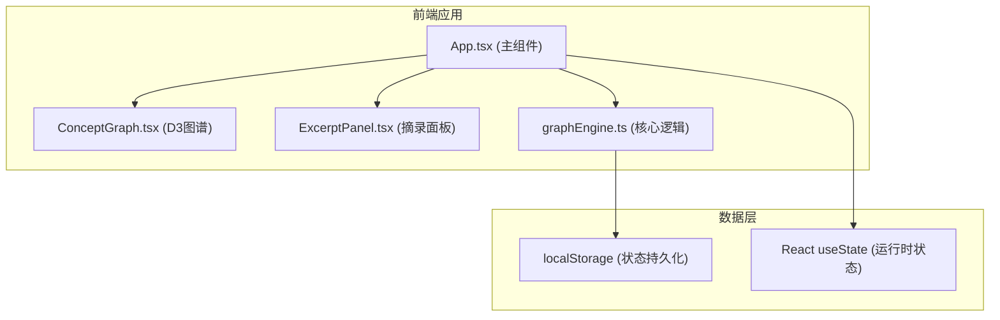

## 1. 架构设计



## 2. 技术描述

- 前端框架：React 18 + TypeScript
- 构建工具：Vite 5
- 可视化库：D3.js v7 + @types/d3
- 工具库：uuid（节点唯一ID）
- 状态管理：React useState（无需复杂全局状态）
- 样式方案：原生CSS（不使用Tailwind，用户未指定）

## 3. 数据模型

### 3.1 核心类型定义

```typescript
// 摘录条目
interface Excerpt {
  id: string;
  text: string;
  createdAt: number;
}

// 图谱节点（概念）
interface GraphNode {
  id: string;
  label: string;
  category: 'concept' | 'person' | 'location' | 'event';
  frequency: number;
  x?: number;
  y?: number;
  fx?: number | null;
  fy?: number | null;
  collapsed?: boolean;
  parentId?: string | null;
}

// 图谱连线（概念关联）
interface GraphLink {
  id: string;
  source: string | GraphNode;
  target: string | GraphNode;
  strength: number;
}

// 图谱数据
interface GraphData {
  nodes: GraphNode[];
  links: GraphLink[];
}

// 应用状态
interface AppState {
  excerpts: Excerpt[];
  graphData: GraphData;
  selectedNodeId: string | null;
  collapsedNodes: Set<string>;
  nodePositions: Record<string, { x: number; y: number }>;
}
```

### 3.2 数据流向

1. 用户在App.tsx的输入框输入摘录文本
2. 点击"添加"触发`handleAddExcerpt` → 创建Excerpt对象 → 调用graphEngine.extractConcepts(text)
3. graphEngine使用简化TF-IDF：分词→停用词过滤→词频统计→关键词提取→共现分析→返回GraphData
4. App.tsx合并新GraphData → 传递给ConceptGraph和ExcerptPanel
5. ConceptGraph通过D3-force渲染，节点点击回调`onNodeSelect`回传选中节点ID
6. ExcerptPanel根据selectedNodeId过滤关联摘录并高亮显示
7. 保存时序列化状态到localStorage，加载时反序列化恢复

## 4. 文件结构与调用关系

```
auto39/
├── package.json
├── vite.config.js
├── tsconfig.json
├── index.html
└── src/
    ├── App.tsx              ← 主入口，管理状态，调用下方三个模块
    ├── components/
    │   ├── ConceptGraph.tsx ← 接收GraphData，渲染D3图谱，输出选中节点ID
    │   └── ExcerptPanel.tsx ← 接收excerpts+selectedNodeId，展示关联摘录
    └── utils/
        └── graphEngine.ts   ← 接收纯文本摘录，返回GraphData
```

**调用关系：**
- App.tsx → graphEngine.extractConcepts(text[])
- App.tsx → ConceptGraph (props: graphData, selectedNodeId, onNodeSelect, onToggleCollapse)
- App.tsx → ExcerptPanel (props: excerpts, selectedNodeId, graphData, onSelectNode, onDeleteExcerpt, onEditExcerpt)
- ConceptGraph → D3.js (内部渲染)

## 5. 性能优化策略

- 图谱节点/连线变化时使用D3的enter/update/exit模式，避免全量重绘
- 拖拽时使用requestAnimationFrame节流，保证30fps+
- 文本高亮使用正则局部替换，避免整段重新渲染
- localStorage保存时使用debounce防抖（200ms）
- 力模拟alpha衰减系数调整，加快收敛速度
