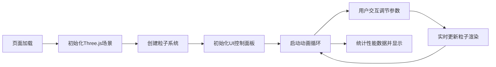

## 1. 产品概述

本产品是一个基于浏览器的3D动态流体粒子系统可视化应用，解决现有流体模拟工具要么过度简化缺乏真实感、要么过于复杂且无法在网页中流畅运行的问题。通过Three.js实现高性能的GPU粒子渲染，配合直观的控制面板，让用户可以实时调整参数并观察流体效果。

- 目标用户：设计师、开发者、视觉艺术爱好者及需要流体模拟效果的创作者
- 核心价值：在浏览器中提供真实感强、交互流畅、可定制的3D流体粒子可视化体验

## 2. 核心特性

### 2.1 功能模块

1. **3D粒子场景**：中央球体发射源，球面均匀随机方向发射粒子
2. **参数控制面板**：右侧固定面板，提供所有粒子参数的实时调节
3. **性能统计系统**：实时显示FPS、平均粒子数、渲染开销
4. **相机交互**：鼠标拖拽旋转、平移、滚轮缩放视角
5. **环境渲染**：纯黑背景+星点纹理闪烁效果

### 2.2 页面详情

| 页面名称 | 模块名称 | 功能描述 |
|-----------|-------------|---------------------|
| 主页面 | 3D渲染画布 | 全屏Canvas，渲染粒子系统、星空背景、球体发射源 |
| 主页面 | 控制面板 | 参数滑块、颜色选择器、复选框、实时柱状图、性能统计 |
| 主页面 | 相机控制 | 左键旋转、右键平移、滚轮缩放（0.5-5倍） |

## 3. 核心流程

## 4. 用户界面设计

### 4.1 设计风格

- **主色调**：纯黑背景(#000000)、深灰面板(#1a1a2ecc)、青色强调(#00bcd4/#00ffff)
- **按钮风格**：圆角6px，过渡动画0.15s ease
- **字体**：现代无衬线字体，科技感
- **布局风格**：全屏Canvas + 右侧固定280px控制面板
- **视觉风格**：暗色科技主题，半透明玻璃效果，干净统一

### 4.2 页面设计概览

| 页面名称 | 模块名称 | UI元素 |
|-----------|-------------|-------------|
| 主页面 | 3D场景 | 纯黑背景、星点纹理闪烁、青色粒子拖尾渐变、深蓝色衰减 |
| 主页面 | 控制面板 | 圆角8px半透明面板、1px边框、滑块带数值显示和过渡动画、动态柱状图 |
| 主页面 | 性能显示 | 左下角小字，每秒更新一次 |

### 4.3 响应式

桌面端优先设计，控制面板固定右侧，Canvas自适应全屏。

### 4.4 3D场景指引

- **环境**：纯黑背景 + 随机星点纹理（透明度0.1-0.3，4秒闪烁周期）
- **光照**：基础环境光，粒子使用自发光材质
- **相机**：PerspectiveCamera，OrbitControls控制视角
- **交互**：左键旋转、右键平移、滚轮缩放
- **后处理**：粒子半透明混合、AdditiveBlending增强流动感

## 5. 粒子参数规格

| 参数 | 范围 | 默认值 | 说明 |
|------|------|--------|------|
| 粒子数量 | 200-2000 | 800 | 最大同时存在粒子数 |
| 发射速率 | 1-50粒子/秒 | 20 | 每秒发射粒子数 |
| 粒子寿命 | 2-10秒 | 5秒 | 单个粒子存活时间 |
| 重力强度 | 0-2 | 0.5 | Y轴向下重力 |
| 湍流强度 | 0-5 | 1 | 随机扰动强度 |
| 初始速度X | -5到5 | 0 | X轴初始速度 |
| 初始速度Y | -5到5 | 1 | Y轴初始速度 |
| 初始速度Z | -5到5 | 0 | Z轴初始速度 |
| 起始颜色 | 颜色选择 | #00ffff | 粒子诞生时颜色 |
| 结束颜色 | 颜色选择 | #00008b | 粒子消亡时颜色 |
| 初始尺寸 | - | 0.3 | 粒子初始大小 |
| 低性能模式 | 复选框 | 关闭 | 关闭拖尾和渐变，固定大小0.2 |
