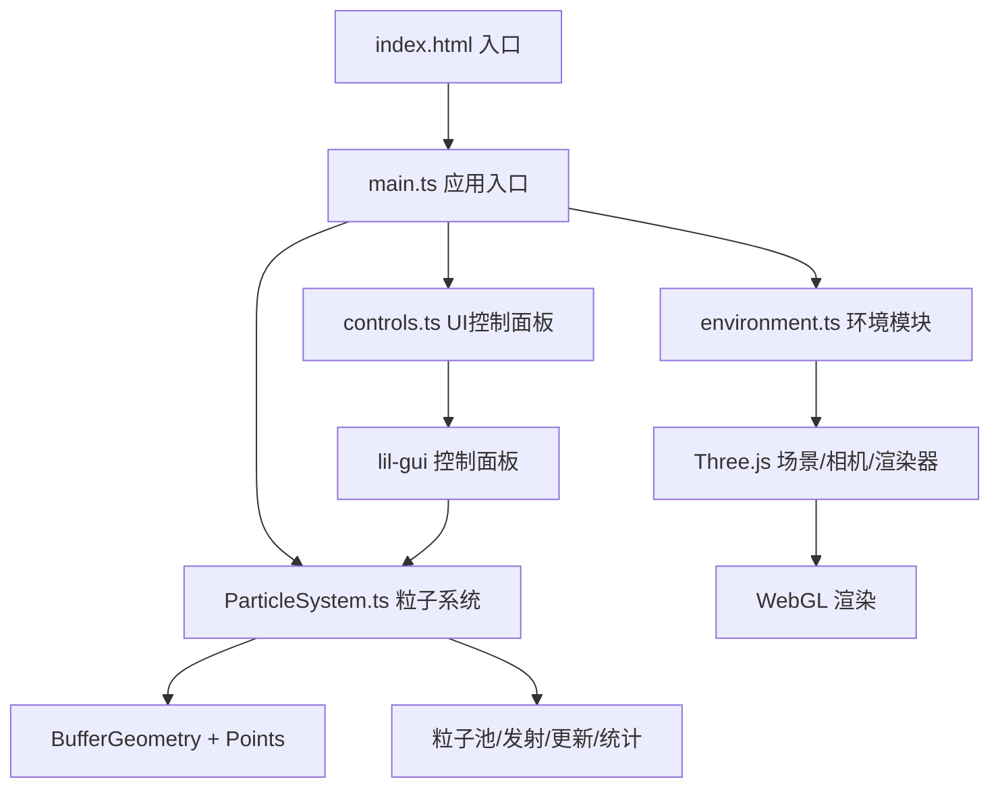

## 1. 架构设计



## 2. 技术描述

- **前端框架**：TypeScript + Vite
- **3D引擎**：Three.js (BufferGeometry + Points实现高性能粒子)
- **UI控制**：lil-gui (轻量级控制面板库)
- **构建工具**：Vite (快速冷启动、HMR热更新)
- **无后端**：纯前端应用，所有逻辑在浏览器端运行

## 3. 文件结构

```
project-root/
├── package.json
├── vite.config.js
├── tsconfig.json
├── index.html
└── src/
    ├── main.ts              # 应用入口，场景初始化与动画循环
    ├── ParticleSystem.ts    # 核心粒子系统类
    ├── controls.ts          # UI控制面板模块
    └── environment.ts       # 环境与场景设置
```

## 4. 核心类与模块

### 4.1 ParticleSystem 类

负责：
- 粒子对象池管理（TypedArray存储位置、颜色、速度、寿命等）
- 球面均匀随机方向发射算法
- 粒子物理更新（重力、湍流、寿命衰减）
- BufferGeometry + Points 渲染（带拖尾历史位置）
- 颜色/大小/透明度随寿命渐变
- 性能统计（FPS、粒子计数、渲染耗时）

关键属性：
- `maxParticles: number` - 最大粒子数（200-2000）
- `emissionRate: number` - 发射速率（1-50/秒）
- `lifetime: number` - 粒子寿命（2-10秒）
- `gravity: number` - 重力强度（0-2）
- `turbulence: number` - 湍流强度（0-5）
- `initialVelocity: Vector3` - 初始速度
- `startColor: Color` - 起始颜色
- `endColor: Color` - 结束颜色
- `lowPerformanceMode: boolean` - 低性能模式开关

### 4.2 controls.ts 模块

使用lil-gui创建控制面板：
- 滑块控件（带数值显示、0.2s平滑过渡动画）
- 颜色选择器
- 复选框（低性能模式）
- 自定义柱状图组件（粒子数量/发射速率）
- 性能统计实时显示

### 4.3 environment.ts 模块

- 创建纯黑背景场景
- 生成星点纹理（随机分布、透明度0.1-0.3、4秒闪烁）
- 相机和渲染器配置
- OrbitControls视角控制

## 5. 性能优化策略

1. **BufferGeometry + Points**：GPU批量渲染，避免逐个粒子draw call
2. **TypedArray存储**：使用Float32Array等提升内存访问效率
3. **对象池复用**：粒子死亡后回收，避免频繁GC
4. **低性能模式**：禁用拖尾（LineSegments）和透明度渐变，减少渲染开销
5. **帧率目标**：≤800粒子稳定60FPS，≤1500粒子≥30FPS

## 6. 粒子着色逻辑

- 颜色插值：`startColor.lerp(endColor, lifeRatio)`
- 大小衰减：`initialSize * (1 - lifeRatio)`
- 透明度衰减：`0.9 * (1 - lifeRatio)`
- 拖尾渲染：保留5个历史位置，使用Line或附加Points渲染
