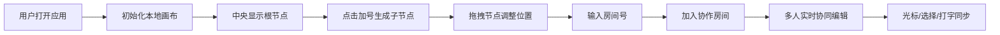

## 1. 产品概述

MindMeld 是一款在线多人协作思维导图编辑器，支持团队成员实时协同编辑同一份思维导图，实现节点增删改、自由拖拽、个性化定制和实时同步功能。

- 主要用途：团队头脑风暴、知识图谱构建、项目规划
- 目标用户：产品经理、设计师、开发团队、教育工作者
- 核心价值：打破空间限制，让团队创意在同一画布上实时碰撞

## 2. 核心功能

### 2.1 用户角色
| 角色 | 注册方式 | 核心权限 |
|------|----------|----------|
| 协作用户 | 通过房间号加入 | 创建/编辑/删除节点、拖拽节点、查看其他用户光标和操作 |

### 2.2 功能模块
1. **思维导图画布**：节点渲染、连线绘制、缩放平移
2. **节点管理**：节点增删、文本编辑、样式定制（颜色/字体/图标）、层级展开
3. **拖拽交互**：节点自由拖拽、连线自动重绘、贝塞尔曲线优化
4. **实时协作**：房间管理、多用户光标显示、节点选择高亮、打字同步
5. **状态统计**：在线用户数、节点总数展示

### 2.3 页面详情
| 页面名称 | 模块名称 | 功能描述 |
|----------|----------|----------|
| 主界面 | 顶部导航栏 | 应用名称、房间号输入框、加入房间按钮 |
| 主界面 | 思维导图画布 | SVG渲染节点和连线、滚轮缩放、中键平移 |
| 主界面 | 节点组件 | 文本编辑、加号按钮展开子节点、拖拽手柄、修改者标识 |
| 主界面 | 协作光标 | 多用户彩色圆点光标、平滑滞后跟随、选择节点高亮环 |
| 主界面 | 状态横幅 | 左下角毛玻璃效果面板、显示用户数和节点数 |

## 3. 核心流程

用户打开应用 → 默认进入一个本地房间 → 画布中央显示根节点"主题" → 点击加号展开子节点 → 拖拽调整布局 → 输入房间号邀请他人 → 多人同时编辑 → 实时同步所有变更

## 4. 用户界面设计

### 4.1 设计风格
- **主色调**：根节点深蓝 #1565c0，子节点黄绿 #c0ca33，连线 #90a4ae
- **背景**：画布灰白 #f5f5f5，导航栏浅灰蓝 #e3f2fd
- **按钮样式**：圆角、悬停加深阴影、点击缩放反馈
- **字体**：系统无衬线字体，节点文本清晰易读
- **布局风格**：简约留白，画布占满屏幕，仅顶部导航和底部状态栏
- **动效**：节点展开弹性动画（0.2s）、拖拽放大1.1倍+阴影、光标平滑滞后0.15s

### 4.2 页面设计概述
| 页面名称 | 模块名称 | UI 元素 |
|----------|----------|---------|
| 主界面 | 导航栏 | 左对齐Logo "MindMeld"，右侧房间号输入框 + 加入按钮，浅蓝背景 #e3f2fd |
| 主界面 | 画布区域 | SVG 全屏渲染，灰白背景 #f5f5f5，支持缩放(0.3x~3x)和平移 |
| 主界面 | 根节点 | 圆形深蓝填充 #1565c0，白色文字"主题"，右侧悬浮加号按钮 |
| 主界面 | 子节点 | 圆角矩形黄绿 #c0ca33，深色文字，四方向分布(间隔90°)，最多5层 |
| 主界面 | 连线 | 三次贝塞尔曲线，颜色 #90a4ae，宽度 2px，末端三角形箭头 |
| 主界面 | 协作光标 | 彩色圆点(8种预设色)，用户名标签，平滑跟随延迟 0.15s |
| 主界面 | 选择高亮 | 用户选中节点时对应颜色 2px 实线圆环 |
| 主界面 | 状态横幅 | 左下角 fixed 定位，毛玻璃(backdrop-filter: blur)，圆角 12px，显示用户数和节点数 |

### 4.3 响应性
- 桌面端优先设计，画布自适应窗口大小
- 支持触控设备的双指缩放和单指拖拽
- 导航栏在小屏幕上垂直堆叠

### 4.4 性能要求
- 200个节点时保持 60fps 流畅拖拽和连线重绘
- 使用 requestAnimationFrame 优化动画
- 节点和连线使用 SVG 高效渲染
- WebSocket 消息节流：文本编辑每 500ms 同步一次
