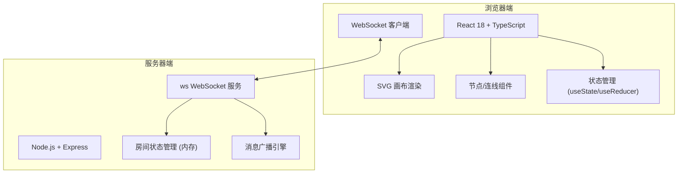
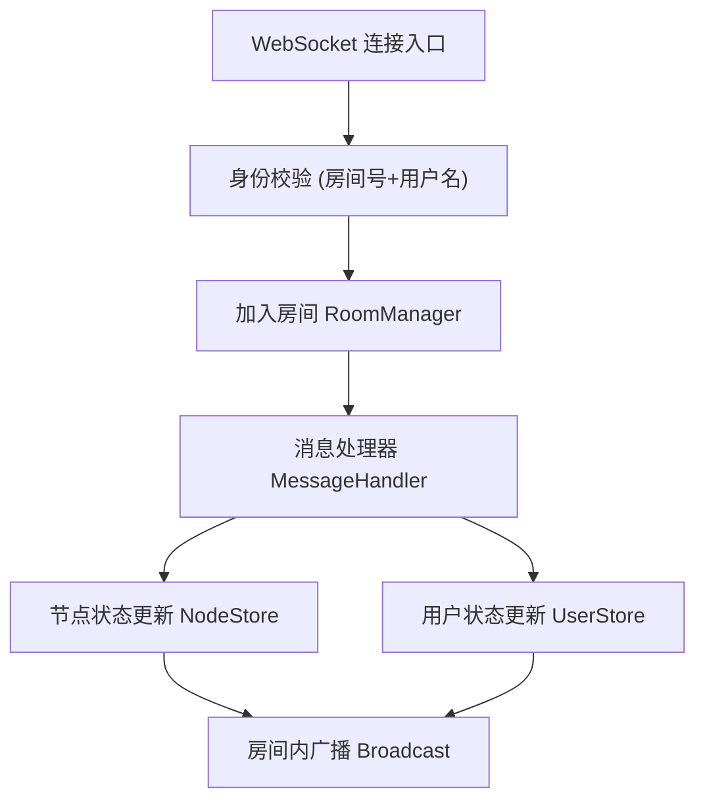
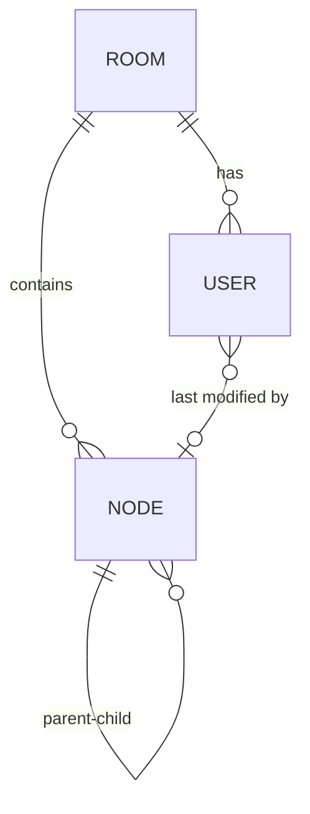

## 1. 架构设计



## 2. 技术说明

- **前端**：React 18 + TypeScript + Vite
- **后端**：Node.js + Express 4 + ws (WebSocket 库)
- **通信协议**：WebSocket 自定义 JSON 消息
- **渲染技术**：原生 SVG（节点、连线、贝塞尔曲线）
- **状态存储**：服务端内存存储房间状态（无持久化数据库）
- **构建工具**：Vite 5，代理 /api 和 /ws 到后端 3001 端口

## 3. 路由定义

| 路由 | 用途 |
|------|------|
| / | 前端 SPA 入口，渲染思维导图编辑器 |
| /ws | WebSocket 连接端点，处理实时协作消息 |

## 4. API 定义（WebSocket 消息协议）

### 4.1 消息类型定义

```typescript
// 节点数据结构
interface MindMapNode {
  id: string;
  parentId: string | null;
  text: string;
  x: number;
  y: number;
  level: number; // 0 = 根节点, 最大 5
  color: string;
  textColor: string;
  lastModifiedBy: string; // 用户ID
  lastModifiedByName: string;
  lastModifiedAt: number;
}

// 用户数据结构
interface User {
  id: string;
  name: string;
  color: string;
  cursorX: number;
  cursorY: number;
  selectedNodeId: string | null;
}

// WebSocket 消息类型
type WSMessage =
  | { type: 'join_room'; roomId: string; userName: string }
  | { type: 'room_joined'; roomId: string; userId: string; nodes: MindMapNode[]; users: User[] }
  | { type: 'user_joined'; user: User }
  | { type: 'user_left'; userId: string }
  | { type: 'cursor_update'; x: number; y: number }
  | { type: 'node_select'; nodeId: string | null }
  | { type: 'node_add'; node: MindMapNode }
  | { type: 'node_update'; node: Partial<MindMapNode> & { id: string } }
  | { type: 'node_delete'; nodeId: string }
  | { type: 'node_move'; nodeId: string; x: number; y: number }
  | { type: 'node_text_edit'; nodeId: string; text: string }
  | { type: 'error'; message: string };
```

## 5. 服务器架构



### 服务端核心模块
- `RoomManager`：维护房间列表，最多8人/房间，节点数据状态
- `NodeStore`：节点增删改查操作，层级校验（≤5层）
- `UserStore`：在线用户管理，颜色分配（8种预设色）
- `Broadcast`：向房间内其他用户广播变更消息

## 6. 数据模型

### 6.1 实体关系图



### 6.2 数据约束

```typescript
// 预设用户颜色（8种）
const USER_COLORS = [
  '#e53935', '#fb8c00', '#fdd835', '#43a047',
  '#00acc1', '#1e88e5', '#8e24aa', '#ec407a'
];

// 节点层级限制
const MAX_LEVEL = 5;

// 子节点分布角度（间隔90度）
const CHILD_ANGLES = [0, 90, 180, 270];

// 默认节点样式
const DEFAULT_ROOT_STYLE = {
  color: '#1565c0',
  textColor: '#ffffff',
  shape: 'circle'
};
const DEFAULT_CHILD_STYLE = {
  color: '#c0ca33',
  textColor: '#263238',
  shape: 'rounded-rect'
};

// 画布缩放范围
const MIN_SCALE = 0.3;
const MAX_SCALE = 3;
```

## 7. 前端核心实现要点

### 7.1 画布交互
- 滚轮缩放：使用鼠标位置为中心，计算 `transform-origin`
- 中键平移：监听 `mousedown`(button=1) → `mousemove` 更新偏移
- 拖拽节点：`mousedown` 捕获 → `mousemove` 更新坐标 → `mouseup` 发送 `node_move`

### 7.2 连线算法
- 三次贝塞尔曲线：控制点根据父子节点相对位置自动计算
- 避免交叉：根据方向角偏移控制点，垂直/水平方向使用不同策略
- 箭头标记：SVG `<marker>` 定义三角形，`marker-end` 属性引用

### 7.3 动画实现
- 节点展开：CSS transform + transition，`scale(0, 0) → scale(1, 1)` + 位移，`ease-out` 0.2s
- 拖拽反馈：`:active` 状态 `scale(1.1)` + `box-shadow: 0 3px 12px #00000033`
- 光标平滑：requestAnimationFrame 插值，目标位置延迟 0.15s 逼近

### 7.4 性能优化
- 节点 memo：`React.memo` 避免不必要重渲染
- 连线批量更新：位置变化时只更新 path d 属性
- 消息节流：text_edit 每 500ms 发送一次，使用 lodash.throttle
- SVG 分层：连线在底层 `<g>`，节点在上层 `<g>`，减少重绘区域
