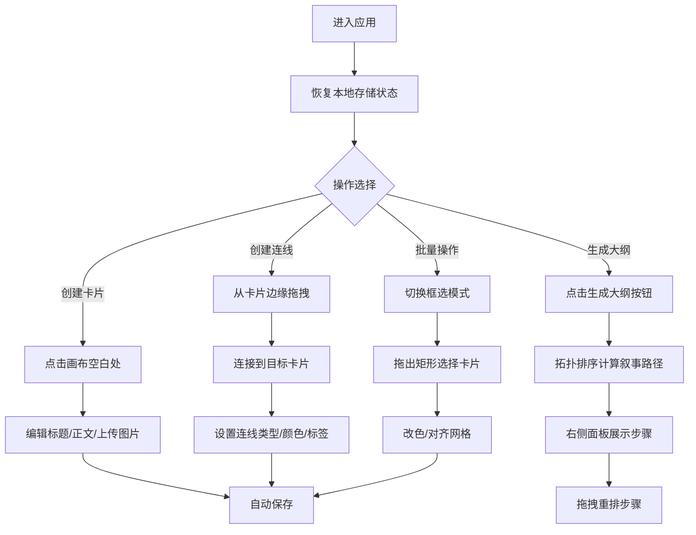

## 1. 产品概述

交互式数字灵感板与情节编排工具，帮助创意写作者将零散的文字片段、图片和笔记以非线性方式自由排列组合，直观呈现创作逻辑，最终自动生成结构化的叙事大纲。

- 主要用途：创意写作辅助、情节构思、灵感整理与叙事编排
- 目标用户：小说作者、编剧、内容创作者、需要非线性思维整理的创意工作者
- 产品价值：将传统线性文档无法表达的非线性创作关系可视化，降低构思复杂度，提升创意组织效率

## 2. 核心功能

### 2.1 功能模块

1. **无限画布模块**：支持缩放（0.5x-3x）、右键拖拽平移、网格对齐
2. **灵感卡片模块**：卡片创建、编辑、拖拽、删除、颜色配置、图片上传
3. **连线关系模块**：贝塞尔曲线连线、箭头/虚线两种类型、颜色选择、标签编辑
4. **批量操作模块**：矩形框选、批量改色、批量对齐网格
5. **叙事大纲模块**：基于拓扑排序自动生成线性叙事路径、大纲面板滑入/收起、手动拖拽重排
6. **本地存储模块**：自动保存画布状态到 localStorage、版本校验恢复

### 2.3 页面详情

| 页面名称 | 模块名称 | 功能描述 |
|-----------|-------------|---------------------|
| 主工作台 | 顶部工具栏 | 新建卡片、切换框选/连线模式、生成大纲、缩放控制 |
| 主工作台 | 无限画布 | 渲染卡片与连线、处理缩放平移、框选交互 |
| 主工作台 | 灵感卡片 | 标题/正文编辑、颜色选择、图片缩略图与预览、拖拽移动 |
| 主工作台 | 连线系统 | 拖拽创建连线、贝塞尔曲线实时绘制、颜色与类型切换、标签编辑 |
| 主工作台 | 大纲面板 | 右侧滑入展示叙事步骤、拖拽重排步骤顺序 |

## 3. 核心流程

### 3.1 主要用户流程

用户进入应用后，画布自动恢复上次保存的状态。用户可在任意位置点击创建灵感卡片，在卡片中输入标题、正文并上传图片。通过从卡片边缘拖拽可创建连线连接到其他卡片，标注因果或时序关系并添加文字标签。使用框选模式可批量选择多张卡片进行颜色修改或网格对齐。点击"生成大纲"按钮后，系统根据连线关系通过拓扑排序计算出线性叙事路径，在右侧面板展示步骤列表，用户可拖拽调整顺序，最终形成完整叙事大纲。

### 3.2 流程图

## 4. 用户界面设计

### 4.1 设计风格

- **主色调**：深蓝紫渐变背景（#1a1a2e → #16213e），卡片主色 #2a2a4e
- **辅助色**：暖橙 #ff6b6b（高亮/删除）、连线预设6色、卡片预设12色
- **字体**：现代无衬线字体，标题醒目、正文易读
- **按钮风格**：毛玻璃背景、圆角、悬停微缩放、点击反馈
- **布局风格**：全屏沉浸式画布，顶部固定毛玻璃工具栏，右侧可滑入大纲面板
- **动效**：卡片创建放大淡入（0.3s ease-out）、悬停上浮阴影加深（0.2s）、连线渐进绘制（0.5s）、面板滑入（0.3s ease）、网格对齐弹性动画（0.2s）

### 4.2 页面设计概览

| 页面名称 | 模块名称 | UI元素 |
|-----------|-------------|-------------|
| 主工作台 | 工具栏 | 毛玻璃背景 rgba(30,30,60,0.8)、backdrop-filter blur(8px)、功能按钮组、缩放控件 |
| 主工作台 | 画布容器 | 深色微渐变背景、50px网格参考线、支持滚轮缩放与右键平移 |
| 主工作台 | 灵感卡片 | 圆角12px、1px半透明白边、阴影 0 4px 12px rgba(0,0,0,0.3)、悬停上浮3px加深阴影、编辑时顶部发光 |
| 主工作台 | 贝塞尔连线 | 2px灰色曲线、起点圆形锚点、末端箭头、选中3px发光、虚线 stroke-dasharray 5,5 |
| 主工作台 | 选框 | 半透明蓝填充 #4d96ff33、2px蓝色边框 |
| 主工作台 | 大纲面板 | 右侧滑入、步骤列表、可拖拽排序、步骤卡片显示标题与摘要 |

### 4.3 响应式设计

- **桌面端（≥768px）**：顶部水平工具栏、卡片 200×150px、连线标签标准字号
- **移动端（<768px）**：左侧垂直侧边栏（宽度60px）、卡片最小 160×120px、连线标签字号缩小
- **触摸优化**：增大点击热区、支持双指缩放与单指平移

### 4.4 性能指标

- 50张卡片 + 100条连线同时渲染：帧率 ≥ 45fps
- 卡片拖拽响应延迟 ≤ 50ms
