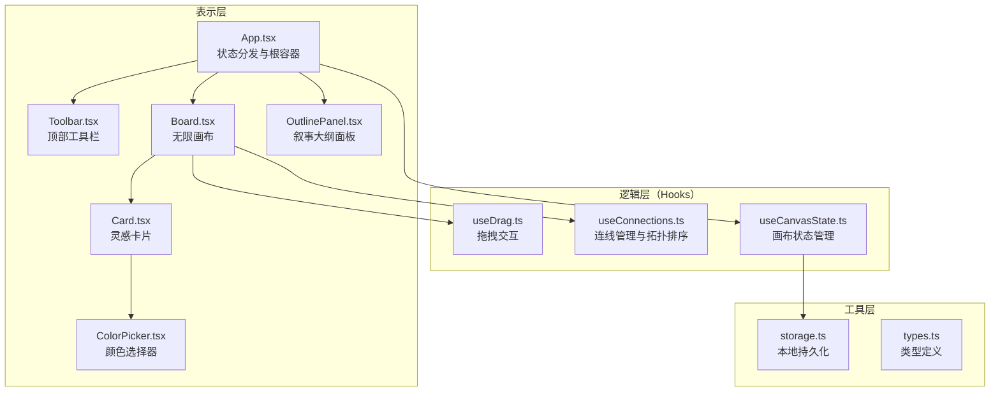
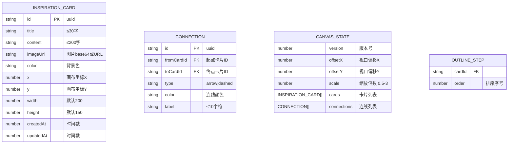

## 1. 架构设计



## 2. 技术栈描述

- **前端框架**：React 18 + TypeScript（严格模式）
- **构建工具**：Vite + @vitejs/plugin-react
- **状态管理**：React useState/useReducer + 自定义 hooks（轻量场景，无需引入 zustand）
- **拖拽库**：react-beautiful-dnd（大纲排序）+ 原生事件（画布拖拽）
- **唯一ID**：uuid
- **样式方案**：原生 CSS + CSS Variables（无 tailwind，按用户指定样式细节精确控制）
- **存储**：localStorage + JSON 序列化 + 版本号校验
- **无后端**：纯前端应用，数据本地持久化

## 3. 路由定义

| 路由 | 用途 |
|-------|---------|
| / | 主工作台（单页应用，无多路由） |

## 6. 数据模型

### 6.1 数据模型定义



### 6.2 TypeScript 类型定义

```typescript
export interface Card {
  id: string;
  title: string;
  content: string;
  imageUrl?: string;
  color: string;
  x: number;
  y: number;
  width: number;
  height: number;
  createdAt: number;
  updatedAt: number;
}

export type ConnectionType = 'arrow' | 'dashed';

export interface Connection {
  id: string;
  fromCardId: string;
  toCardId: string;
  type: ConnectionType;
  color: string;
  label: string;
}

export interface CanvasState {
  version: number;
  offsetX: number;
  offsetY: number;
  scale: number;
  cards: Card[];
  connections: Connection[];
}

export interface OutlineStep {
  cardId: string;
  order: number;
}

export type ToolMode = 'select' | 'boxSelect' | 'connect';

export const CANVAS_STORAGE_VERSION = 1;
export const CARD_COLORS = ['#2a2a4e', '#ff6b6b', '#ffd93d', '#6bcb77', '#4d96ff', '#9b59b6', '#e67e22', '#1abc9c', '#34495e', '#e91e63', '#00bcd4', '#795548'];
export const CONNECTION_COLORS = ['#aaaaaa', '#ff6b6b', '#ffd93d', '#6bcb77', '#4d96ff', '#9b59b6'];
export const GRID_SIZE = 50;
export const MIN_SCALE = 0.5;
export const MAX_SCALE = 3;
```
