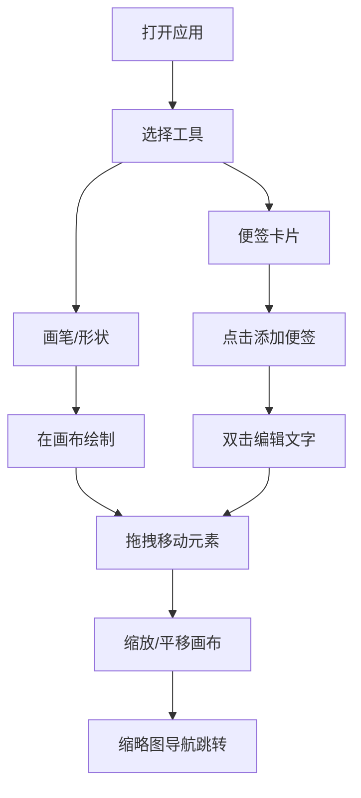

## 1. 产品概述

在线协作白板工具，为远程团队提供轻量级的头脑风暴空间。用户可在网页上实时绘制图形、粘贴便签卡片、拖拽元素，支持无限画布缩放平移。

- 目标用户：远程协作团队、产品经理、设计师、教育工作者
- 核心价值：打破地理限制，提供直观、流畅的可视化协作体验

## 2. 核心功能

### 2.1 功能模块

1. **主画布界面**：无限画布、工具栏、缩略图导航器
2. **绘制工具**：自由画笔、矩形、圆形、颜色选择、线条粗细
3. **便签卡片**：彩色便签、文字编辑、拖拽移动、删除功能
4. **画布控制**：缩放、平移、缩略图导航、视口同步

### 2.2 页面详情

| 页面名称 | 模块名称 | 功能描述 |
|-----------|-------------|---------------------|
| 主画布 | 顶部工具栏 | 工具选择、颜色选择、粗细调节、便签添加、清空画布 |
| 主画布 | Konva画布 | 自由绘制、图形绘制、元素拖拽、缩放平移 |
| 主画布 | 便签卡片 | 双击编辑文字、拖拽移动、右上角删除按钮、弹性动画 |
| 主画布 | 缩略图导航器 | 实时显示视口位置、点击跳转、淡入更新效果 |

## 3. 核心流程

用户打开应用 → 选择绘制工具（画笔/矩形/圆形）或便签工具 → 在画布上进行创作 → 可缩放平移查看不同区域 → 通过缩略图快速导航 → 编辑或删除已创建元素

## 4. 用户界面设计

### 4.1 设计风格

- 主色调：暖灰米白 (#f5f0e6) 作为画布背景
- 点缀色：柔和蓝绿色 (#4a9e8f) 用于按钮、选中状态
- 按钮风格：圆角10px、微弱阴影悬浮效果、点击下压反馈 (translateY(2px))
- 字体：现代无衬线字体，清晰易读
- 布局：顶部工具栏集中布局，画布自适应窗口
- 便签动画：从中心向外扩散的弹性动画（0.3秒）
- 缩略图：淡入更新效果

### 4.2 页面设计概览

| 页面名称 | 模块名称 | UI元素 |
|-----------|-------------|-------------|
| 主画布 | 顶部工具栏 | 圆角按钮、颜色选择器、粗细滑块、图标按钮 |
| 主画布 | 画布区域 | 暖灰背景、无限延伸、绘制元素 |
| 主画布 | 便签卡片 | 圆角矩形、彩色背景、可编辑文字、删除按钮、弹性动画 |
| 主画布 | 缩略图导航器 | 固定右下角、边框、视口指示框、点击跳转 |

### 4.3 响应式设计

- Desktop-first 设计，移动端自动折叠工具栏为汉堡菜单
- 画布始终自适应窗口大小
- 触控设备支持手势缩放和平移
- 按钮和交互元素在移动端增大触摸区域

## 5. 性能要求

- 拖拽和绘画帧率 ≥ 50fps
- 支持 2000 个绘制元素内流畅操作
- 缩放时保持画笔坐标精准
- 缩略图更新带节流优化
