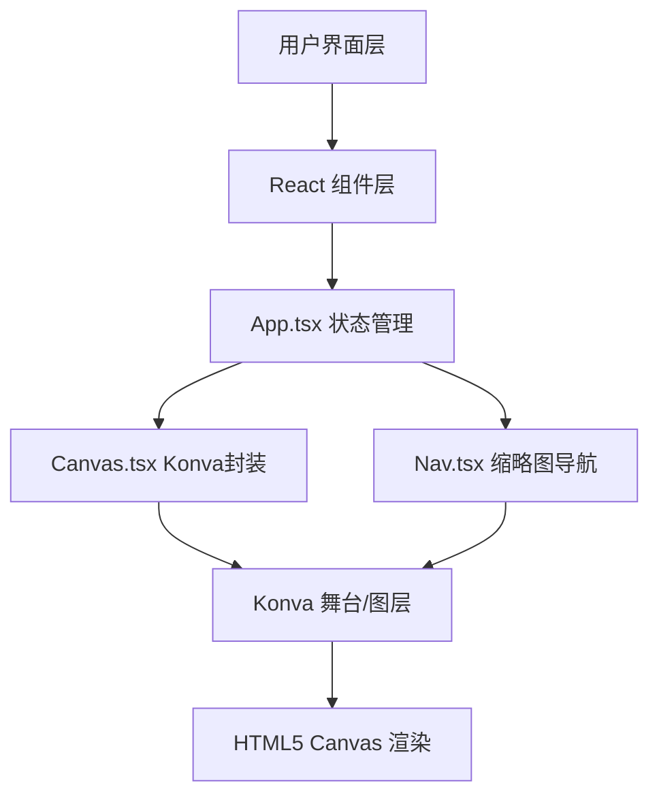

## 1. 架构设计



## 2. 技术说明

- 前端框架：React 18 + TypeScript
- 构建工具：Vite
- 画布库：konva + react-konva
- 状态管理：React useState/useRef (App层集中管理)
- 样式方案：纯CSS (内联样式 + 全局样式)
- 无后端、无数据库，纯前端应用

## 3. 文件结构

```
├── package.json
├── vite.config.ts
├── tsconfig.json
├── index.html
└── src/
    ├── main.tsx
    ├── App.tsx
    └── components/
        ├── Canvas.tsx
        └── Nav.tsx
```

## 4. 数据模型

### 4.1 类型定义

```typescript
// 工具类型
type ToolType = 'pen' | 'rect' | 'circle' | 'sticky' | 'select';

// 基础绘制元素
interface BaseElement {
  id: string;
  x: number;
  y: number;
}

// 画笔线条
interface PenLine extends BaseElement {
  type: 'pen';
  points: number[];
  color: string;
  strokeWidth: number;
}

// 矩形
interface RectElement extends BaseElement {
  type: 'rect';
  width: number;
  height: number;
  color: string;
  strokeWidth: number;
}

// 圆形
interface CircleElement extends BaseElement {
  type: 'circle';
  radius: number;
  color: string;
  strokeWidth: number;
}

// 便签卡片
interface StickyNote extends BaseElement {
  type: 'sticky';
  text: string;
  color: string;
  width: number;
  height: number;
}

// 联合类型
type DrawElement = PenLine | RectElement | CircleElement | StickyNote;

// 视口状态
interface Viewport {
  x: number;
  y: number;
  scale: number;
}
```

## 5. 性能优化策略

1. 使用 Konva 的分层渲染，静态元素与动态元素分离
2. 便签卡片使用 HTML 覆盖层 + Konva 坐标同步
3. 缩略图渲染使用 requestAnimationFrame 节流
4. 缩放平移使用 Konva 内置的 stage 变换
5. 绘制时使用临时 layer，完成后移至主 layer
6. 事件监听使用节流/防抖优化

## 6. 数据流

```
App.tsx (状态中心)
  ├── 传出: elements[], tool, color, strokeWidth, viewport
  ├── 传入: onAddElement, onUpdateElement, onDeleteElement, onViewportChange
  │
  ├── Canvas.tsx
  │     └── 处理: 绘制事件、缩放平移、便签交互
  │
  └── Nav.tsx
        └── 处理: 缩略图渲染、点击跳转
```
