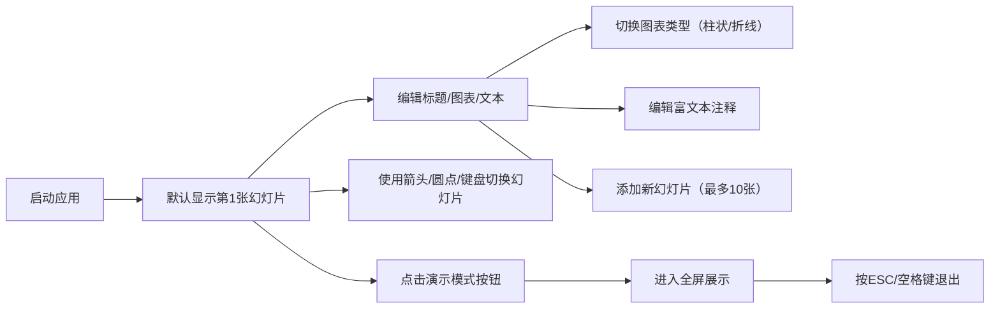

## 1. 产品概述
交互式数据故事讲述工具，让用户能以幻灯片形式组合图表、文本和图片，并配有平滑的页面切换动画。
- 主要用途：创建数据驱动的演示文稿，融合D3数据可视化与叙事性文本
- 目标用户：数据分析师、产品经理、教育工作者、内容创作者
- 产品价值：将枯燥的数据转化为引人入胜的可视化故事，提升信息传达效率

## 2. 核心功能

### 2.1 功能模块
1. **幻灯片编辑器**：创建、编辑最多10张幻灯片，每张包含标题、图表、文本注释
2. **数据可视化**：支持柱状图/折线图，基于D3实现，带入场动画和响应式缩放
3. **富文本编辑**：注释区支持粗体、斜体、列表，字号可调（12px-32px）
4. **导航系统**：底部圆点进度条、左右箭头、键盘方向键切换
5. **演示模式**：全屏展示，隐藏编辑控件，ESC/空格退出

### 2.2 页面详情
| 页面名称 | 模块名称 | 功能描述 |
|-----------|-------------|---------------------|
| 主编辑界面 | 幻灯片容器 | 展示当前幻灯片，圆角卡片布局，支持左右滑动切换 |
| 主编辑界面 | 导航栏 | 底部圆点进度指示器（当前页高亮放大）、左右箭头按钮 |
| 主编辑界面 | 工具栏 | 演示模式按钮、新增幻灯片按钮、图表类型切换 |
| 主编辑界面 | 富文本编辑器 | 支持粗体、斜体、列表，字号调节，焦点高亮边框 |
| 主编辑界面 | D3图表区域 | 柱状图/折线图渲染，底部向上生长动画，响应式缩放 |
| 演示模式 | 全屏展示 | 幻灯片居中放大，背景遮罩雾化（backdrop-filter: blur），隐藏编辑控件 |

## 3. 核心流程
用户从打开应用开始，可以创建新幻灯片、编辑标题和内容、配置图表类型与数据、添加富文本注释，然后通过导航控件或键盘切换预览，最后进入演示模式进行全屏展示。

## 4. 用户界面设计

### 4.1 设计风格
- **主色调**：深色科技风 - 背景#0f172a，卡片#1e293b
- **文字颜色**：标题#f8fafc，正文#cbd5e1
- **强调色**：紫色渐变#7c3aed → #a78bfa
- **按钮风格**：圆角设计，悬停scale(1.05)缩放，0.2s颜色过渡
- **字体**：现代无衬线字体，清晰易读
- **布局**：居中布局，最大宽度1200px，左右留白自适应
- **卡片样式**：圆角16px，阴影box-shadow: 0 4px 6px -1px rgba(0,0,0,0.3)

### 4.2 页面设计概述
| 页面名称 | 模块名称 | UI元素 |
|-----------|-------------|-------------|
| 主编辑界面 | 幻灯片卡片 | 深色背景卡片，16px圆角，柔和阴影，标题栏+图表区+文本区三段式布局 |
| 主编辑界面 | 导航圆点 | 底部居中排列，当前页缩放1.2倍高亮，弹性过渡动画 |
| 主编辑界面 | 箭头按钮 | 左右两侧垂直居中，紫色渐变背景，悬停缩放 |
| 主编辑界面 | 富文本区 | 可编辑区域，焦点边框#7c3aed→#a78bfa渐变过渡0.3s |
| 主编辑界面 | D3图表 | SVG渲染，柱状/折线带入场动画（0.8s从底部向上生长） |
| 演示模式 | 全屏遮罩 | backdrop-filter: blur(4px)，幻灯片居中放大 |

### 4.3 响应式
- Desktop-first设计
- 768px以下：幻灯片卡片宽度占满可用空间，导航圆点缩小至8px
- 图表区域响应式缩放，保持纵横比
