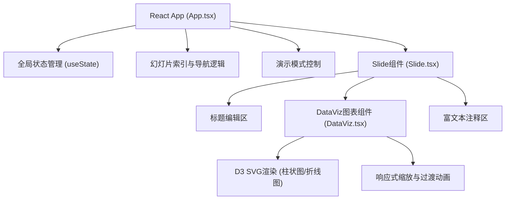

## 1. 架构设计



## 2. 技术描述
- **前端框架**：React@18 + TypeScript
- **构建工具**：Vite@5 + @vitejs/plugin-react
- **动画库**：framer-motion（幻灯片切换、入场动画、弹性过渡）
- **数据可视化**：D3@7（柱状图、折线图渲染与过渡）
- **样式方案**：原生CSS（styles.css），CSS变量定义主题，keyframes动画
- **状态管理**：React useState（轻量级，无需额外状态库）

## 3. 项目文件结构
| 文件 | 用途 |
|-------|---------|
| `package.json` | 项目依赖与脚本配置 |
| `vite.config.js` | Vite构建配置（React+TS支持） |
| `tsconfig.json` | TypeScript严格模式配置 |
| `index.html` | 入口HTML，CSS重置与字体引入 |
| `src/main.tsx` | React根组件挂载 |
| `src/App.tsx` | 主应用，管理幻灯片索引、演示模式、导航逻辑 |
| `src/Slide.tsx` | 单幻灯片组件，渲染标题/图表/文本，framer-motion动画 |
| `src/DataViz.tsx` | D3图表封装，柱状图/折线图，响应式缩放与过渡 |
| `src/styles.css` | 全局样式，暗色主题CSS变量，过渡keyframes |

## 4. 数据模型

### 4.1 Slide类型定义
```typescript
interface SlideData {
  id: string;
  title: string;
  chartType: 'bar' | 'line';
  data: { label: string; value: number }[];
  note: string;
  noteFontSize: number;
}
```

### 4.2 初始数据
- 默认创建3张示例幻灯片
- 每张至少5个数据点
- 示例数据覆盖不同场景（销售趋势、用户增长、产品分布等）

## 5. 动画与性能策略
| 场景 | 实现方式 | 性能目标 |
|-------|---------|---------|
| 幻灯片切换 | framer-motion AnimatePresence + x轴位移 | 60FPS，0.5s easeInOut |
| 图表入场 | D3 transition() + scaleY从0到1 | 300ms内完成，0.8s动画 |
| 导航圆点 | framer-motion spring弹性动画 | 流畅无卡顿 |
| 按钮悬停 | CSS transform: scale(1.05) + 0.2s过渡 | GPU加速 |
| 焦点高亮 | CSS border-color transition 0.3s | 仅重绘边框 |
| 演示模式 | Fullscreen API + CSS backdrop-filter | 平滑过渡 |
