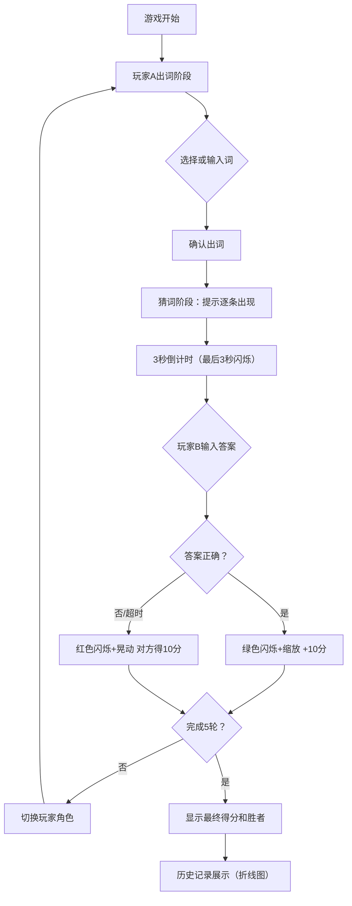

## 1. 产品概述
双人实时猜词对抗小游戏，解决远程朋友间缺乏轻量、即时、有互动感的文字默契挑战问题。纯前端实现，无需后端支持，通过轮流出词和猜词模式进行趣味对战。

- 主要用途：朋友间远程互动、文字默契挑战、休闲娱乐
- 目标用户：喜欢文字游戏、需要远程互动娱乐的用户群体
- 产品价值：提供即时、轻量、有趣的双人文字对战体验

## 2. 核心功能

### 2.1 用户角色
| 角色 | 说明 | 核心权限 |
|------|------|----------|
| 出词方（玩家A） | 选择或输入目标词 | 从词库选词/自定义输入词、确认出词、观看猜词过程 |
| 猜词方（玩家B） | 根据提示猜测目标词 | 查看提示、倒计时内猜词、获得/失去分数 |

### 2.2 功能模块
1. **游戏主界面**：轮次显示、得分显示、当前玩家标识
2. **出词阶段**：预设词库分类浏览、自定义词输入、确认出词按钮
3. **猜词阶段**：提示打字机动画、键盘音效、倒计时闪烁、答案输入
4. **结果反馈**：猜对/猜错动画、分数飘字、卡片特效
5. **历史记录**：轮次明细、得分变化折线图、清空记录

### 2.3 页面详情
| 页面名称 | 模块名称 | 功能描述 |
|-----------|-------------|---------------------|
| 游戏主页 | 状态栏 | 显示当前轮次、双方得分、当前玩家角色 |
| 游戏主页 | 出词面板 | 词库分类标签、词条列表、自定义输入框、确认出词按钮 |
| 游戏主页 | 猜词面板 | 提示展示区（打字机效果）、倒计时、答案输入框 |
| 游戏主页 | 结果反馈 | 卡片颜色闪烁、缩放/晃动动画、分数飘字 |
| 游戏主页 | 历史记录边栏 | 轮次列表、Canvas折线图、清空按钮 |

## 3. 核心流程

### 主流程描述
游戏开始 → 玩家A出词（词库选择或自定义）→ 确认后进入猜词阶段 → 逐条提示以打字机效果出现（每条3秒倒计时）→ 玩家B输入答案 → 判断正误并显示反馈动画 → 切换玩家角色 → 重复5轮 → 显示总分和胜者 → 可查看历史记录折线图

## 4. 用户界面设计

### 4.1 设计风格
- **主色调**：深蓝紫渐变背景（#1a1a2e → #16213e）
- **卡片风格**：磨砂玻璃效果（backdrop-filter: blur(12px)，背景半透明#ffffff10，边框1px solid #ffffff30）
- **按钮风格**：圆角12px，悬停时背景变亮1.2倍，过渡0.2s，确认按钮有3D按压效果（transition 0.15s）
- **字体**：提示区域使用等宽字体 'Courier New', monospace，颜色#e0e0e0
- **高亮**：当前提示金色边框（#ffd700），猜对绿色#4CAF50，猜错红色#F44336
- **动效**：所有切换带有0.3s淡入淡出+上移15px组合动画

### 4.2 页面设计概览
| 页面名称 | 模块名称 | UI元素 |
|-----------|-------------|-------------|
| 游戏主页 | 状态栏 | 磨砂玻璃卡片、得分数字、玩家标识、轮次进度 |
| 游戏主页 | 出词面板 | 分类标签页、词条网格、输入框、3D按压按钮 |
| 游戏主页 | 猜词面板 | 等宽字体提示区、打字机光标、居中闪烁倒计时、输入框 |
| 游戏主页 | 结果反馈 | 背景色闪现、缩放/晃动关键帧动画、向上飘动渐隐分数飘字 |
| 游戏主页 | 历史记录 | 280px侧边栏、轮次明细列表、Canvas折线图（渐变阴影+圆点标记） |

### 4.3 响应式设计
- **桌面端（≥1024px）**：左右分栏布局，左游戏区70%，右历史记录30%
- **平板端（768-1023px）**：上下布局，历史记录折叠为可展开面板
- **手机端（<768px）**：全屏单列，历史记录以底部滑出抽屉形式呈现

### 4.4 性能要求
- 界面操作帧率稳定≥55fps
- 猜词倒计时精确±50ms以内
