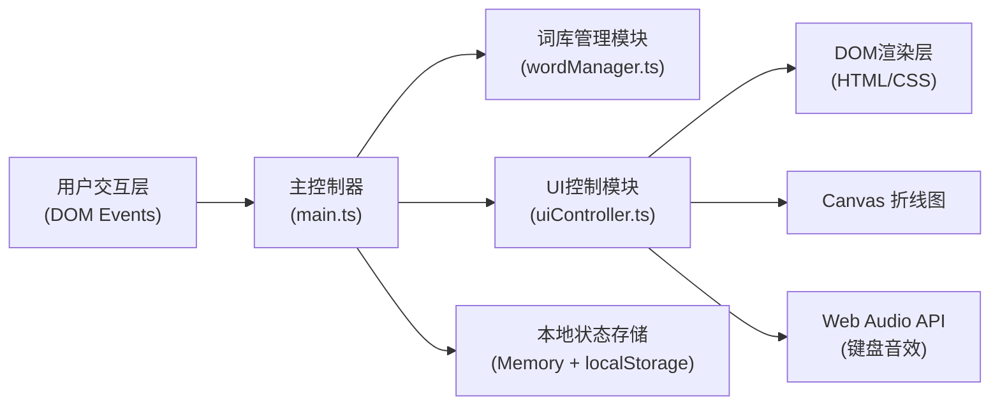

## 1. 架构设计

纯前端单页应用，无后端服务，所有状态和逻辑在浏览器本地运行。



## 2. 技术说明
- **前端框架**：纯 TypeScript + Vite（无React/Vue框架，原生DOM操作）
- **构建工具**：Vite 5.x
- **语言**：TypeScript 5.x（严格模式）
- **样式**：原生 CSS3（CSS变量、关键帧动画、backdrop-filter）
- **图形绘制**：Canvas 2D API（折线图）
- **音频**：Web Audio API（生成键盘敲击音效）
- **数据存储**：内存状态 + localStorage（历史记录持久化）

## 3. 路由定义
无路由，单页应用（SPA），通过状态切换显示不同阶段UI。

## 4. 文件结构定义

```
auto8/
├── package.json              # 项目依赖与脚本
├── vite.config.js            # Vite配置
├── tsconfig.json             # TypeScript配置（严格模式）
├── index.html                # 入口HTML
├── style.css                 # 全局样式
└── src/
    ├── main.ts               # 游戏主循环与状态管理
    ├── wordManager.ts        # 词库管理模块
    └── uiController.ts       # UI控制与动画模块
```

## 5. 模块职责定义

### 5.1 wordManager.ts
- 暴露预设词库（50个中文词，5个分类各10个）
- 提供 `getRandomWord(category?)` 随机选词
- 提供 `getWordsByCategory(category)` 分类查询
- 提供 `validateCustomWord(word)` 自定义词验证
- 提供 `generateHints(word)` 生成分类提示

### 5.2 uiController.ts
- `initUI()` 初始化DOM结构和事件监听
- `renderWordPicker(categories, words)` 渲染出词面板
- `renderHint(text, isCurrent)` 渲染单条提示（打字机效果）
- `startCountdown(seconds, onComplete)` 倒计时与闪烁动画
- `playKeystrokeSound()` Web Audio生成键盘音效
- `showCorrectFeedback()` 猜对反馈（绿色+缩放+分数飘字）
- `showWrongFeedback()` 猜错反馈（红色+晃动）
- `renderHistory(records)` 历史记录面板
- `drawScoreChart(canvas, data)` Canvas绘制折线图
- `clearHistory()` 清空记录
- `fadeIn(element) / fadeOut(element)` 通用过渡动画

### 5.3 main.ts
- 游戏状态机管理（idle / wordPicking / hintRevealing / guessing / result / gameOver）
- 轮次控制（5轮切换、玩家角色轮换）
- 得分计算与历史记录数据维护
- 调用 wordManager 和 uiController
- localStorage 持久化历史记录

## 6. 数据模型

### 6.1 类型定义

```typescript
// wordManager.ts
export interface WordCategory {
  key: 'animal' | 'food' | 'occupation' | 'sport' | 'item';
  label: string;
  words: string[];
}

// main.ts
export interface RoundRecord {
  round: number;
  picker: 'A' | 'B';
  word: string;
  correct: boolean;
  scoreA: number;
  scoreB: number;
  timestamp: number;
}

export interface GameState {
  phase: 'idle' | 'wordPicking' | 'hintRevealing' | 'guessing' | 'result' | 'gameOver';
  currentRound: number;
  totalRounds: number;
  currentPlayer: 'A' | 'B';
  scoreA: number;
  scoreB: number;
  currentWord: string | null;
  currentHints: string[];
  currentHintIndex: number;
  history: RoundRecord[];
}
```

## 7. 性能与精度保障

- **帧率**：使用 CSS transform/opacity 实现动画（GPU加速），避免 layout thrashing
- **倒计时精度**：使用 `performance.now()` 计算时间差校准，而非单纯依赖 setInterval 累加
- **动画**：所有过渡使用 CSS 关键帧 + requestAnimationFrame 辅助，避免频繁重排
- **内存**：及时清理定时器和动画引用，历史记录限制最大条数
