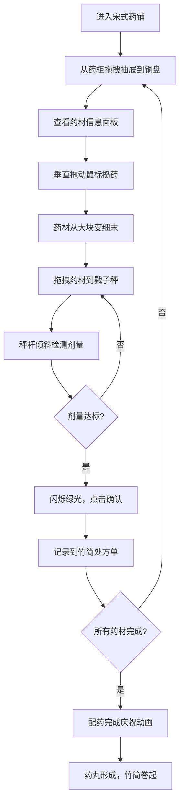

## 1. 产品概述

古代药铺3D交互可视化应用，模拟中药炮制的捣药、称药与配药全流程，解决传统中药炮制过程中药料捣碎精度、剂量称量准确度与多味药材配比难以直观模拟和反复练习的问题。

- 面向中医药专业学生、药剂师和中药文化爱好者，提供沉浸式的中药炮制学习与练习体验
- 通过3D交互技术降低学习门槛，提升药材炮制操作的熟练度与精准度

## 2. 核心功能

### 2.1 用户角色

| 角色 | 注册方式 | 核心权限 |
|------|----------|----------|
| 学习者 | 无需注册，直接使用 | 完整使用捣药、称药、配药全流程功能 |

### 2.2 功能模块

1. **3D药铺场景**：宋式药铺环境渲染，百子药柜、柜台、铜盘、捣药臼、戥子秤等道具
2. **药材选择系统**：从药柜拖拽抽屉到铜盘，查看药材信息，触发撒落动画
3. **捣药交互系统**：垂直拖动鼠标控制捣锤运动，根据速度和次数产生不同效果
4. **称药交互系统**：拖拽药材到戥子秤，根据重量自动倾斜，剂量达标检测
5. **处方管理系统**：竹简卷轴展示处方单，记录每味药材状态，配药完成庆祝动画
6. **信息面板**：实时显示药材名称、性味、用量范围等信息

### 2.3 页面详情

| 页面名称 | 模块名称 | 功能描述 |
|-----------|-------------|---------------------|
| 主场景页 | 3D药铺环境 | 宋式药铺渲染，米黄色墙面、青瓷砖地面、百子药柜、柜台 |
| 主场景页 | 药柜抽屉交互 | 抽屉标签显示药材名，拖拽抽屉到铜盘，0.4s滑动拉出动画 |
| 主场景页 | 铜盘与撒落动画 | 浅金色铜盘，药材落入触发粒子动画，颜色随药材变化 |
| 主场景页 | 捣药臼交互 | 深灰色花岗岩材质，按住鼠标垂直拖动捣锤，速度影响粉末效果 |
| 主场景页 | 戥子秤交互 | 木制秤杆黄铜秤盘，根据重量自动倾斜，剂量达标闪烁绿光 |
| 主场景页 | 竹简处方单 | 竖向排列显示处方，记录药材状态，配药完成自动卷起 |
| 主场景页 | 信息面板 | 显示当前选中药材的名称、性味、用量范围 |

## 3. 核心流程

用户进入3D药铺 → 从百子药柜拖拽药抽屉到铜盘 → 查看右侧信息面板了解药材 → 按住鼠标垂直拖动捣锤捣药（控制速度调节力度）→ 药材从大块变为细末 → 将捣碎的药材拖拽到戥子秤盘 → 观察秤杆倾斜，达到处方剂量时闪烁绿光 → 点击秤盘确认，药材记录到处方单 → 重复以上步骤完成所有药材 → 触发配药完成庆祝动画 → 药丸形成，竹简卷起显示完成

## 4. 用户界面设计

### 4.1 设计风格

- **主色调**：浅橡木色#d2b48c（背景木质纹理）、米黄色#f5e6c8（墙面）、青瓷砖色#a0b0a0（地面）
- **点缀色**：金色#b8860b（高亮边框）、浅金色#e0c090（铜盘）、深灰色#6b5b4a（捣药臼）、浅褐色#c4956a（秤杆）
- **按钮样式**：圆角矩形（4px圆角），微凹陷阴影效果，悬停放大1.05倍并增加2px金色边框
- **字体**：思源宋体，传承古籍韵味，标题加粗，正文易读
- **整体风格**：宋式古典美学，仿古木质感UI，竹简卷轴元素，营造传统中医药文化氛围

### 4.2 页面设计概述

| 页面名称 | 模块名称 | UI元素 |
|-----------|-------------|-------------|
| 主场景页 | 3D药铺环境 | 米黄色墙面、青瓷砖地面、左侧百子药柜、中间柜台、铜盘、捣药臼、戥子秤、右侧竹简处方单 |
| 主场景页 | 药柜抽屉 | 半透明灰色未选中状态，选中后不透明高亮，2px金色边框+0.2s呼吸动画，抽屉标签显示药材名 |
| 主场景页 | 捣药交互 | 捣锤跟随鼠标垂直运动，药材碎片网格数随捣数增加（8→64片），细粉飘散粒子 |
| 主场景页 | 戥子秤交互 | 秤杆随重量0-45度倾斜，剂量达标时水平并闪烁绿光3次，文字气泡"剂量达标" |
| 主场景页 | 处方单 | 竹简卷轴竖向排列，每味药材一行显示序号、名称、剂量、状态（未称/已称/已入药） |
| 主场景页 | 信息面板 | 仿古木质边框，显示药材名称、性味、用量范围 |
| 主场景页 | 完成动画 | 铜盘上升、碎片聚合成发光药丸、金黄色粒子散射、竹简自动卷起、"药方已配好"淡入 |

### 4.3 响应式设计

- **桌面端（≥1440x900）**：3D场景占75%宽度，右侧信息面板占25%
- **平板端（1024px-1439px）**：保持75%/25%布局，适当缩放UI元素
- **移动端（<1024px）**：信息面板折叠为底部浮动栏，高度自适应，最小220px，可展开收起
- **触摸优化**：拖拽操作支持触摸滑动，按钮点击区域≥44x44px

### 4.4 3D场景指导

- **环境与氛围**：宋式药铺室内场景，温暖柔和的自然光从窗户射入，营造古朴宁静的氛围，使用环境光+方向光+点光源组合
- **光照设置**：主光源为暖色平行光模拟日光（强度0.8），环境光（强度0.4）提供基础照明，柜台区域增加点光源（强度0.6）突出操作区域
- **相机设置**：PerspectiveCamera，fov 50度，初始位置(0, 1.5, 3.5)，看向场景中心，支持OrbitControls环绕观察，限制俯仰角避免穿透地面
- **构图与焦点**：柜台和铜盘位于画面视觉中心，药柜在左侧作为背景，戥子秤在右侧，形成稳定的三角形构图
- **交互与动画**：抽屉滑出0.4s动画，捣锤下降0.15s/上升0.1s，药材粒子0.6s，药丸聚合0.8s，粒子散射1s，文字淡入0.5s
- **后处理效果**：轻微Bloom效果增强发光药丸和高亮元素，ACES色调映射，输出编码sRGB
- **性能预算**：1440x900分辨率下稳定60fps，粒子总数≤200，绘制调用≤50次，内存占用≤500MB

### 4.5 交互反馈

- **悬停反馈**：所有可交互元素悬停时放大1.05倍，添加2px金色边框
- **选中反馈**：药柜抽屉选中后高亮显示，0.2s呼吸动画
- **拖拽反馈**：抽屉拖拽时半透明跟随鼠标
- **操作反馈**：捣药时产生粒子效果，称药达标时闪烁绿光和语音气泡
- **性能监控**：开发环境显示fps面板，确保60fps稳定运行
