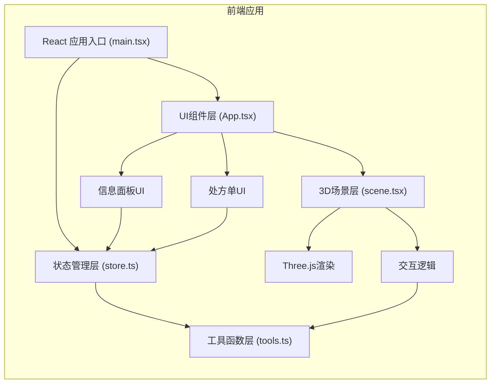

## 1. 架构设计



## 2. 技术描述

- **前端框架**：React@18 + TypeScript@5
- **构建工具**：Vite@5 + @vitejs/plugin-react@4
- **3D引擎**：three@0.160 + @react-three/fiber@8 + @react-three/drei@9
- **动画库**：framer-motion@11
- **类型支持**：@types/three@0.160
- **状态管理**：React Context + useReducer，自定义useStore hook

## 3. 目录结构

```
d:\Solocoder\VersionFast\tasks\auto1/
├── index.html
├── package.json
├── tsconfig.json
├── vite.config.js
└── src/
    ├── main.tsx          # 应用入口
    ├── App.tsx           # 根组件，布局与响应式
    ├── scene.tsx         # 3D场景主组件
    ├── store.ts          # 全局状态管理
    ├── tools.ts          # 工具函数（物理计算、碰撞检测等）
    ├── InfoPanel.tsx     # 药材信息面板
    ├── Prescription.tsx  # 竹简处方单
    └── types.ts          # TypeScript类型定义
```

## 4. 数据模型

### 4.1 类型定义

```typescript
// 药材类型
interface Herb {
  id: string;
  name: string;
  color: string;
  nature: string;      // 性味
  taste: string;       // 味道
  dosageRange: string; // 用量范围
  position: [number, number, number]; // 药柜位置
}

// 处方条目
interface PrescriptionItem {
  id: string;
  herbId: string;
  herbName: string;
  requiredDosage: number;  // 需要剂量（钱）
  currentDosage: number;   // 当前称量剂量
  status: '未称' | '已称' | '已入药';
  poundCount: number;      // 捣药次数
}

// 应用状态
interface AppState {
  phase: '选药' | '捣药' | '称药' | '配药完成';
  selectedHerb: Herb | null;
  currentItem: PrescriptionItem | null;
  prescription: PrescriptionItem[];
  poundCount: number;
  scaleWeight: number;      // 戥子秤当前重量
  isDraggingDrawer: boolean;
  draggedDrawer: string | null;
  showCompletion: boolean;
}

// 工具函数返回类型
interface PoundResult {
  fragmentCount: number;    // 碎片网格数量
  powderParticleCount: number; // 粉末粒子数
  colorLightness: number;   // 颜色变浅程度
  splashEffect: boolean;    // 是否产生飞溅
}

interface ScaleResult {
  tiltAngle: number;        // 倾斜角度
  isDosageReached: boolean; // 是否达标
  showBubble: boolean;      // 显示文字气泡
}
```

### 4.2 初始数据

```typescript
// 预设药材数据
const HERBS: Herb[] = [
  { id: 'huanglian', name: '黄连', color: '#c4a35a', nature: '寒', taste: '苦', dosageRange: '1-3钱', position: [0, 0, 0] },
  { id: 'danggui', name: '当归', color: '#8b6914', nature: '温', taste: '甘辛', dosageRange: '1-2钱', position: [0, 0, 0] },
  { id: 'gancao', name: '甘草', color: '#d4a574', nature: '平', taste: '甘', dosageRange: '1-3钱', position: [0, 0, 0] },
  { id: 'renshen', name: '人参', color: '#e8d4b8', nature: '微温', taste: '甘微苦', dosageRange: '0.5-1钱', position: [0, 0, 0] },
  { id: 'baishao', name: '白芍', color: '#f0e6d3', nature: '微寒', taste: '苦酸', dosageRange: '1-2钱', position: [0, 0, 0] },
  { id: 'chuanxiong', name: '川芎', color: '#a67c52', nature: '温', taste: '辛', dosageRange: '1-1.5钱', position: [0, 0, 0] },
];

// 示例处方
const SAMPLE_PRESCRIPTION: PrescriptionItem[] = [
  { id: 'p1', herbId: 'huanglian', herbName: '黄连', requiredDosage: 1.5, currentDosage: 0, status: '未称', poundCount: 0 },
  { id: 'p2', herbId: 'danggui', herbName: '当归', requiredDosage: 2.0, currentDosage: 0, status: '未称', poundCount: 0 },
  { id: 'p3', herbId: 'gancao', herbName: '甘草', requiredDosage: 1.0, currentDosage: 0, status: '未称', poundCount: 0 },
];
```

## 5. 核心模块设计

### 5.1 状态管理模块 (store.ts)

- 使用 React Context + useReducer 实现全局状态管理
- 导出 `useStore` hook 供所有组件订阅状态
- Action 类型：SELECT_HERB、POUND_HERB、ADD_TO_SCALE、CONFIRM_DOSAGE、NEXT_PHASE 等
- 状态变更均经过 reducer 统一处理，确保可预测性

### 5.2 工具函数模块 (tools.ts)

1. **计算捣药结果** `calculatePoundResult(poundCount: number, speed: number): PoundResult`
   - 速度 < 0.1s：快速捣击，粉末多，可能飞溅
   - 速度 > 0.3s：慢速捣击，粉末少，省力
   - 碎片数从8片逐步增加到64片（每捣+8片，上限64）
   - 粉末粒子数 = 捣次数 * 2，最大50个
   - 颜色亮度随捣数增加

2. **计算戥子秤结果** `calculateScaleResult(weight: number, target: number): ScaleResult`
   - 倾斜角度 = weight / 5 * 45度（最大45度）
   - 剂量误差在±0.1钱内判定达标
   - 达标时闪烁绿光3次（0.3s间隔）

3. **碰撞检测** `checkDrawerCollision(drawerPos: Vector3, trayPos: Vector3): boolean`
   - 检测拖拽的抽屉是否落入铜盘区域
   - 使用简单的球体碰撞检测

4. **抽屉吸附** `snapDrawerToTray(drawerPos: Vector3, trayPos: Vector3): Vector3`
   - 抽屉落入铜盘时自动吸附到正确位置

### 5.3 3D场景模块 (scene.tsx)

组件结构：
```
<Canvas>
  <ambientLight />
  <directionalLight />
  <pointLight />
  
  {/* 药铺环境 */}
  <ShopRoom />
  
  {/* 百子药柜 */}
  <MedicineCabinet>
    {herbs.map(herb => (
      <Drawer 
        key={herb.id} 
        herb={herb}
        onDragStart={handleDragStart}
        onDragEnd={handleDragEnd}
      />
    ))}
  </MedicineCabinet>
  
  {/* 柜台与铜盘 */}
  <Counter>
    <BronzeTray 
      onDrop={handleDrawerDrop}
      position={trayPosition}
    />
  </Counter>
  
  {/* 捣药臼 */}
  <Mortar position={mortarPosition}>
    <Pestle 
      onPointerDown={startPounding}
      onPointerMove={handlePoundMove}
      onPointerUp={stopPounding}
    />
    <HerbFragments count={fragmentCount} />
    <PowderParticles count={powderCount} />
  </Mortar>
  
  {/* 戥子秤 */}
  <BalanceScale 
    position={scalePosition}
    weight={scaleWeight}
    tiltAngle={tiltAngle}
    onDrop={handleScaleDrop}
    onClick={handleScaleConfirm}
  />
  
  {/* 药丸完成动画 */}
  {showCompletion && <PillAnimation />}
  
  <OrbitControls />
</Canvas>
```

### 5.4 UI组件模块

- **InfoPanel.tsx**：显示当前选中药材的名称、性味、用量范围，仿古木质边框设计
- **Prescription.tsx**：竹简卷轴样式，竖向排列处方条目，实时更新状态
- **App.tsx**：整体布局，响应式适配，framer-motion动画

## 6. 性能优化策略

1. **粒子系统优化**：
   - 使用对象池管理粒子，避免频繁创建销毁
   - 粒子总数严格限制≤200个
   - 超过上限时复用最早的粒子

2. **3D渲染优化**：
   - 使用 InstancedMesh 渲染重复的药柜抽屉
   - 药材碎片使用低多边形模型
   - 视锥体剔除，只渲染可见物体

3. **动画优化**：
   - 使用 useFrame 钩子进行帧更新，避免不必要的重渲染
   - 状态更新节流，捣药和称量交互延迟<50ms
   - 使用 framer-motion 的 transform 而非 top/left 进行动画

4. **状态更新优化**：
   - 状态分片更新，避免不必要的组件重渲染
   - 使用 useMemo 缓存计算结果
   - 事件处理函数使用 useCallback 缓存

## 7. 动画时间线规范

| 动画 | 时长 | 缓动函数 |
|------|------|----------|
| 抽屉拉出 | 0.4s | easeOutCubic |
| 药材撒落粒子 | 0.6s | easeOutQuad |
| 捣锤下降 | 0.15s | easeInQuad |
| 捣锤上升 | 0.1s | easeOutQuad |
| 秤杆倾斜 | 0.3s | spring |
| 达标绿光闪烁 | 0.3s×3次 | easeInOut |
| 药丸聚合 | 0.8s | easeInOutCubic |
| 药丸粒子散射 | 1.0s | easeOut |
| 竹简卷起 | 0.6s | easeInOut |
| 文字淡入 | 0.5s | easeOut |
| 元素悬停 | 0.2s | easeOut |
| 抽屉呼吸动画 | 0.2s | easeInOut |
