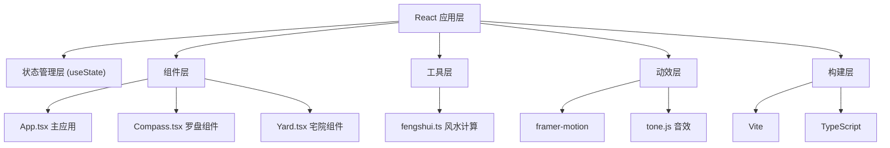

## 1. 架构设计



## 2. 技术描述

- **前端框架**：React@18 + TypeScript@5
- **构建工具**：Vite@5 + @vitejs/plugin-react@4
- **动效库**：framer-motion@11
- **音效库**：tone.js@14
- **样式方案**：内联样式 + CSS变量
- **初始化方式**：手动配置项目结构

## 3. 项目结构

```
auto10/
├── package.json
├── index.html
├── tsconfig.json
├── vite.config.js
└── src/
    ├── App.tsx              # 主应用组件，管理场景状态和布局切换
    ├── components/
    │   ├── Compass.tsx      # 罗盘组件，渲染圆形罗盘和指针拖拽交互
    │   └── Yard.tsx         # 宅院地图组件，渲染庭院、房间和家具摆件网格
    └── utils/
        └── fengshui.ts      # 工具模块，根据方位和摆件计算吉凶评分
```

## 4. 核心数据类型定义

```typescript
// 八卦方位类型
type Trigram = 'qian' | 'kun' | 'zhen' | 'xun' | 'kan' | 'li' | 'gen' | 'dui';

// 方位信息
interface TrigramInfo {
  name: string;           // 卦名
  element: string;        // 五行
  color: string;          // 颜色
  angle: number;          // 起始角度
  description: string;    // 风水描述
}

// 家具类型
type FurnitureType = 'bed' | 'table' | 'screen' | 'vat' | 'plant';

// 家具位置
interface Furniture {
  id: string;
  type: FurnitureType;
  x: number;             // 当前x坐标
  y: number;             // 当前y坐标
  initialX: number;      // 初始x坐标
  initialY: number;      // 初始y坐标
  rotation: number;      // 朝向角度
}

// 宅院区域
interface YardZone {
  id: string;
  name: string;
  x: number;
  y: number;
  width: number;
  height: number;
}

// 吉凶等级
type AuspiciousLevel = 'great' | 'good' | 'neutral' | 'bad';

// 分析结果
interface AnalysisResult {
  score: number;
  details: {
    furniture: string;
    position: string;
    score: number;
    comment: string;
  }[];
}
```

## 5. 核心接口

### 5.1 fengshui.ts 工具函数

```typescript
// 获取指定角度对应的八卦方位
function getTrigramByAngle(angle: number): Trigram;

// 获取方位的吉凶等级
function getAuspiciousLevel(trigram: Trigram): AuspiciousLevel;

// 获取方位的风水描述文字
function getTrigramDescription(trigram: Trigram): string;

// 获取吉凶等级对应的颜色
function getAuspiciousColor(level: AuspiciousLevel): string;

// 计算单个家具的风水分数
function calculateFurnitureScore(furniture: Furniture, trigram: Trigram): number;

// 计算全局布局总分（满分100）
function calculateTotalScore(furnitures: Furniture[], currentTrigram: Trigram): AnalysisResult;
```

### 5.2 组件Props

```typescript
// Compass.tsx
interface CompassProps {
  diameter: number;
  angle: number;
  onAngleChange: (angle: number) => void;
  onSnap: (trigram: Trigram) => void;
}

// Yard.tsx
interface YardProps {
  furnitures: Furniture[];
  currentTrigram: Trigram | null;
  onFurnitureMove: (id: string, x: number, y: number) => void;
  gridSize: number;
}
```

## 6. 状态管理

```typescript
// App.tsx 中的状态
const [compassAngle, setCompassAngle] = useState(0);
const [currentTrigram, setCurrentTrigram] = useState<Trigram | null>(null);
const [furnitures, setFurnitures] = useState<Furniture[]>(initialFurnitures);
const [isAnalyzing, setIsAnalyzing] = useState(false);
const [analysisResult, setAnalysisResult] = useState<AnalysisResult | null>(null);
const [isResetting, setIsResetting] = useState(false);
const [descriptionText, setDescriptionText] = useState('');
```

## 7. 性能优化策略

1. **罗盘拖拽优化**：使用 requestAnimationFrame 确保60FPS，指针位置更新直接操作DOM
2. **家具拖拽优化**：使用 transform 进行位置变化，避免重排重绘
3. **事件监听**：指针拖拽使用 pointer 事件，支持触摸和鼠标
4. **记忆化**：使用 useMemo 缓存计算结果，使用 useCallback 稳定函数引用
5. **节流防抖**：风水计算在拖拽结束后执行，避免频繁计算
