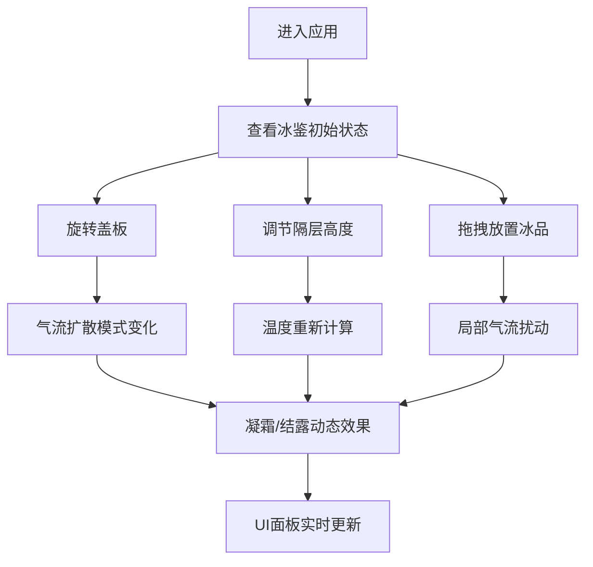

## 1. 产品概述

本产品是一个基于浏览器的古代冰鉴三维交互可视化应用，让用户以周代凌人的身份，在虚拟宗庙膳堂中操作青铜冰鉴，实时观察内部制冷气流与冰品陈设的动态效果。

- 主要目的：通过高度还原的3D交互，展示古代冰鉴的制冷原理和使用场景，兼具教育意义与视觉体验
- 目标用户：历史文化爱好者、教育工作者、博物馆参观者
- 产品价值：将古代科技与现代Web技术结合，提供沉浸式的文化体验

## 2. 核心功能

### 2.1 用户角色
| 角色 | 注册方式 | 核心权限 |
|------|----------|----------|
| 凌人（用户） | 无需注册 | 操作冰鉴盖板、调节隔层、放置冰品、观察气流效果 |

### 2.2 功能模块
1. **3D场景主视图**：宗庙膳堂环境、青铜冰鉴本体、气流粒子系统
2. **冰鉴交互系统**：盖板旋转、隔层高度调节、冰品拖拽放置
3. **物理模拟系统**：冷气流流动、温度分布计算、凝霜/结露效果
4. **侧边UI控制面板**：参数调节滑块、温度显示、冰品库、气流指示器

### 2.3 页面详情
| 页面名称 | 模块名称 | 功能描述 |
|----------|----------|----------|
| 主界面 | 3D场景渲染 | 宗庙膳堂背景、青铜冰鉴模型、实时气流粒子、冰品陈设 |
| 主界面 | 盖板交互 | 鼠标拖拽/滑块控制盖板0-90度旋转，实时影响气流扩散 |
| 主界面 | 隔层调节 | 三层木质隔板独立调节高度（0-150px），动态分配空间与温度 |
| 主界面 | 冰品管理 | 三种冰品（果脯、醴酒、鲜果）拖拽放置，每层最多3个 |
| 主界面 | 气流模拟 | 蓝色粒子从底部冰窖上升，遇冰品附着形成凝霜或结露 |
| 侧边面板 | 温度显示 | 三层温度实时显示（华氏度），随参数动态变化 |
| 侧边面板 | 冰品库 | 可拖拽的冰品列表，显示名称与缩略图 |
| 侧边面板 | 气流指示器 | 实时显示气流强度与方向状态 |

## 3. 核心流程

用户进入应用后，首先看到闭合的青铜冰鉴位于宗庙膳堂中央。用户可以：
1. 拖拽或使用滑块打开盖板，观察内部结构
2. 调节各层隔板高度，改变内部空间分布
3. 从侧边冰品库拖拽冰品到隔层中
4. 实时观察冷气流流动、温度变化和凝霜效果
5. 通过调整参数，体验不同配置下的制冷效果

## 4. 用户界面设计

### 4.1 设计风格
- **主色调**：青铜色（#6b4e3a → #b87333渐变）、木质棕色（#8b6f47）、冷蓝色（#4a90e2）
- **背景色**：土墙色（#d4a76a）、深木梁色（#5d3a1a）
- **UI风格**：古朴典雅，半透明毛玻璃面板，木质边框控件
- **动效**：所有交互均有0.3-0.6s平滑过渡动画，ease-in-out缓动
- **字体**：使用具有古典气息的衬线字体，标题使用装饰性字体

### 4.2 页面设计概述
| 页面名称 | 模块名称 | UI元素 |
|----------|----------|--------|
| 主界面 | 3D场景 | 青铜冰鉴（兽面纹浮雕）、三层木质隔板、气流粒子系统、宗庙背景 |
| 主界面 | 侧边UI面板 | 毛玻璃半透明（rgba(139, 111, 71, 0.6)）、backdrop-filter: blur(8px) |
| 主界面 | 控制面板 | 古朴木质边框滑块、温度数值显示（大字号）、气流强度指示器 |
| 主界面 | 冰品库 | 可拖拽冰品卡片、网格布局、拖拽时光标跟随 |

### 4.3 响应式设计
- **桌面优先**：针对1920x1080优化，自适应至1024x768
- **窄屏适配**：宽度 < 1024px时，侧边面板自动折叠为浮动按钮
- **触摸优化**：支持触摸拖拽操作，交互区域最小44x44px

### 4.4 3D场景设计
- **环境**：宗庙膳堂，土墙纹理背景，深色木梁结构，柔和暖色调全局光照
- **光照**：环境光 + 方向光模拟室内光线，冰鉴内部添加点光源突出冷色调
- **相机**：透视相机，初始位置斜45度俯瞰，支持轨道控制缩放旋转
- **材质**：青铜使用MeshStandardMaterial + 粗糙度贴图，木质使用纹理贴图，冰品使用半透明材质
- **粒子系统**：使用Points + BufferGeometry实现高效气流粒子，动态数量控制（≤2000）
- **后期处理**：轻微Bloom效果增强冷光氛围，FXAA抗锯齿
- **性能**：目标60FPS，粒子池化复用，状态更新1帧内完成
