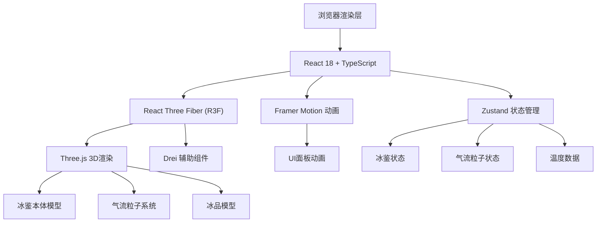

## 1. 架构设计



## 2. 技术栈描述

* **前端框架**：React\@18 + TypeScript + Vite

* **3D引擎**：Three.js + @react-three/fiber + @react-three/drei

* **状态管理**：zustand

* **动效库**：framer-motion

* **构建工具**：Vite

* **语言**：TypeScript（严格模式）

## 3. 项目文件结构

```
auto100/
├── package.json
├── vite.config.js
├── tsconfig.json
├── index.html
├── .trae/documents/
│   ├── PRD.md
│   └── TECH_ARCH.md
└── src/
    ├── types.ts          # 核心类型定义
    ├── store.ts          # Zustand状态管理
    ├── App.tsx           # 根组件
    └── components/
    │   ├── IceJianScene.tsx  # 3D场景组件
    │   └── UIPanel.tsx       # UI控制面板
    └── shaders/          # 自定义着色器（凝霜效果）
    └── utils/            # 工具函数
```

## 4. 核心数据模型

### 4.1 类型定义（types.ts）

```typescript
// 冰品类型
type IceItemType = 'dried_fruit' | 'wine' | 'fresh_fruit';

// 冰品接口
interface IceItem {
  id: string;
  type: IceItemType;
  position: { x: number; y: number; z: number };
  layer: number;
  frostLevel: number; // 0-1, 凝霜程度
}

// 隔层接口
interface Shelf {
  id: number;
  height: number; // 0-150px;
  temperature: number; // 华氏度
  items: IceItem[];
}

// 气流粒子接口
interface AirParticle {
  id: number;
  position: [number, number, number];
  velocity: [number, number, number];
  velocity: [number, number, number];
  size: number;
  opacity: number;
  active: boolean;
}

// 冰鉴状态接口
interface IceJianState {
  lidAngle: number; // 0-90度
  shelves: Shelf[];
  particles: AirParticle[];
  airflowIntensity: number;
}
```

### 4.2 状态管理（store.ts）

```typescript
// Zustand store 包含：
- lidAngle: 盖板角度 (0-90)
- shelves: 三层隔板状态
- particles: 气流粒子数组
- draggingItem: 当前拖拽的冰品
- setLidAngle: 设置盖板角度
- setShelfHeight: 设置隔板高度
- addIceItem: 添加冰品到指定隔层
- removeIceItem: 移除冰品
- updateParticles: 更新粒子状态
- calculateTemperatures: 计算各层温度
```

## 5. 温度计算公式

```
基础温度（盖板全闭时：
- 底层：-10°F
- 中层：10°F
- 顶层：30°F

盖板全开时：
- 底层：20°F
- 中层：40°F
- 顶层：60°F

温度随盖板角度线性插值：
temp = baseClosed + (baseOpen - baseClosed) * (lidAngle / 90

冰品降温效果：
每放置一个冰品，该层温度降低5°F

隔板高度影响：
隔板下调时，上层温度升高，下层温度降低
```

## 6. 性能优化策略

1. **粒子池化**：预分配2000个粒子Buffer，复用 inactive 粒子
2. **InstancedMesh**：重复几何体实例化渲染
3. **ShaderMaterial**：凝霜效果使用顶点着色器实现
4. **按需渲染**：状态变化时才更新几何体
5. **帧率控制**：requestAnimationFrame 节流

