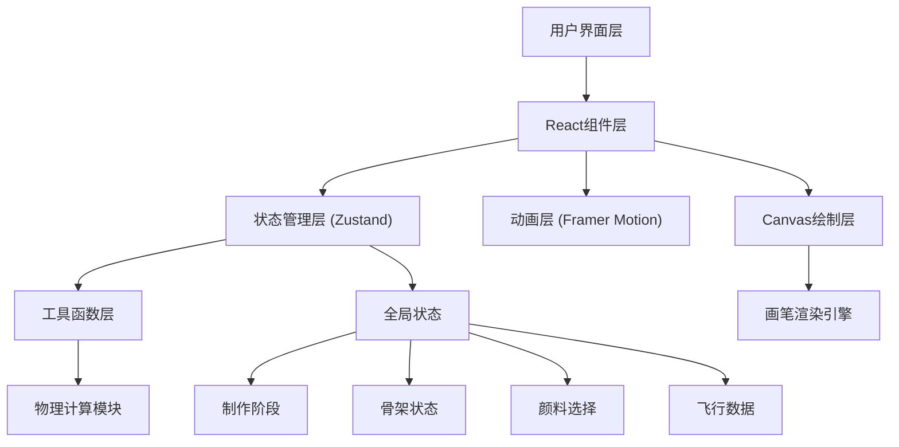

## 1. 架构设计



## 2. 技术描述

- **前端框架**：React@18 + TypeScript@5
- **构建工具**：Vite@5 + @vitejs/plugin-react@4
- **状态管理**：Zustand@4（集中管理所有游戏状态）
- **动画库**：Framer Motion@11（负责复杂动画和过渡效果）
- **样式方案**：CSS Modules + CSS Variables（主题色系统）
- **渲染技术**：
  - CSS绘制：作坊场景、竹篾、风筝造型（clip-path）
  - Canvas 2D：彩绘画笔渲染
  - CSS Transforms：风筝3D摇摆效果

## 3. 核心文件结构

| 文件路径 | 用途 |
|----------|------|
| `package.json` | 项目依赖配置 |
| `vite.config.js` | Vite构建配置 |
| `tsconfig.json` | TypeScript编译配置 |
| `index.html` | 应用入口页面 |
| `src/main.tsx` | React应用入口 |
| `src/App.tsx` | 主应用组件，布局容器 |
| `src/useGameStore.ts` | Zustand全局状态管理 |
| `src/components/MakeScene.tsx` | 制作场景组件 |
| `src/components/PaintScene.tsx` | 彩绘场景组件 |
| `src/components/FlyScene.tsx` | 放飞场景组件 |
| `src/components/WorkshopScene.tsx` | 作坊背景场景 |
| `src/components/MaterialPanel.tsx` | 左侧材料控制面板 |
| `src/components/InfoPanel.tsx` | 右侧信息面板 |
| `src/components/BottomToolbar.tsx` | 底部工具栏 |
| `src/components/Palette.tsx` | 调色盘组件 |
| `src/components/Kite.tsx` | 风筝组件 |
| `src/components/BambooStrip.tsx` | 竹篾组件 |
| `src/utils/physics.ts` | 物理计算工具函数 |
| `src/utils/canvas.ts` | Canvas绘制工具函数 |
| `src/types/index.ts` | TypeScript类型定义 |
| `src/styles/global.css` | 全局样式和CSS变量 |

## 4. 状态管理设计

### 4.1 Zustand Store 状态定义

```typescript
interface GameState {
  // 当前阶段: 'make' | 'paint' | 'fly'
  currentStage: Stage;
  
  // 骨架状态
  frame: {
    type: 'cross' | 'delta';  // 十字形/三角翼形
    bambooStrips: BambooStrip[];
    isComplete: boolean;
  };
  
  // 颜料选择
  paint: {
    selectedColor: string | null;
    brushSize: number;
    strokes: PaintStroke[];
  };
  
  // 放飞物理参数
  flight: {
    altitude: number;          // 高度 0-100
    rotationY: number;         // 左右摇摆角度 -15~15
    windSpeed: number;         // 风速
    lineTension: number;       // 牵线张力 0-1
    isLineTight: boolean;      // 丝线是否紧绷
    kitePosition: { x: number; y: number };
  };
  
  // 操作
  actions: {
    setStage: (stage: Stage) => void;
    addBambooStrip: (strip: BambooStrip) => void;
    completeFrame: () => void;
    selectColor: (color: string) => void;
    addStroke: (stroke: PaintStroke) => void;
    updateFlight: (data: Partial<FlightState>) => void;
    reset: () => void;
    clear: () => void;
  };
}
```

## 5. 物理计算模型

### 5.1 升力系数计算
```
liftCoefficient = 0.5 * airDensity * windSpeed² * kiteArea * angleOfAttack
```

### 5.2 风速影响
```
effectiveWind = baseWind * (1 + altitude * 0.005)
rotationSpeed = baseSpeed * (1 - altitude * 0.008)
```

### 5.3 牵线张力
```
tension = sqrt((liftForce)² + (dragForce)²) / lineStrength
isTight = tension > 0.5
```

## 6. 性能优化策略

1. **Canvas渲染优化**
   - 使用离屏Canvas预绘制
   -  requestAnimationFrame 批量绘制
   - 局部重绘而非全量刷新

2. **动画优化**
   - 使用transform和opacity属性触发GPU加速
   - will-change 预声明动画属性
   - Framer Motion layout animations 减少重排

3. **状态更新优化**
   - Zustand 选择器订阅避免不必要重渲染
   - useMemo/useCallback 缓存计算结果和回调
   - 组件粒度细化，减少重渲染范围

4. **拖拽性能**
   - pointer events 替代 mouse events
   - 0.1s 延迟平滑跟随，减少更新频率
   - CSS transform 实现拖拽位移，避免布局抖动
